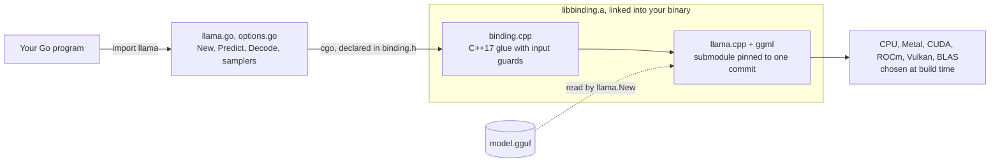
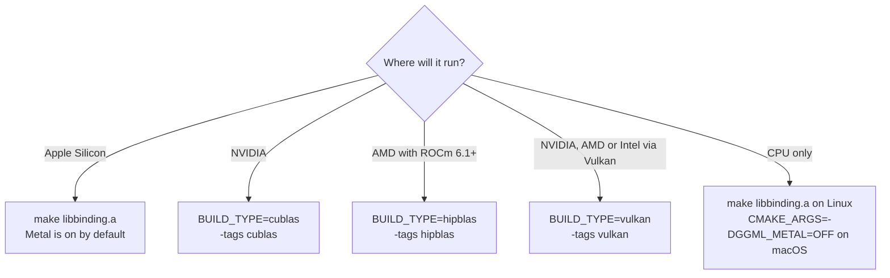
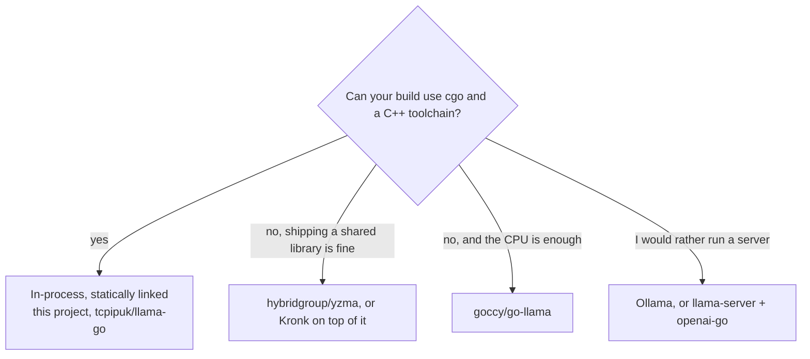
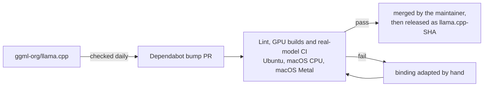

<div align="center">


# go-llama.cpp

**Run GGUF language models inside your Go program.**<br>
llama.cpp is compiled into your binary: no server to run, no API key, no network at run time.

[](https://pkg.go.dev/github.com/AshkanYarmoradi/go-llama.cpp)
[](https://github.com/AshkanYarmoradi/go-llama.cpp/actions/workflows/test.yaml)
[](https://github.com/AshkanYarmoradi/go-llama.cpp/actions/workflows/lint.yaml)
[](https://github.com/AshkanYarmoradi/go-llama.cpp/releases)
[](LICENSE)

[Quick start](#quick-start) ·
[What you can do](#what-you-can-do) ·
[Things to know](#things-to-know-before-you-ship) ·
[Tested on](#tested-on) ·
[GPU](#gpu-acceleration) ·
[Docs](#documentation)

</div>

> **Coming from go-skynet/go-llama.cpp?** `New` and `Predict` keep their signatures, so most programs
> change one import line. Read the [migration guide](docs/migrating-from-go-skynet.md).

## Hello, llama

```go
package main

import (
	"fmt"
	"log"

	llama "github.com/AshkanYarmoradi/go-llama.cpp"
)

func main() {
	model, err := llama.New("model.gguf", llama.SetContext(2048))
	if err != nil {
		log.Fatal(err)
	}
	defer model.Free()

	answer, err := model.Predict("[INST] Answer to the following question:\nhow much is 2+2?\n[/INST]",
		llama.SetTokens(32))
	if err != nil {
		log.Fatal(err)
	}
	fmt.Println(answer)
}
```

CI sends this prompt to CodeLlama-7B-Instruct on every pull request and checks that the answer
contains "4" (the `predicts successfully` spec in [llama_test.go](llama_test.go)). The program is also
the package's [`Example`][ex-package] in [example_test.go](example_test.go), so `go vet` compiles it on
every pull request too.

To run it you need the compiled engine and a model file. The next section gets you both.

## Quick start

| Requirement | |
|---|---|
| Go | 1.26 or newer |
| C++ compiler | GCC, Clang or Apple Clang, with C++17 |
| CMake | 3.14 or newer; the CUDA, ROCm and Vulkan builds need a newer one |
| OS | Linux or macOS. Windows is not supported; WSL2 will probably work but is not tested. |
| Linux only | the OpenMP runtime (libgomp, which comes with GCC) |

```bash
# Ubuntu / Debian
sudo apt-get install build-essential cmake git

# macOS
xcode-select --install && brew install cmake
```

> [!IMPORTANT]
> **This is not a `go get`-only package.** Go module downloads leave out git submodules and never
> run `make`, so you build the engine from a clone.

**1. Clone and build the engine.**

```bash
git clone --recurse-submodules https://github.com/AshkanYarmoradi/go-llama.cpp
cd go-llama.cpp
make libbinding.a
```

The first build compiles all of llama.cpp, so it takes a few minutes; later builds reuse it. On
macOS the build includes Metal. If `llama.cpp/` is empty, the clone missed the submodule: run
`git submodule update --init`.

**2. Download a model.** This is the one CI uses (about 2.8 GB):

```bash
curl -L -o model.gguf https://huggingface.co/TheBloke/CodeLlama-7B-Instruct-GGUF/resolve/main/codellama-7b-instruct.Q2_K.gguf
```

Q2_K is small and fast to fetch, but heavily compressed. For real work, pick a Q4_K_M file of a
model you like; [Getting started](docs/getting-started.md) explains how to choose.

**3. Talk to it.**

```bash
LIBRARY_PATH=$PWD C_INCLUDE_PATH=$PWD go run ./examples -m model.gguf
```

Type a question, then press Enter on an empty line to send it. On macOS, add `-ngl 99` (more than
the model's layer count) to offload every layer to Metal. On a CUDA, ROCm or Vulkan build, also pass
the backend's tag: `go run -tags cublas ./examples -m model.gguf -ngl 99` (see
[GPU acceleration](#gpu-acceleration)). `-h` lists the other flags.

## Use it from your own module

Import the package as `llama "github.com/AshkanYarmoradi/go-llama.cpp"`, then build the engine in a
checkout next to your module and point your module at it:

```bash
git clone --recurse-submodules https://github.com/AshkanYarmoradi/go-llama.cpp ../go-llama.cpp
make -C ../go-llama.cpp libbinding.a

go mod edit -replace github.com/AshkanYarmoradi/go-llama.cpp=../go-llama.cpp
go mod tidy
LIBRARY_PATH=$PWD/../go-llama.cpp C_INCLUDE_PATH=$PWD/../go-llama.cpp go build ./...
```

cgo finds `libbinding.a` and `binding.h` in the checkout through the `replace`, so the two variables
are optional; if you set them, point them at the checkout, not at your module.

To pin the engine, check out one of the `llama.cpp-<sha>` [release tags](https://github.com/AshkanYarmoradi/go-llama.cpp/releases)
and rebuild:

```bash
git -C ../go-llama.cpp checkout llama.cpp-<sha>
git -C ../go-llama.cpp submodule update --init
make -C ../go-llama.cpp clean libbinding.a
```

Building a container instead? [Getting started](docs/getting-started.md#docker) has a multi-stage
Dockerfile.

## Coming from go-skynet/go-llama.cpp?

```diff
- llama "github.com/go-skynet/go-llama.cpp"
+ llama "github.com/AshkanYarmoradi/go-llama.cpp"
```

`func New(model string, opts ...ModelOption) (*LLama, error)` and
`func (l *LLama) Predict(text string, opts ...PredictOption) (string, error)` keep their exact
signatures. Almost every exported name of go-skynet's still exists, its exported variables
included, down to the misspelled `EnabelLowVRAM`. These six are gone, and the compiler will find
them for you: `Eval`, `SpeculativeSampling`, `SetMulMatQ`, `SetPerplexity`, `SetNegativePrompt`
and `SetNegativePromptScale`.

Four changes still compile, so check them by hand:

1. **There is no prompt cache.** `SetPathPromptCache`, `EnablePromptCacheAll` and
   `EnablePromptCacheRO` do nothing, and `Predict` clears the KV cache on every call. To resume a
   conversation, save it with `SaveSessionFile` and continue with your own `Decode` loop.
2. **Some options are accepted and ignored**, because llama.cpp dropped the feature behind them or
   the binding no longer implements it: `IgnoreEOS`, `SetTailFreeSamplingZ`, `SetPenalizeNL`,
   `EnableF16Memory` and others. Each is marked
   `// Deprecated: has no effect.`, so `staticcheck` lists every call site.
3. **The default sampler changed.** A min-p 0.05 stage now runs by default (`llama.SetMinP(0)`
   removes it), and the engine underneath is years newer, so expect different text from the same
   seed.
4. **RoPE now comes from the model.** go-skynet forced base 10000 and scale 1.0 on every model;
   each model now runs with its trained values, so output changes. `WithRopeFreqBase(10000)` and
   `WithRopeFreqScale(1)` restore the old values.

The [migration guide](docs/migrating-from-go-skynet.md) has the full list, a replacement for each
removed name, and how to find the ignored options in your code. This project is a
fork of [go-skynet/go-llama.cpp](https://github.com/go-skynet/go-llama.cpp), and it carries on from
that project's last commit; thanks to the go-skynet authors for the foundation.

## What you can do

Each row names the API, links example code, and says whether a CI spec asserts the behaviour
against a real model. The pkg.go.dev examples are compiled by `go vet` on every pull request; the
cookbook recipes are not. "Compiled only" means `go vet` type-checks the example, but nothing runs
it against a model.

| You want to | Use | Example | Checked by CI |
|---|---|---|---|
| Generate text in one call | `Predict`, `SetTokens`, `SetTemperature`, `SetTopP`, `SetSeed` | [Predict][ex-predict] | yes for `Predict`; nothing asserts what `SetTokens` or the sampling options do to the output |
| Chat with the model's own template | `ApplyChatTemplate`, `BuiltinChatTemplates`, `ErrNoChatTemplate` | [ApplyChatTemplate][ex-chat] | with a built-in template; the model's own template is not covered |
| Stream tokens and stop early | the `SetTokenCallback` option | [SetTokenCallback][ex-stream] | streaming yes; stopping early (returning false) is not covered |
| Cancel a running decode from a `context.Context` | `SetAbortCallback` | [SetAbortCallback][ex-abort] | yes |
| Route llama.cpp's logs into `log/slog`, or silence them | `SetLogHandler`, `LogLevel`, `LogHandlerInstalled` | [SetLogHandler][ex-log] | yes |
| Write your own generation loop | `Tokenize`, `NewBatch`, `Decode`, `NewSamplerChain`, `Sampler.Sample`, `IsEOG`, `TokenToPiece` | [generation loop][ex-loop] | each step yes; the whole loop compiled only |
| Compose, inspect and clone sampler chains | `SamplerTopK`, `SamplerTemp`, `SamplerDist`, …, `model.SamplerInfill`, `Sampler.Len`/`At`/`Remove`/`Clone` | [NewSamplerChain][ex-chain], [Sampler.Clone][ex-clone] | yes |
| Ban or boost tokens | `SamplerLogitBias` | [SamplerLogitBias][ex-bias] | yes |
| Constrain output with a GBNF grammar | `WithGrammar`, `SamplerGrammar`, `SamplerGrammarLazy` | [cookbook](docs/cookbook.md#get-json-back-with-a-grammar) | `WithGrammar` and `SamplerGrammar` in your own chain, yes; `SamplerGrammarLazy` is built but not run |
| Compute embeddings | `EnableEmbeddings`, `Embeddings`, `TokenEmbeddings` | [cookbook](docs/cookbook.md#embeddings-and-similarity-search) | yes, on a causal model (last-token vectors); pooled embedding models not covered |
| Keep long conversations going | `MemoryCanShift`, `MemorySeqRemove`, `MemorySeqAdd` | [MemorySeqAdd][ex-shift] | yes |
| Save and resume, even in another process | `SaveSessionFile`/`LoadSessionFile`, `StateData`/`SetStateData`, `SequenceStateDataWith` | [SaveSessionFile][ex-session] | yes |
| Score text (perplexity) | `Batch.Add(..., true)`, `Logits(i)` | [perplexity][ex-ppl] | compiled only |
| Inspect a loaded model and its context | `GetModelInfo`, `Architecture`, `ModelMetadataValue`, `GetSpecialTokens`, `ContextParams`, `Perf` | [GetModelInfo][ex-info] | yes |
| Quantize and load split models from Go | `Quantize`, `NewFromSplits`, `SplitPath`, `SplitPrefix` | [Quantize][ex-quant], [NewFromSplits][ex-splits] | error paths and single-file loads |
| Apply LoRA adapters and control vectors | `ApplyLoRA`, `ClearLoRA`, `LoRAMetadata`, `SetControlVector` | [cookbook](docs/cookbook.md#apply-lora-adapters-and-control-vectors) | control vectors yes; LoRA error paths only |
| Sample inside the compute backend, such as the GPU (experimental) | `SetSequenceSampler`, `SampledToken`, `SampledProbs` | [cookbook](docs/cookbook.md#sample-on-the-gpu-experimental) | on the CPU backend |

Every row is also a recipe in the [cookbook](docs/cookbook.md), where each recipe names its evidence.

## How it works



- Each commit of this repository pins one llama.cpp commit as a git submodule. `make` compiles it,
  with a thin C++ layer, into `libbinding.a`, and cgo links that archive into your program.
- The engine is not loaded at run time, so the Go API and the engine cannot drift apart. Bindings
  that load a prebuilt shared library at run time skip the C++ build, and in exchange have to keep
  the library and the Go code compatible.
- The cost: a C++17 compiler, CMake, and a clone instead of `go get`.

[How it works](docs/how-it-works.md) covers the build pipeline, the GPU builds and the callbacks in
detail.

## Things to know before you ship

1. **Free what you load.** A `*LLama` holds C memory the garbage collector never sees. Call `Free`
   when you are done; a second call is a no-op, but do not use the model afterwards.
2. **One caller at a time.** A `*LLama` is not safe for concurrent use. Guard it with a
   `sync.Mutex`, or give each worker its own `llama.New`; each one loads the weights again,
   including any GPU layers. A context holds one sequence unless you load it with `SetNSeqMax(n)`,
   and even then sequence ids separate conversations, not callers. A token callback runs in the
   middle of `Predict`: from inside it you may call `SetTokenCallback` and use other models, but
   never call `Predict`, `Decode` or `Free` on the model that is generating, or change its KV
   cache.
3. **`Predict` starts from scratch.** Every call clears the KV cache. For multi-turn chat,
   re-render the whole history with `ApplyChatTemplate` each turn. To continue from saved state, use
   your own `Decode` loop instead of `Predict`.
4. **Speed is opt-in.** `SetGPULayers` defaults to 0, so the weights stay in system memory and
   generation runs on the CPU until you ask for layers. A GPU build, including the default macOS
   build, still sends large prompt batches to the GPU; for a CPU-only binary, build without a GPU
   backend (`CMAKE_ARGS=-DGGML_METAL=OFF` on macOS). The context uses llama.cpp's default of 4
   threads; raise it with `model.SetThreads(n, n)`, or for a single call with the
   `llama.SetThreads(n)` option.
5. **A few mistakes still end the process.** llama.cpp asserts instead of returning an error in
   some places, and `recover()` cannot catch that. The binding checks what it can first: a token
   id outside the vocabulary makes `TokenToPiece` and `Detokenize` return `""`, and a `Decode`
   batch larger than `ContextParams().NBatch` returns -1. Most of what it cannot check is in your
   own sampler chains: `Sampler.Sample` on a batch position that did not request logits, a chain
   with no stage that picks a token (such as `SamplerGreedy` or `SamplerDist`), and a grammar
   stage placed after top-k or another truncation stage, or after the picking stage, when the
   token picked is end-of-generation. The
   [failure model](docs/production.md#failure-model) lists the rest.
6. **Errors are terse.** `Predict` reports every failure as a generic "inference failed". The
   binding writes the cause to stderr; llama.cpp's own log lines, which can add detail, go to your
   `SetLogHandler` handler if you set one.
7. **Hand-built sampler chains have rules.**
   - `Sample` already accepts the token it returns. Never call `Accept` after it: the penalty
     history counts the token twice, and a grammar stage either moves on twice or refuses it.
   - Put grammar stages first, ahead of top-k and of the stage that picks. A grammar further down
     can be handed a token it does not allow; `Sample` then returns -1, writes the reason to
     stderr and restarts the grammar from its beginning. `Sample` also returns -1 for an empty
     sampler, so check for it before you use the token.
   - A grammar that does not parse is dropped without an error: the stage `SamplerGrammar` returns
     is empty and `Add` ignores it, so generation runs unconstrained. Check `chain.Len()` after
     adding it. (`WithGrammar` with such a grammar makes `Predict` return an error instead.)

[Running it in production](docs/production.md) covers sizing, concurrency patterns, timeouts and
observability.

## Tested on

Every pull request and every push to `main` runs:

| Workflow | Where | What it proves |
|---|---|---|
| CI | Ubuntu (CPU), macOS on Apple Silicon (CPU only), macOS (Metal build); each on Go 1.26.x and the latest stable Go | Builds the pinned llama.cpp, downloads CodeLlama-7B-Instruct Q2_K and runs the [Ginkgo suite](llama_test.go) against it |
| Lint | Ubuntu | `gofmt`; `go vet` with no build tag and with each backend tag (`cublas`, `hipblas`, `vulkan`, `openblas`, `blis`), which compiles every Example; the `go mod tidy` check; a compile check of binding.cpp; [check-binding-symbols.sh](scripts/check-binding-symbols.sh); an engine-coverage freshness warning |
| GPU builds | GPU-less hosted Ubuntu runners: `ubuntu-cuda-build`, in NVIDIA's `nvidia/cuda` devel image, and `ubuntu-vulkan-build` | `BUILD_TYPE=cublas` and `BUILD_TYPE=vulkan` compile, `libbinding.a` holds the backend's objects, and the test binary and the example link against the backend's libraries. No model runs. |

A failing spec gets up to five attempts (`--flake-attempts 5`) before the job fails.

Not covered:

- Windows.
- Running on CUDA, ROCm or Vulkan hardware. The specs labelled `gpu` in
  [llama_test.go](llama_test.go) run only in the GPU tests workflow
  ([test-gpu.yaml](.github/workflows/test-gpu.yaml)), which needs a self-hosted runner
  with an NVIDIA GPU. It runs when started by hand or on a pull request labelled `gpu`, and on
  pushes to `main` and tags only when the repository variable `GPU_RUNNER` is `true`. When it
  runs, it passes only if CUDA finds a device and layers are offloaded to it.
- The ROCm, OpenBLAS and BLIS builds. CI type-checks their build tags with `go vet`, but nothing
  compiles or links them.
- Layer offload on Metal: the specs load models with 0 GPU layers.
- Models other than CodeLlama-7B-Instruct Q2_K. Smoke-test yours before you ship.
- Anything the "Checked by CI" column of [What you can do](#what-you-can-do) does not answer with
  a plain yes.

## GPU acceleration

Layer offload is opt-in twice: build the engine with a GPU backend, then ask for layers when you
load a model.

```bash
make BUILD_TYPE=cublas libbinding.a
LIBRARY_PATH=$PWD C_INCLUDE_PATH=$PWD go build -tags cublas ./...
```

```go
// More layers than the model has offloads all of them; the default is 0.
model, err := llama.New("model.gguf", llama.SetGPULayers(99))
```



| Backend | Build | Needs | Go build tag | In CI |
|---|---|---|---|---|
| CPU (Linux) | `make libbinding.a` | | none | full suite |
| Apple Metal | `make libbinding.a`; Metal is llama.cpp's default on Apple, and `BUILD_TYPE=metal` spells it out | | none | full suite, without layer offload |
| CPU only on macOS | `make clean`, then `make CMAKE_ARGS=-DGGML_METAL=OFF libbinding.a` | | none | full suite |
| NVIDIA CUDA | `make BUILD_TYPE=cublas libbinding.a` | the CUDA toolkit; the tag links from `/usr/local/cuda` | `cublas` | compile and link |
| AMD ROCm | `make BUILD_TYPE=hipblas libbinding.a` | ROCm 6.1 or newer under `/opt/rocm` (set `ROCM_HOME` for another place); `GPU_TARGETS` picks the GPU architectures | `hipblas` | `go vet` only |
| Vulkan (NVIDIA, AMD, Intel) | `make BUILD_TYPE=vulkan libbinding.a` | the Vulkan headers and loader, `glslc` and SPIRV-Headers (Ubuntu: `libvulkan-dev glslc spirv-headers`) | `vulkan` | compile and link |
| CPU + OpenBLAS | `make BUILD_TYPE=openblas libbinding.a` | OpenBLAS, and `pkg-config` to find its headers | `openblas` | `go vet` only |
| CPU + BLIS | `make BUILD_TYPE=blis libbinding.a` | BLIS, and `pkg-config` to find its headers | `blis` | `go vet` only |

- Switching `BUILD_TYPE` rebuilds llama.cpp from scratch on its own: the Makefile records the
  type in `build/.build_type` and clears `build/` when it changes. Changing only `CMAKE_ARGS` is
  not tracked, so run `make clean` first (for example before a CPU-only macOS build).
- `CMAKE_ARGS`, set in the environment or on the make command line, adds to the CMake options a
  GPU or BLAS build type sets; it does not replace them. Use it for extras such as
  `-DCMAKE_CUDA_ARCHITECTURES=<arch>` when you build CUDA on a machine without a GPU, or
  `-DBLAS_INCLUDE_DIRS=<dir>` for a BLAS build without `pkg-config`.
- Pass the build tag, not `CGO_LDFLAGS`. The tag selects a Go file (`llama_cublas.go` and friends)
  that carries the backend's link flags in the right order. `CGO_LDFLAGS` is still the place
  for an extra `-L` path, such as a CUDA toolkit outside `/usr/local/cuda` or ROCm outside
  `/opt/rocm`. `make test` passes the matching tag itself.
- `make` stops with an error for a `BUILD_TYPE` it does not know, llama.cpp's own names `cuda`
  and `hip` included, rather than quietly building for the CPU. `BUILD_TYPE=clblas` is gone,
  because llama.cpp removed its CLBlast backend; use `vulkan` instead.
- To confirm offload, check `llama.SupportsGPUOffload()` at startup and look for llama.cpp's
  `load_tensors: offloaded N/M layers to GPU` log line when the model loads.

Build hosts without a GPU, multi-GPU placement and link errors are covered in
[How it works](docs/how-it-works.md#gpu-builds).

## Choosing a binding

There are four ways to run llama.cpp from Go. They trade build effort against deployment effort,
and each is the right choice for someone:

| Approach | Projects | C toolchain to build | GPU | Engine updates | Fits when |
|---|---|---|---|---|---|
| cgo, engine linked statically | this project, [tcpipuk/llama-go](https://github.com/tcpipuk/llama-go) | yes | the backends you compile in | rebuild against a newer pin | you want one self-contained binary |
| Prebuilt shared library loaded at run time (purego, no cgo) | [hybridgroup/yzma](https://github.com/hybridgroup/yzma); [ardanlabs/kronk](https://github.com/ardanlabs/kronk) builds on it | no | whatever the library was built with | swap the library, no recompile | you cannot use cgo, or want to update the engine without rebuilding |
| Pure Go translation of llama.cpp | [goccy/go-llama](https://github.com/goccy/go-llama) | no, works with `CGO_ENABLED=0` | CPU; GPU APIs need cgo or a loaded library | a new module version | you need a cgo-free static binary and CPU speed is enough |
| A separate server process | [Ollama](https://github.com/ollama/ollama) through its Go `api` package; llama.cpp's `llama-server` with an OpenAI-compatible client such as [openai-go](https://github.com/openai/openai-go); [LocalAI](https://github.com/mudler/LocalAI) | no | on the server | update the server | several programs share one model, or you would rather run a daemon than link an engine |



Two names you may meet in searches: [go-skynet/go-llama.cpp](https://github.com/go-skynet/go-llama.cpp)
is the original this project forks. It is not archived, but its last commit was in March 2024 and it
pins a September 2023 llama.cpp. [gotzmann/llama.go](https://github.com/gotzmann/llama.go) is a
pure-Go reimplementation of LLaMA inference from before GGUF, not a llama.cpp binding.

## Project status and versioning

The project is maintained, and the engine is kept current by a daily check:



- Dependabot checks [llama.cpp](https://github.com/ggml-org/llama.cpp) for new commits every day.
  Each bump runs the same Lint, GPU builds and real-model CI as any other change, and a bump that
  breaks the binding is fixed by hand ([runbook](CONTRIBUTING.md#when-llamacpp-breaks-the-build)). Merged
  bumps are released by hand as `llama.cpp-<sha>` [releases](https://github.com/AshkanYarmoradi/go-llama.cpp/releases),
  usually one per bump.
- There are no semver tags yet, so Go records a pseudo-version. Pin by checking out a release tag,
  as shown in [Use it from your own module](#use-it-from-your-own-module).
- Breaking changes to the Go API are listed under "Changed" in [CHANGELOG.md](CHANGELOG.md), with
  before-and-after code. An option that stops doing anything is marked `// Deprecated:` before it is
  removed.
- [Engine coverage](docs/engine-coverage.md) lists which llama.cpp functions the binding wraps,
  generated by a script, and why the rest are left out.
- No benchmarks are published yet. To measure your own hardware, read the counters after a call:

  ```go
  p := model.Perf()
  tokensPerSecond := float64(p.EvalTokens) / (p.EvalMS / 1000)
  ```

## Documentation

- [API reference on pkg.go.dev](https://pkg.go.dev/github.com/AshkanYarmoradi/go-llama.cpp), with
  runnable examples
- [Getting started](docs/getting-started.md): your first local LLM, Docker, troubleshooting
- [Cookbook](docs/cookbook.md): recipes, each labelled with its evidence
- [Migrating from go-skynet](docs/migrating-from-go-skynet.md)
- [How it works](docs/how-it-works.md): architecture, the build, GPU builds, staying current
- [Running it in production](docs/production.md): failure model, limits, operations
- [Engine coverage](docs/engine-coverage.md)
- [CHANGELOG.md](CHANGELOG.md), [CONTRIBUTING.md](CONTRIBUTING.md), [SECURITY.md](SECURITY.md)

## API map

<details>
<summary>The exported API, grouped by job, with every option and its default. Click to expand.</summary>

Full documentation is on [pkg.go.dev](https://pkg.go.dev/github.com/AshkanYarmoradi/go-llama.cpp).

### Loading and lifetime

| | |
|---|---|
| `New(path, ...ModelOption)` | load a model and create its context; accepts the first shard of a split model |
| `NewFromSplits(paths, ...ModelOption)` | load shards whose names do not follow llama.cpp's scheme |
| `Free()` | release the model and context; a second call is a no-op |
| `ContextParams()` | the geometry the context actually uses (`NCtx`, `NBatch`, `NSeqMax`, …) |
| `Threads()` / `SetThreads(n, nBatch)` | CPU threads for generation and prompt processing |
| `SetEmbeddings` · `SetCausalAttn` · `Synchronize` | context switches |
| `BackendFree()` | release llama.cpp's global backend state at exit |

### Generation and chat

| | |
|---|---|
| `Predict(text, ...PredictOption)` | generate in one call |
| `SetTokenCallback(fn)` | stream pieces; return false to stop. A method, and a per-call option that takes precedence for its call, after which the method's callback is back. Inside a callback, `SetTokenCallback` and other models are safe; `Predict`, `Decode` and `Free` on the generating model are not |
| `SetAbortCallback(fn)` | interrupt a running decode |
| `Embeddings(text)` / `TokenEmbeddings(tokens)` | one vector of the model's output embedding width (`n_embd` for nearly every model; a reranker returns its scores). When the context pools (`ContextParams().Pooling` is not `PoolingNone`, as for most embedding models) it is the pooled embedding of the whole input; otherwise, as for a generative model, it is the last token's. The input must fit in one decode (`ContextParams().NBatch` tokens); longer input is an error |
| `ApplyChatTemplate(tmpl, msgs, addAssistant)` | render a conversation; `tmpl` is `""` for the model's own template, or a built-in name or template string that llama.cpp recognises (there is no Jinja engine; others return `ErrNoChatTemplate`) |
| `BuiltinChatTemplates()` · `GetChatTemplate(name)` · `ChatMessage` · `ErrNoChatTemplate` | template discovery |

### Tokens and vocabulary

`Tokenize` · `Detokenize` · `TokenToPiece` · `TokenizeString` · `VocabType` · `TokenText` ·
`TokenScore` · `TokenAttr` (`TokenAttr.Has`) · `IsEOG` · `IsControlToken` · `AddSeparator` ·
`SuppressTokens` · `GetSpecialTokens` · `GetVocabAddBOS` · `GetVocabAddEOS`

A token id outside the vocabulary never ends the process. `TokenToPiece` and `TokenText` return
`""` for it, `Detokenize` returns `""` if any id is outside, `TokenScore` returns 0,
`TokenAttr` returns `TokenAttrUndefined`, and `IsEOG` and `IsControlToken` return false.

### Low-level inference

| | |
|---|---|
| `NewBatch(maxTokens, maxSeq)`; `Batch.Add`, `Reset`, `Len`, `Free` | batch assembly |
| `Decode(batch)` / `Encode(batch)` | run the graph; `Decode` returns 0 (ok), 1 (no KV slot), 2 (aborted) or a negative error. A batch larger than `ContextParams().NBatch` returns -1 without reaching the engine (`Encode`: larger than `NUbatch`) |
| `Logits(i)` · `TokenEmbedding(i)` · `SequenceEmbedding(seq)` | outputs |

### Sampling

Chain: `NewSamplerChain`, `Add`, `Sample`, `Accept`, `Reset`, `Free`, `Perf`, `PerfReset`, `Len`,
`At`, `Remove`, `Name`, `Clone`, `Seed`, and `DefaultSeed`.

`Sample` accepts the token it returns, and returns -1 for an empty sampler or when a grammar stage
refuses the token picked (grammar stages belong first in the chain). `Accept` is for tokens chosen
some other way: it ignores negative ids, and when the chain has a grammar stage, a token the grammar
does not allow next is recorded by no stage, with the reason on stderr.

Stages: `SamplerGreedy` · `SamplerDist` · `SamplerTopK` · `SamplerTopP` · `SamplerMinP` ·
`SamplerTypical` · `SamplerTemp` · `SamplerTempExt` · `SamplerXTC` · `SamplerTopNSigma` ·
`SamplerMirostatV2` · `SamplerAdaptiveP`

Model-bound stages, methods on `*LLama` because they need the vocabulary: `SamplerPenalties` ·
`SamplerDRY` · `SamplerGrammar` · `SamplerGrammarLazy` · `SamplerInfill` · `SamplerLogitBias`
(with `LogitBias`). `SamplerDRY`'s window works like `SetDRYPenaltyLastN` below: a negative
window is the context size, a larger one is cut to it, and 0 disables the stage, as do a
multiplier of 0 and a base below 1.

Mirostat v1 is reachable only through `Predict`, with `SetMirostat(1)`.

GPU-side sampling (experimental): `SetSequenceSampler` (`nil` detaches) · `SampledToken` ·
`SampledCandidates` · `SampledProbs` · `SampledLogits`

### KV cache

`MemoryClear` · `MemorySeqRemove` · `MemorySeqCopy` · `MemorySeqKeep` · `MemorySeqAdd` ·
`MemorySeqDiv` · `MemorySeqPosMin` · `MemorySeqPosMax` · `MemoryCanShift`

Sequence ids run from 0 to `ContextParams().NSeqMax` - 1, and the `MemorySeq` methods treat any
other id as a sequence that is not there: `MemorySeqRemove` returns false, `MemorySeqPosMin` and
`MemorySeqPosMax` return -1, and the rest do nothing. The exception is a negative
`MemorySeqRemove` id, which means every sequence.

### State

| | |
|---|---|
| `StateSize` · `StateData` · `SetStateData` | whole-context state in memory |
| `SaveSessionFile` · `LoadSessionFile` | whole-context state plus its token list, on disk |
| `SaveState` · `LoadState` | whole-context state on disk, without tokens |
| `SequenceStateSize` · `SequenceStateData` · `SetSequenceStateData` | one sequence in memory |
| `SequenceStateSizeWith` · `SequenceStateDataWith` · `SetSequenceStateDataWith` | the same with `SeqStateFlags` (`SeqStatePartialOnly`, `SeqStateOnDevice`) |
| `SaveSequenceFile` · `LoadSequenceFile` | one sequence plus its tokens, on disk |

The sequence methods take -1 to mean every sequence. Any other id outside
`[0, ContextParams().NSeqMax)` is absent: its size is 0, reading or restoring it returns an error,
and `SaveSequenceFile` writes no file. Bytes captured with `SeqStateOnDevice` restore only into
the same `*LLama`, from the latest on-device capture of that sequence, with the same flags;
anything else returns an error.

### Adapters

`ApplyLoRA(path, scale)` · `ClearLoRA` · `LoRACount` · `LoRAMetadata` · `LoRAMetadataValue` ·
`LoRAInvocationTokens` · `SetControlVector` · `ClearControlVector`

### Introspection

| | |
|---|---|
| `GetModelInfo()` | description, vocabulary size, layers, heads, parameters, size, training context |
| `Architecture()` | RoPE type, file type, encoder/decoder, recurrent or hybrid, classifier labels |
| `ModelMetadata()` / `ModelMetadataValue(key)` | the raw GGUF key-value header |
| `ModelHasEncoder` · `ModelHasDecoder` · `ModelIsRecurrent` | model shape |
| `Perf()` / `PerfReset()` | prompt and generation timings and token counts |

### Logs and model files

`SetLogHandler` · `LogHandlerInstalled` · `LogLevel` (`LogLevelNone` … `LogLevelCont`) ·
`Quantize` (with `QuantizeOptions`) · `QuantizeDryRun` · `SaveModel` · `SplitPath` · `SplitPrefix` ·
`LoadMode` · `ParseLoadMode` · `PoolingType`

### Package level

`Version()` · `TimeUS()` · `SystemInfo()` · `SupportsMmap` · `SupportsMlock` · `SupportsGPUOffload`
· `SupportsRPC` · `MaxDevices` · `MaxParallelSequences` · `MaxTensorBuftOverrides` · `FileTypeName` ·
`FlashAttnTypeName`

### Load options for `New`

| Option | What it does | Default |
|---|---|---|
| `SetContext(n)` | context size in tokens, rounded up to a multiple of 256; 0 means the model's training length | 512 |
| `SetNBatch(n)` | the most tokens one decode may take (also the micro-batch size) | 512 |
| `SetGPULayers(n)` | layers to offload to the GPU | 0 (weights stay in system memory) |
| `SetNSeqMax(n)` | sequences one context can hold, with ids 0 to n-1, each getting its share of the context (`ContextParams().NCtxSeq`). `New` fails if n is above `MaxParallelSequences()` or the batch size, the smaller of `SetNBatch` and `SetContext` (the training length when `SetContext` is 0) | 1 |
| `SetMainGPU(id)` | llama.cpp's `main_gpu`. llama.cpp reads it only for a model that is not split across GPUs, and the binding loads with llama.cpp's default layer split, so today it changes nothing. A value that is not a number is ignored | 0 |
| `SetTensorSplit(split)` | each GPU's share of the model, as proportions such as `"3,1"`. Devices the list leaves out get none; entries past `MaxDevices()` are dropped with a warning on stderr; a list with an entry that is not a number is ignored whole | llama.cpp's |
| `SetMMap(b)` | memory-map the model file | true |
| `EnableMLock` | read the whole model into locked RAM; turns mmap off | off |
| `EnableNUMA` | NUMA-aware initialisation | off |
| `EnableEmbeddings` | allow `Embeddings` and `TokenEmbeddings`; `SetEmbeddings(true)` does the same on a loaded model | off |
| `WithRopeFreqBase(f)` · `WithRopeFreqScale(f)` | override RoPE; 0 means the model's trained values | 0 |
| `SetLoraAdapter(path)` | apply one LoRA at load, at scale 1.0. A bad path only logs a warning and the first `ApplyLoRA` replaces it, so prefer `ApplyLoRA`, which returns an error | none |

### Predict options

| Option | What it does | Default |
|---|---|---|
| `SetTokens(n)` | the most tokens to generate; 0 means until end of generation (output is capped at 4 MiB) | 128 |
| `SetTemperature(t)` | randomness; 0 or below always picks the likeliest token (see below) | 0.8 |
| `SetTopK(k)` | keep the k likeliest tokens | 40 |
| `SetTopP(p)` | nucleus sampling threshold | 0.95 |
| `SetMinP(p)` | minimum probability relative to the best token; 0 removes the stage | 0.05 |
| `SetTypicalP(p)` | locally typical sampling | 1.0, off |
| `SetPenalty(p)` | repetition penalty; 1.0 disables it | 1.1 |
| `SetRepeat(n)` | how many recent tokens the penalties look at | 64 |
| `SetFrequencyPenalty(p)` · `SetPresencePenalty(p)` | penalties by count and by presence | 0 |
| `SetDRYMultiplier` · `SetDRYBase` · `SetDRYAllowedLength` · `SetDRYPenaltyLastN` | DRY repetition penalty, on when the multiplier and the temperature are both above 0 and the base is at least 1. `SetDRYPenaltyLastN` is how many recent tokens it scans: any negative value means the context size (`ContextParams().NCtx`), a larger value is cut to that, and 0 turns DRY off. No sequence breakers are set, so a newline does not end a repeat | multiplier 0 (off), base 1.75, allowed length 2, window -1 |
| `SetXTCProbability` · `SetXTCThreshold` | exclude-top-choices sampling | off |
| `SetTopNSigma(n)` | keep tokens within n standard deviations | off |
| `SetMirostat(mode)` · `SetMirostatTAU` · `SetMirostatETA` | Mirostat v1 or v2 | off, 5.0, 0.1 |
| `SetSeed(n)` | sampling seed; -1 picks a new one each call | -1 |
| `SetThreads(n)` | CPU threads for this call only; 0 keeps the context's setting | 0 |
| `SetBatch(n)` | prompt tokens per decode step, never more than the context's `NBatch` | 512 |
| `SetNKeep(n)` | prompt tokens kept when a full context shifts | 64 |
| `SetStopWords(words...)` | stop at any of these strings and trim it from the end | none |
| `SetLogitBias("token(+\|-)value")` | bias one token; use `SamplerLogitBias` for several | none |
| `WithGrammar(gbnf)` | constrain output to a GBNF grammar whose start rule is `root`. The grammar runs before every other stage; one that does not parse makes `Predict` return an error | none |
| `SetTokenCallback(fn)` | stream this call's pieces; for this call it replaces a callback set with the method | none |
| `Debug` | print llama.cpp's timings after the call | off |

At a temperature of 0 or below, `Predict` keeps only the `WithGrammar` and `SetLogitBias` stages
and then picks the likeliest token, so the penalty, DRY, top-k, top-p, min-p, typical, top-n-sigma,
XTC and Mirostat options have no effect.

### Accepted but ignored

These compile for compatibility and are marked `// Deprecated: has no effect.`

| Option | Use instead |
|---|---|
| `SetPathPromptCache` · `EnablePromptCacheAll` · `EnablePromptCacheRO` | `SaveSessionFile` / `LoadSessionFile` with your own `Decode` loop |
| `SetRopeFreqBase` · `SetRopeFreqScale` (Predict options) | `WithRopeFreqBase` / `WithRopeFreqScale` at load |
| `SetMlock` · `SetMemoryMap` (Predict options) | `EnableMLock` / `SetMMap` at load |
| `SetPredictionMainGPU` · `SetPredictionTensorSplit` | `SetTensorSplit` at load; a split that gives one GPU every share, such as `"0,1"`, puts all offloaded layers on it. The load-time `SetMainGPU` has no effect either (see Load options for `New`) |
| `SetModelSeed` | `SetSeed` on each `Predict`, or the seed of `SamplerDist` |
| `IgnoreEOS` | your own `Decode` loop; `Predict` always stops at an end-of-generation token |
| `SetNDraft` | none; build speculative decoding from `Decode` and `Logits` |
| `EnableF16KV` · `EnableF16Memory` | nothing; the KV cache is F16 by default |
| `SetTailFreeSamplingZ` · `SetPenalizeNL` · `EnabelLowVRAM` · `SetLoraBase` | none; llama.cpp removed these features (use `ApplyLoRA` for adapters) |

</details>

## Models

- **GGUF only.** For legacy GGML `.bin` files, use the
  [`pre-gguf`](https://github.com/AshkanYarmoradi/go-llama.cpp/releases/tag/pre-gguf) tag. GGUF
  version 1 files are rejected too; convert them again.
- **Find models** on [Hugging Face](https://huggingface.co/models?library=gguf). Prefer an instruct
  or chat variant, and start with Q4_K_M.
- **Convert** a Hugging Face model with llama.cpp's script, after installing
  `llama.cpp/requirements.txt`:

  ```bash
  python llama.cpp/convert_hf_to_gguf.py /path/to/hf-model --outtype f16 --outfile model-f16.gguf
  ```

- **Quantize** from Go. File type 15 is Q4_K_M (`LLAMA_FTYPE_MOSTLY_Q4_K_M` in llama.h):

  ```go
  err := llama.Quantize("model-f16.gguf", "model-q4_k_m.gguf", llama.QuantizeOptions{FileType: 15, QuantizeOutputTensor: true})
  ```

- **Split models:** pass the `-00001-of-0000N.gguf` shard to `New`, or list the shards yourself
  with `NewFromSplits`.

## Contributing, security and license

[CONTRIBUTING.md](CONTRIBUTING.md) covers the layers, the build, running the tests against a real
model, and what CI checks. Report vulnerabilities privately, as [SECURITY.md](SECURITY.md)
describes. For questions and bugs, [open an issue](https://github.com/AshkanYarmoradi/go-llama.cpp/issues).

MIT; see [LICENSE](LICENSE). Copyright (c) 2023 go-skynet authors; copyright (c) 2025-2026 Ashkan
Yarmoradi.

Programs built with this package link llama.cpp and ggml statically. They are MIT-licensed too
("The ggml authors", [license](https://github.com/ggml-org/llama.cpp/blob/master/LICENSE)), and
llama.cpp bundles a few third-party libraries under `llama.cpp/vendor/` with their own notices, so
include those notices when you distribute a binary.

This project began as [go-skynet/go-llama.cpp](https://github.com/go-skynet/go-llama.cpp); thanks to
its authors. The logo's gopher follows the Go gopher designed by Renée French, licensed under
[CC BY 4.0](https://creativecommons.org/licenses/by/4.0/).

[ex-package]: https://pkg.go.dev/github.com/AshkanYarmoradi/go-llama.cpp#example-package
[ex-predict]: https://pkg.go.dev/github.com/AshkanYarmoradi/go-llama.cpp#example-LLama.Predict
[ex-chat]: https://pkg.go.dev/github.com/AshkanYarmoradi/go-llama.cpp#example-LLama.ApplyChatTemplate
[ex-stream]: https://pkg.go.dev/github.com/AshkanYarmoradi/go-llama.cpp#example-SetTokenCallback
[ex-abort]: https://pkg.go.dev/github.com/AshkanYarmoradi/go-llama.cpp#example-LLama.SetAbortCallback
[ex-log]: https://pkg.go.dev/github.com/AshkanYarmoradi/go-llama.cpp#example-SetLogHandler
[ex-loop]: https://pkg.go.dev/github.com/AshkanYarmoradi/go-llama.cpp#example-package-GenerationLoop
[ex-chain]: https://pkg.go.dev/github.com/AshkanYarmoradi/go-llama.cpp#example-NewSamplerChain
[ex-clone]: https://pkg.go.dev/github.com/AshkanYarmoradi/go-llama.cpp#example-Sampler.Clone
[ex-bias]: https://pkg.go.dev/github.com/AshkanYarmoradi/go-llama.cpp#example-LLama.SamplerLogitBias
[ex-shift]: https://pkg.go.dev/github.com/AshkanYarmoradi/go-llama.cpp#example-LLama.MemorySeqAdd
[ex-session]: https://pkg.go.dev/github.com/AshkanYarmoradi/go-llama.cpp#example-LLama.SaveSessionFile
[ex-ppl]: https://pkg.go.dev/github.com/AshkanYarmoradi/go-llama.cpp#example-package-Perplexity
[ex-info]: https://pkg.go.dev/github.com/AshkanYarmoradi/go-llama.cpp#example-LLama.GetModelInfo
[ex-quant]: https://pkg.go.dev/github.com/AshkanYarmoradi/go-llama.cpp#example-Quantize
[ex-splits]: https://pkg.go.dev/github.com/AshkanYarmoradi/go-llama.cpp#example-NewFromSplits
