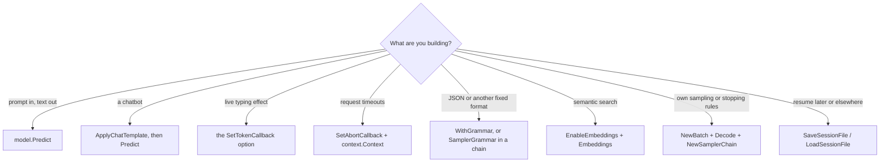
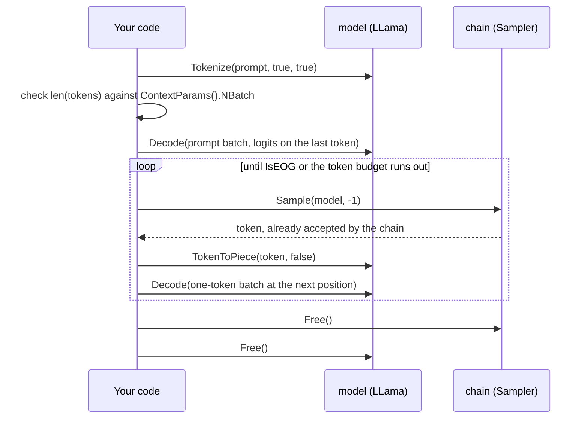
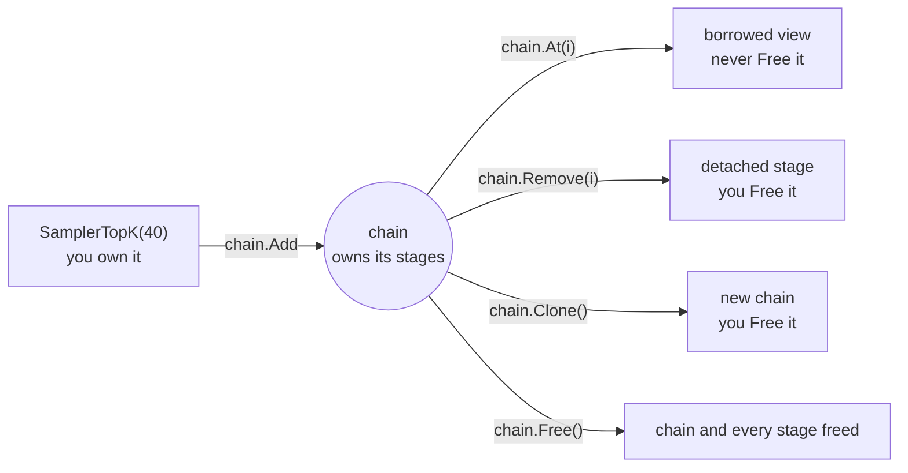

# Cookbook

Recipes for the things people build with go-llama.cpp. Each one states the problem, gives the
code, explains why it works and what to watch for, and ends with a line saying how much of it CI
proves.

## How to read this page

Every recipe ends with an **Evidence** line using one of three labels:

| Label | Meaning |
|---|---|
| **CI** | A spec in [llama_test.go](../llama_test.go) runs this against CodeLlama-7B-Instruct Q2_K on Ubuntu and macOS for every pull request. The quoted text is the spec's name, so you can search for it. |
| **compiled** | An Example in [example_test.go](../example_test.go) or [example_loop_test.go](../example_loop_test.go) contains this code, so `go vet` type-checks it on every pull request. Nothing runs it against a model. |
| **not covered** | No spec or Example exercises it yet. The recipe was checked against the source it names. Test it against your own model before you rely on it. |

Conventions:

- Snippets import the package as `llama "github.com/AshkanYarmoradi/go-llama.cpp"`.
- `model` is a `*llama.LLama` from `llama.New`, released with `defer model.Free()`.
- `log.Fatal` stands in for your own error handling.
- A snippet that starts with `package main` is a complete program. Build it as shown in
  [Getting started](getting-started.md#4-your-first-program).

Start from what you are building:



**Basics:**
[Generate text](#generate-text-with-sensible-settings) ·
[Same output twice](#get-the-same-output-twice) ·
[Stream to HTTP](#stream-to-an-http-client) ·
[Cancel with a deadline](#cancel-with-a-context-deadline) ·
[Chat templates](#chat-with-the-models-own-template)

**Structured output and search:**
[JSON with a grammar](#get-json-back-with-a-grammar) ·
[Embeddings and similarity search](#embeddings-and-similarity-search)

**Driving the model yourself:**
[Generation loop](#write-your-own-generation-loop) ·
[Sampler chains](#build-and-inspect-a-sampler-chain) ·
[Ban or boost tokens](#ban-or-boost-tokens) ·
[Context shifting](#keep-long-conversations-going) ·
[Save and resume](#save-and-resume-a-session) ·
[Perplexity](#score-text-with-perplexity)

**Running it:**
[Goroutines](#share-a-model-across-goroutines) ·
[Logs into slog](#route-llamacpp-logs-into-slog) ·
[Tokens per second](#measure-tokens-per-second) ·
[Counting tokens](#count-tokens-before-you-send-them) ·
[Start-up checks](#check-the-build-and-the-model-at-startup)

**Model files and adapters:**
[Quantize](#quantize-a-model) ·
[LoRA and control vectors](#apply-lora-adapters-and-control-vectors) ·
[GPU-side sampling](#sample-on-the-gpu-experimental) ·
[Sharp edges](#sharp-edges)

---

## Basics

### Generate text with sensible settings

You want one call: a prompt in, text out, with control over length and randomness.

```go
out, err := model.Predict("[INST] Write a haiku about Go. [/INST]",
	llama.SetTokens(64),       // at most 64 new tokens; 0 means no limit
	llama.SetTemperature(0.7), // 0 or below always picks the likeliest token
	llama.SetTopK(40),
	llama.SetTopP(0.9),
	llama.SetMinP(0.05),
	llama.SetStopWords("\n\n"), // stop at the first blank line
)
if err != nil {
	log.Fatal(err)
}
fmt.Println(out)
```

**Why it works.** `Predict` tokenizes the prompt, runs it through the model, then picks one token
at a time until it reaches the token limit, an end-of-generation token or a stop word. Each pick
goes through a chain of sampling stages. With the defaults the chain is:

- a repetition penalty over the last 64 tokens (×1.1),
- top-k 40, then top-p 0.95, then min-p 0.05,
- temperature 0.8,
- a random pick, seeded by `SetSeed`.

Optional stages join when you set them: DRY before the penalties, top-n-sigma before top-k,
typical-p after top-k, XTC after min-p. `SetMirostat(1)` or `SetMirostat(2)` replaces the
truncation stages and the random pick with temperature followed by Mirostat. A grammar from
`WithGrammar` goes first of all, then a logit bias from `SetLogitBias`.
[How it works](how-it-works.md) draws the full chain.

DRY ("don't repeat yourself") stays off until `SetDRYMultiplier` is above 0. It then penalises
tokens that would extend a sequence already repeated within its look-back window,
`SetDRYPenaltyLastN`. The default window, -1, is the whole context; 0 turns DRY off, and a larger
window is cut to the context size. `Predict`'s DRY stage has no sequence breakers, so unlike
llama.cpp's own tools, a newline or punctuation does not end a repeat.

**Gotchas.**

- A temperature of 0 or below keeps the grammar and logit bias and replaces every later stage with
  greedy selection, so neither the repetition penalty nor DRY applies.
- `Predict` clears the KV cache before it starts. Every call is independent.
- A stop word ends generation once the text ends with it, and is removed from the result. A token
  callback has already received it by then.
- With `SetTokens(0)` the model runs until it ends its turn. If the context fills first, `Predict`
  keeps the first 64 prompt tokens (`SetNKeep`), drops half of the rest and carries on. A model
  whose cache cannot shift (`MemoryCanShift` reports false, as for M-RoPE models such as
  Qwen2-VL and Qwen3.5) stops at the full context instead and returns what it generated.
- The result buffer holds 8 bytes per `SetTokens` token plus the prompt length and 1 KiB, and
  never more than 4 MiB; longer text is cut off. Stream anything long with a token callback.
- The only error is "inference failed". The cause goes to stderr or to your `SetLogHandler`.

**Evidence: CI** for `Predict`, `SetMinP` and `SetStopWords`: "predicts successfully", "predicts
with min_p sampling", "trims a stop word from the end of the result as a suffix". For DRY, "applies
DRY with the default look-back window of -1" checks that -1 and an oversized window build a
working stage and 0 a disabled one, and that `Predict` with -1 matches an explicit window (that
half skips when DRY does not change the CI model's output). `SetTemperature` and `SetTopK` run in
the regression specs (temperature 0, and top-k 1 in the DRY spec) without a check of their own.
`SetTopP` is compiled only, in `ExampleLLama_Predict`. `SetDRYMultiplier` and
`SetDRYPenaltyLastN` are also compiled in `ExampleSetDRYMultiplier`.

### Get the same output twice

You want a run you can repeat, for tests or for debugging a prompt.

```go
for range 2 {
	out, err := model.Predict(prompt,
		llama.SetSeed(42), // the default, -1, picks a new seed for every call
		llama.SetTokens(64),
	)
	if err != nil {
		log.Fatal(err)
	}
	fmt.Println(out) // the same text both times
}
```

**Why it works.** `Predict` builds a fresh sampler chain for every call and seeds its random pick
from `SetSeed`. The KV cache is cleared too, so two calls with the same prompt and options start
from the same state. `SetTemperature(0)` removes randomness altogether.

**Gotchas.** Repeatability holds for the same model file, build, backend and options. CPU, Metal
and CUDA builds round differently, so the same seed can produce different text on each.

**Evidence: compiled.** `ExampleLLama_Predict` passes `SetSeed(42)`. No spec compares two runs.

### Stream to an HTTP client

You want the reply to appear in the browser or terminal while it is generated, and generation to
stop when the client hangs up.

```go
package main

import (
	"io"
	"log"
	"net/http"
	"sync"

	llama "github.com/AshkanYarmoradi/go-llama.cpp"
)

// server streams generated text to HTTP clients. A *llama.LLama runs one
// call at a time, so requests take turns on mu.
type server struct {
	mu    sync.Mutex
	model *llama.LLama
}

func (s *server) ServeHTTP(w http.ResponseWriter, r *http.Request) {
	prompt := r.FormValue("prompt")
	if prompt == "" {
		http.Error(w, "missing prompt", http.StatusBadRequest)
		return
	}
	flusher, ok := w.(http.Flusher)
	if !ok {
		http.Error(w, "streaming unsupported", http.StatusInternalServerError)
		return
	}

	s.mu.Lock()
	defer s.mu.Unlock()

	// Stop the engine in the middle of a token if the client goes away.
	ctx := r.Context()
	s.model.SetAbortCallback(func() bool { return ctx.Err() != nil })
	defer s.model.SetAbortCallback(nil)

	w.Header().Set("Content-Type", "text/plain; charset=utf-8")
	wrote := false
	_, err := s.model.Predict(prompt,
		llama.SetTokens(512),
		llama.SetTokenCallback(func(piece string) bool {
			wrote = true // the first write sends the 200 status
			if _, err := io.WriteString(w, piece); err != nil {
				return false // the client is gone: stop generating
			}
			flusher.Flush()
			return true
		}),
	)
	if err != nil && ctx.Err() == nil {
		if !wrote {
			http.Error(w, "generation failed", http.StatusInternalServerError)
			return
		}
		log.Printf("generate: %v", err) // the reply has started, so the status is already sent
	}
}

func main() {
	model, err := llama.New("model.gguf", llama.SetContext(4096))
	if err != nil {
		log.Fatal(err)
	}
	defer model.Free()

	http.Handle("/generate", &server{model: model})
	log.Fatal(http.ListenAndServe("localhost:8080", nil))
}
```

Try it with:

```bash
curl -N --data-urlencode 'prompt=[INST] Explain goroutines in two sentences. [/INST]' \
  http://localhost:8080/generate
```

**Why it works.** The token callback runs on the goroutine that called `Predict`, once per token,
so it can write to the `ResponseWriter` directly. Returning false ends generation between tokens.
The abort callback covers the other case, a client that leaves while llama.cpp is still working
through a long prompt.

**Gotchas.**

- Pieces are raw bytes, and a multi-byte character can be split across two of them. A byte stream
  such as this one reassembles them. If you wrap each piece in its own message, as server-sent
  events or JSON do, buffer until `utf8.ValidString` reports true.
- The model is still inside this `Predict` while the callback runs. Do not call `Free`,
  `Predict`, `Decode`, `Embeddings` or anything else that changes its KV cache from the callback:
  `Predict` carries on from the cache as it left it. The binding releases its own lock before it
  calls you, so `model.SetTokenCallback` works there, as does any method of a different model
  that no other goroutine is using.
- The option covers this call only. A callback installed with `model.SetTokenCallback` is back in
  place when `Predict` returns.
- The callback never receives the end-of-generation token's text, such as `</s>`.
- The streamed text and `Predict`'s result can differ at the edges. The result drops one leading
  space, then the prompt text if the reply happens to start with it, then one leading newline, and
  a stop word at its end. When the callback returns false, the piece it was just given is not part
  of the result.
- The first write sends a 200 status. A failure before any text, such as a prompt longer than the
  context, still gets a 500; once the reply has started, the handler can only log the error.
- The handler sends the text as typed. For a chat model, render it with
  [ApplyChatTemplate](#chat-with-the-models-own-template) first.
- One model serves one request at a time. To serve several at once, see
  [Share a model across goroutines](#share-a-model-across-goroutines).

**Evidence: CI** for the per-call callback: "restores the persistent token callback after a
per-call one", "leaves the end-of-generation token out of the result and the callback", "lets a
token callback call SetTokenCallback". No spec
or Example streams over HTTP, so the handler itself is not covered. The callbacks it relies on are
compiled in `ExampleSetTokenCallback` and `ExampleLLama_SetAbortCallback`.

### Cancel with a context deadline

You want `Predict` to honour a `context.Context`, including in the middle of a long prompt.

```go
// predictWithContext stops when ctx ends and returns what it had generated
// so far, along with ctx.Err().
func predictWithContext(ctx context.Context, model *llama.LLama, prompt string) (string, error) {
	// llama.cpp polls this while it computes; true aborts the work in progress.
	model.SetAbortCallback(func() bool { return ctx.Err() != nil })
	defer model.SetAbortCallback(nil)

	var partial strings.Builder
	reply, err := model.Predict(prompt,
		llama.SetTokens(0), // no token limit: the deadline decides
		llama.SetTokenCallback(func(piece string) bool {
			partial.WriteString(piece)
			return ctx.Err() == nil // also stop between tokens
		}),
	)
	if ctx.Err() != nil {
		return partial.String(), ctx.Err()
	}
	return reply, err
}
```

Call it with a deadline:

```go
ctx, cancel := context.WithTimeout(context.Background(), 30*time.Second)
defer cancel()

reply, err := predictWithContext(ctx, model, prompt)
if errors.Is(err, context.DeadlineExceeded) {
	log.Printf("timed out; partial reply: %q", reply)
}
```

**Why it works.** A token callback can only stop generation between tokens. The abort callback
reaches inside a decode: when it returns true, llama.cpp abandons the computation, the decode
reports status 2, and `Predict` returns "inference failed". Checking `ctx.Err()` afterwards tells a
timeout from a real failure.

**Gotchas.**

- An aborted `Predict` returns no text, which is why the callback keeps a copy.
- The callback runs on an engine thread and is called very often. Keep it cheap and safe for
  concurrent use; `ctx.Err()` is both.
- llama.cpp polls the callback from its CPU backend. When every layer is offloaded to a GPU, little
  of the graph runs there, so a decode may finish before the callback is seen. The token callback
  still stops generation between tokens.
- In your own loop, `Decode` returns 2 when aborted.

**Evidence: CI.** "aborts a decode from the callback" (`Decode` returns 2, and 0 again once the
callback is removed). Also compiled in `ExampleLLama_SetAbortCallback`.

### Chat with the model's own template

You want to send a conversation without hard-coding one model's prompt format.

```go
msgs := []llama.ChatMessage{
	{Role: "system", Content: "You are terse."},
	{Role: "user", Content: "How much is 2+2?"},
}
prompt, err := model.ApplyChatTemplate("", msgs, true) // "": the template in the GGUF file
if errors.Is(err, llama.ErrNoChatTemplate) {
	prompt, err = model.ApplyChatTemplate("chatml", msgs, true) // pick the one your model was trained on
}
if err != nil {
	log.Fatal(err)
}
reply, err := model.Predict(prompt, llama.SetTokens(256))
if err != nil {
	log.Fatal(err)
}
msgs = append(msgs, llama.ChatMessage{Role: "assistant", Content: reply})
```

**Why it works.** `ApplyChatTemplate` renders the messages with llama.cpp's own template code. The
first argument selects the template:

- `""` uses the template stored in the model file.
- A name from `llama.BuiltinChatTemplates()`, such as `"chatml"`, `"llama2"`, `"llama3"` or
  `"gemma"`, uses that built-in layout.
- Template source text, such as what `GetChatTemplate` returns, is matched to the built-in layout
  it resembles.

The last argument, `true`, ends the prompt with the opening of an assistant turn. Pass `false` to
render a finished conversation, for logging or for training data. `model.GetChatTemplate("")`
returns the template text stored in the file, and `GetChatTemplate("tool_use")` a named
alternative when the file has one.

**Gotchas.**

- llama.cpp does not run a Jinja engine. It recognises a fixed set of well-known templates, and
  returns `ErrNoChatTemplate` for a file without a template or with one it cannot place.
- `Predict` remembers nothing between calls, so render the whole history again for every turn.
- The reply does not include the end-of-turn token's text, so it can go into the history as it is.
- `Predict` adds the BOS token itself for models that use one. If a prompt you build by hand
  starts with the BOS text, such as `<s>`, llama.cpp reads it as a second BOS and logs a warning
  about it. Leave it out.

**Evidence: CI.** "renders a chat with an explicit template", "omits the assistant turn when not
requested", "reports an unusable template rather than truncating", "lists the built-in templates".
The `""` path, the model's own template, is compiled only, in `ExampleLLama_ApplyChatTemplate`.

---

## Structured output and search

### Get JSON back with a grammar

You want output your code can parse, every time. A GBNF grammar restricts which tokens the model
may pick, so the text cannot leave the format.

```go
// personGrammar accepts exactly {"name": "...", "age": N}.
const personGrammar = `
root   ::= "{" ws "\"name\":" ws string "," ws "\"age\":" ws age ws "}"
string ::= "\"" [^"\\\x7F\x00-\x1F]* "\""
age    ::= [0-9]{1,3}
ws     ::= | " " | "\n" [ \t]{0,20}
`

type person struct {
	Name string `json:"name"`
	Age  int    `json:"age"`
}

func extract(model *llama.LLama, text string) (person, error) {
	prompt := "[INST] Extract the person as JSON with the keys name and age:\n" + text + " [/INST]"
	out, err := model.Predict(prompt,
		llama.WithGrammar(personGrammar), // the start rule must be called root
		llama.SetTemperature(0),          // the likeliest token the grammar allows
		llama.SetTokens(128),
	)
	if err != nil {
		return person{}, err
	}
	var p person
	err = json.Unmarshal([]byte(out), &p)
	return p, err
}
```

**Why it works.** `WithGrammar` puts a grammar stage first in `Predict`'s chain. Before each pick
it masks every token that would break the grammar, and once the grammar is complete only an
end-of-generation token remains, so the reply stops right after the closing brace. A grammar that
does not parse makes `Predict` fail with "inference failed"; the parser prints the reason to stderr
(not through `SetLogHandler`).
llama.cpp ships a general JSON grammar in `llama.cpp/grammars/json.gbnf`, next to grammars for
lists, arithmetic and more.

The same stage works in a chain of your own, with any sampling you like. Put the grammar first, so
every later stage, including the one that picks the token, sees only tokens the grammar allows:

```go
chain := llama.NewSamplerChain()
defer chain.Free()

chain.Add(model.SamplerGrammar(personGrammar, "root"))
if chain.Len() != 1 {
	log.Fatal("the grammar did not parse; the reason is on stderr")
}
chain.Add(llama.SamplerTopK(40))
chain.Add(llama.SamplerTemp(0.7))
chain.Add(llama.SamplerDist(llama.DefaultSeed))

out, err := generate(model, chain, prompt, 128) // the loop from "Write your own generation loop"
if err != nil {
	log.Fatal(err)
}
fmt.Println(out)
```

For tool calls, a lazy grammar leaves prose alone and constrains only what follows a trigger. The
trigger patterns are regular expressions, and the grammar sees the text from the match onwards, so
it starts with the trigger itself. Put it first in a chain, in place of the eager grammar above:

```go
const toolGrammar = `
root ::= "<tool_call>" ws "{" ws "\"name\":" ws "\"" [a-z_]+ "\"" ws "}" ws "</tool_call>"
ws   ::= [ \n]?
`

chain := llama.NewSamplerChain()
defer chain.Free()

chain.Add(model.SamplerGrammarLazy(toolGrammar, "root", []string{"<tool_call>"}, nil))
if chain.Len() != 1 {
	log.Fatal("the grammar did not parse; the reason is on stderr")
}
// ...then the other stages, as above.
```

**Gotchas.**

- In your own chain, a grammar that does not parse produces an empty stage, and `Add` ignores it
  without an error: generation then runs unconstrained. Check `chain.Len()` after adding it, as
  above. The parser prints the reason to stderr; llama.cpp's log gets only "failed to parse
  grammar".
- Grammar stages belong first. After a truncation stage such as top-k, or after the stage that
  picks, the grammar can be handed a token it does not allow. `Sample` then returns -1, writes the
  reason to stderr and restarts the grammar from its beginning. If that refused token is an
  end-of-generation token, llama.cpp aborts the process instead.
- `Sample` already passes the chosen token to every stage. Calling `Accept` for it again moves the
  grammar on a second time, or, when the grammar does not allow that token again, is refused: no
  stage records it, and the refusal goes to stderr.
- A grammar fixes the syntax, not the facts. Ask for the format in the prompt as well; a model
  forced into a shape it did not expect writes worse content.
- Grammar checks cost time on every token, more for large grammars.
- The token limit still applies. JSON cut off by `SetTokens` fails to unmarshal, so leave room.

**Evidence: CI** for `WithGrammar`: "constrains Predict to a WithGrammar grammar" (a yes-or-no
grammar, and an error for one that does not parse). For `SamplerGrammar` in your own chain,
"refuses sampler tokens a stage cannot take instead of aborting" samples one token through a
grammar-first chain and checks that its text is a prefix of "yes" or "no". The same spec checks
that `Accept` refuses off-grammar and out-of-vocabulary tokens, and that a grammar placed after
the picking stage makes `Sample` return -1. No spec runs a whole generation loop through a
grammar. "builds a lazy grammar stage" only builds `SamplerGrammarLazy` and adds it to a chain.
`WithGrammar` is also compiled in `ExampleWithGrammar`, and a grammar-first chain driven by
`generate` in `ExampleLLama_SamplerGrammar`.

### Embeddings and similarity search

You want to find the stored text closest in meaning to a query: the retrieval half of RAG,
deduplication, or clustering.

```go
package main

import (
	"fmt"
	"log"
	"math"
	"sort"

	llama "github.com/AshkanYarmoradi/go-llama.cpp"
)

func main() {
	model, err := llama.New("embedding-model.gguf", llama.EnableEmbeddings, llama.SetContext(2048))
	if err != nil {
		log.Fatal(err)
	}
	defer model.Free()

	fmt.Println("pooling:", model.ContextParams().Pooling) // mean, cls or last for an embedding model

	docs := []string{
		"The cat sat on the mat.",
		"Go is a statically typed, compiled language.",
		"llama.cpp runs language models on CPUs and GPUs.",
	}
	vecs := make([][]float32, len(docs))
	for i, d := range docs {
		if vecs[i], err = model.Embeddings(d); err != nil {
			log.Fatal(err)
		}
	}

	query, err := model.Embeddings("Which language compiles to native code?")
	if err != nil {
		log.Fatal(err)
	}

	order := make([]int, len(docs))
	scores := make([]float64, len(docs))
	for i, v := range vecs {
		order[i], scores[i] = i, cosine(query, v)
	}
	sort.Slice(order, func(a, b int) bool { return scores[order[a]] > scores[order[b]] })
	for _, i := range order {
		fmt.Printf("%.3f  %s\n", scores[i], docs[i])
	}
}

// cosine returns the cosine similarity of a and b: 1 for the same direction,
// 0 for unrelated.
func cosine(a, b []float32) float64 {
	var dot, na, nb float64
	for i := range a {
		dot += float64(a[i]) * float64(b[i])
		na += float64(a[i]) * float64(a[i])
		nb += float64(b[i]) * float64(b[i])
	}
	if na == 0 || nb == 0 {
		return 0
	}
	return dot / (math.Sqrt(na) * math.Sqrt(nb))
}
```

**Why it works.** `Embeddings` runs the text through the model and returns one vector, as long as
the model's output embedding width, `Architecture().EmbdOut`. That equals
`GetModelInfo().EmbeddingSize` for nearly every model; a few models project their output to a
different width. Texts with similar meaning get vectors that point in similar directions, and
cosine similarity measures that. Which vector you get depends on the model's pooling type, which
`ContextParams().Pooling` reports:

- Embedding models (BERT-style, and most models published for embeddings) pool every token into
  one vector for the whole text, by mean, CLS or last-token pooling.
- A causal chat model has no pooling (`PoolingNone`), so you get the hidden state of the last
  token, the only one that has seen the whole text. That works, but a dedicated embedding model
  usually ranks text far better.

A reranker (`PoolingRank`) returns its relevance scores instead of an embedding, one per
classifier output.

`TokenEmbeddings` embeds token ids you already have, exactly as given, without adding special
tokens. Ids from `Tokenize(text, true, true)` give the same vector as `Embeddings(text)`. Note that
it takes `[]int`, not `[]int32`. An id outside the vocabulary returns an error.

**Gotchas.**

- The model must be loaded with `EnableEmbeddings`, or switched with `model.SetEmbeddings(true)`.
  Until then `Embeddings` and `TokenEmbeddings` return an error, and they do again after
  `SetEmbeddings(false)`. Switch back that way before you call `Predict` on the same model.
- Text longer than `ContextParams().NBatch` tokens returns an error. Split long documents into
  chunks, or load with a larger `SetNBatch` and `SetContext` (a generative model caps the batch
  size at the context size).
- Each call clears the KV cache first, as `Predict` does, and ignores any `PredictOption`s passed
  to it.
- Many embedding models expect a task prefix, such as `search_query: ` for queries and
  `search_document: ` for documents. Check the model card; without it, rankings get worse.
- Compare vectors only from the same model file. Store the model's name next to every vector.
- A linear scan is fine for thousands of vectors. Beyond that, use a vector index.

**Evidence: CI** for the calls: "returns one n_embd vector per text from Embeddings", "embeds
token ids directly with TokenEmbeddings", "rejects input longer than NBatch instead of aborting",
"lets SetEmbeddings change what Embeddings accepts". The CI model is a causal one, so those specs
check last-token embeddings, whose width there is `n_embd`. Pooled embedding models, rerankers,
models with a separate output width and the quality of the ranking are not covered. The recipe's
calls are also compiled in `ExampleLLama_Embeddings`.

---

## Driving the model yourself

### Write your own generation loop

You want sampling, stopping or cache handling that `Predict` does not offer: your own sampler
chain, a stop rule on token ids, a cache you keep between calls. Write the loop `Predict` runs.



```go
// generate decodes prompt, then samples up to maxTokens tokens from chain,
// stopping at the model's end-of-generation token.
func generate(model *llama.LLama, chain *llama.Sampler, prompt string, maxTokens int) (string, error) {
	model.MemoryClear(true) // start from an empty cache, as Predict does

	tokens := model.Tokenize(prompt, true, true) // add BOS, parse chat-template markup
	if len(tokens) == 0 {
		return "", errors.New("empty prompt")
	}
	if n := model.ContextParams().NBatch; len(tokens) > n {
		return "", fmt.Errorf("prompt is %d tokens; one Decode takes at most %d", len(tokens), n)
	}

	batch := llama.NewBatch(len(tokens), 1)
	defer batch.Free()
	for i, t := range tokens {
		// Only the last prompt token needs logits: it is the one sampled from.
		if err := batch.Add(t, int32(i), []int32{0}, i == len(tokens)-1); err != nil {
			return "", err
		}
	}

	var out strings.Builder
	pos := int32(len(tokens))
	for range maxTokens {
		switch rc := model.Decode(batch); rc {
		case 0:
		case 1:
			return out.String(), errors.New("the context is full")
		case 2:
			return out.String(), errors.New("stopped by the abort callback")
		default:
			return out.String(), fmt.Errorf("decode failed with status %d", rc)
		}

		next := chain.Sample(model, -1) // Sample also accepts the token: no Accept call
		if next < 0 {
			return out.String(), errors.New("the sampler gave no token; the reason is on stderr")
		}
		if model.IsEOG(next) {
			break
		}
		out.WriteString(model.TokenToPiece(next, false))

		batch.Reset()
		if err := batch.Add(next, pos, []int32{0}, true); err != nil {
			return out.String(), err
		}
		pos++
	}
	return out.String(), nil
}
```

Build a chain and call it. These are `Predict`'s default stages, in its order:

```go
chain := llama.NewSamplerChain()
defer chain.Free() // frees every stage too
chain.Add(model.SamplerPenalties(64, 1.1, 0, 0))
chain.Add(llama.SamplerTopK(40))
chain.Add(llama.SamplerTopP(0.95, 1))
chain.Add(llama.SamplerMinP(0.05, 1))
chain.Add(llama.SamplerTemp(0.8))
chain.Add(llama.SamplerDist(llama.DefaultSeed)) // DefaultSeed asks for a random seed

text, err := generate(model, chain, "[INST] Name three Go proverbs. [/INST]", 128)
if err != nil {
	log.Fatal(err)
}
fmt.Println(text)
```

**Why it works.** `Decode` runs a batch through the model and stores the logits of every token
that asked for them. `Sample(model, -1)` runs those of the last output through the chain and
returns the chosen token. Feeding that token back at the next position extends the sequence by
one, and the loop repeats.

**Gotchas.**

- `Sample` already accepts the token into the chain, which is how penalties see history. Never call
  `Accept` after it; `Accept` is for tokens you chose some other way.
- Sample only from an output that requested logits, with the last argument of `Batch.Add`.
  Sampling any other position ends the process with an engine assertion, and so does a chain
  without a stage that picks a token (`SamplerGreedy`, `SamplerDist`, `SamplerMirostatV2`).
- `Sample` returns -1 when it has no token for you: the sampler is empty, or a grammar stage
  refused the pick (see [the grammar recipe](#get-json-back-with-a-grammar)). The loop above stops
  with an error then. Without that check, -1 would go into the next batch, which `Batch.Add`
  accepts and `Decode` rejects with status -1.
- Stop on `IsEOG`, not on one end-of-sequence id. Many models have several end-of-turn tokens.
- One `Decode` takes at most `ContextParams().NBatch` tokens and returns -1 for a larger batch.
  Feed a longer prompt in several batches, positions continuing from one to the next.
- Status 1 means the KV cache is full. [Shift the context](#keep-long-conversations-going) and
  carry on, or stop.
- `TokenToPiece(next, false)` renders control tokens as empty text, and an id outside the
  vocabulary too. Pieces can split a multi-byte character, so join them before you treat the text
  as runes.
- Call `chain.Reset()` before reusing a chain for an unrelated prompt; it clears the penalty
  history and any grammar state.
- `Predict` clears the KV cache, so do not mix it with this loop on the same model mid-conversation.

**Evidence: CI** for each step: "decodes a batch and returns next-token logits", "builds a chain
and samples a valid token", "describes individual tokens" (`IsEOG`). The whole loop is compiled
only, in `Example_generationLoop`.

### Build and inspect a sampler chain

You want to know who owns which sampler, and how to look inside a chain.



```go
chain := llama.NewSamplerChain()
defer chain.Free() // frees every stage added below

chain.Add(llama.SamplerTopK(40))
chain.Add(llama.SamplerTemp(0.8))
chain.Add(llama.SamplerDist(1234)) // the last stage picks the token

fmt.Println(chain.Len())                                   // 3
fmt.Println(strings.Contains(chain.At(0).Name(), "top-k")) // true
fmt.Println(chain.At(2).Seed())                            // 1234

clone := chain.Clone() // an independent copy, state included
defer clone.Free()
// Remove hands the stage back to you, so free it.
clone.Remove(0).Free()
fmt.Println(clone.Len(), chain.Len()) // 2 3
```

**Why it works.** `Add` transfers ownership: the chain frees its stages when you free the chain.
`At` lends you a stage that stays the chain's. `Remove` and `Clone` give you samplers that are
yours to free.

Order the stages the way `Predict` does:

1. Stages that rule tokens in or out: grammar, then logit bias. A grammar anywhere later can be
   handed a token it refuses, and `Sample` then returns -1.
2. Penalties: DRY, then repetition (`SamplerDRY`, then `SamplerPenalties`).
3. Truncation: top-n-sigma, top-k, typical-p, top-p, min-p, XTC.
4. Temperature.
5. Exactly one selecting stage, last: `SamplerDist`, `SamplerGreedy` or `SamplerMirostatV2`.

**Gotchas.**

- Match `Name()` by substring. llama.cpp decorates names to show a stage's state, for example
  `"?top-k"` for a stage whose parameters disable it.
- Grammar, lazy-grammar and infill stages (`SamplerGrammar`, `SamplerGrammarLazy`,
  `SamplerInfill`) keep a pointer to the model's vocabulary. Free them, or their chain, before the
  model. `SamplerPenalties`, `SamplerDRY` and `SamplerLogitBias` only read the vocabulary when
  they are built.
- `SamplerDRY`'s last argument is its look-back window: -1 for the context size, 0 to disable the
  stage (its `Name` is then `"?dry"`), and anything larger than the context is cut to the context
  size. A DRY stage the engine cannot allocate comes back empty, and `Add` ignores it.
- Chain operations on a single stage (`Len`, `At`, `Remove`, `Add`) are safe no-ops. They do not
  turn the stage into a chain.
- `chain.Perf()` reports sampling time and count for the chain.

**Evidence: CI.** "reports stage names, count and seeds", "removes a stage and hands over
ownership", "clones a chain independently", "treats a single stage's chain operations as safe
no-ops", "applies DRY with the default look-back window of -1". Also compiled in
`ExampleNewSamplerChain` and `ExampleSampler_Clone`.

### Ban or boost tokens

You want to stop the model from producing a particular token, or nudge it towards one.

```go
// After a Decode or Predict, find the model's favourite next token...
greedy := llama.NewSamplerChain()
greedy.Add(llama.SamplerGreedy())
favourite := greedy.Sample(model, -1)
greedy.Free()

// ...then ban it. The bias stage goes first so every later stage sees it.
banned := llama.NewSamplerChain()
defer banned.Free()
banned.Add(model.SamplerLogitBias([]llama.LogitBias{{Token: favourite, Bias: -1e9}}))
banned.Add(llama.SamplerGreedy())

fmt.Println(banned.Sample(model, -1) != favourite) // true
```

With `Predict`, a single token can be biased with a `"token(+|-)value"` string:

```go
out, err := model.Predict(prompt, llama.SetLogitBias("15043-100")) // token 15043, bias -100
if err != nil {
	log.Fatal(err)
}
fmt.Println(out)
```

**Why it works.** A logit bias adds a fixed amount to a token's score before any other stage
looks at it. A large negative bias bans the token, and a positive one makes it more likely.

**Gotchas.**

- Find token ids with `model.Tokenize(word, false, false)`. A word can be several tokens, and the
  same text gets different tokens with and without a leading space. Banning every piece of a word
  also bans those pieces everywhere else.
- `SetLogitBias` takes one token. A malformed string is reported on stderr and ignored, not
  returned as an error. Use `SamplerLogitBias` in your own chain for several tokens.
- An empty bias list produces an empty stage, which `Add` ignores.

**Evidence: CI.** "bans a token with a large negative logit bias", "ignores an empty logit bias
list", "applies logit bias during generation" (the string form runs; its effect is not checked),
"ignores a malformed logit bias".
Also compiled in `ExampleLLama_SamplerLogitBias`.

### Keep long conversations going

Your own loop got status 1 from `Decode`: the KV cache is full. Drop the oldest tokens after a
prefix you want to keep, such as the system prompt, and slide the rest back.

```go
// shift frees n positions by dropping the n tokens after the first keep and
// moving the rest down. It returns the position for the next token.
func shift(model *llama.LLama, keep, n int32) (int32, error) {
	if !model.MemoryCanShift() {
		return 0, errors.New("this model's cache cannot shift positions")
	}
	if !model.MemorySeqRemove(0, keep, keep+n) {
		return 0, errors.New("could not remove tokens from the cache")
	}
	model.MemorySeqAdd(0, keep+n, -1, -n)
	return model.MemorySeqPosMax(0) + 1, nil
}
```

In the [generation loop](#write-your-own-generation-loop), call it before adding the next token
once `pos` reaches `ContextParams().NCtxSeq`, for example with `n = (pos - keep) / 2`, then add the
token at the position it returns.

**Why it works.** `MemorySeqRemove` evicts positions `[keep, keep+n)` of sequence 0.
`MemorySeqAdd` then moves every later position down by `n`, so the cache is contiguous again and
has `n` free cells. `Predict` does the same when its context fills, keeping the first `SetNKeep`
tokens (default 64).

**Gotchas.**

- The model forgets the dropped text. Keep the instructions it must not lose in the `keep` prefix.
- Not every cache can shift; check `MemoryCanShift`. Without it, start over with a shorter
  history.
- A negative `p1` means "to the end", which is what `MemorySeqAdd` needs here.
- `MemorySeqRemove` returns false for a sequence id the context does not hold, and a negative id
  removes from every sequence. `MemorySeqAdd` does nothing for an id out of range.

**Evidence: CI.** "tracks KV-cache sequence positions across a decode" (removes the oldest token and
slides the rest back). Also compiled in `ExampleLLama_MemorySeqAdd`.

### Save and resume a session

You want to stop a conversation and pick it up later, possibly in another process, without
processing the prompt again.

```go
// After decoding with your own loop, save the cache and every token in it, in order.
if err := model.SaveSessionFile("chat.session", tokens); err != nil {
	log.Fatal(err)
}
```

Later, with the same model file and the same load options:

```go
tokens, err := model.LoadSessionFile("chat.session")
if err != nil {
	log.Fatal(err)
}

// The file holds the cache but not the logits. Remove the last token from the
// cache and decode it again, so there are logits to sample from.
last := int32(len(tokens) - 1)
if !model.MemorySeqRemove(0, last, -1) {
	log.Fatal("cannot remove the last token")
}
batch := llama.NewBatch(1, 1)
defer batch.Free()
if err := batch.Add(tokens[last], last, []int32{0}, true); err != nil {
	log.Fatal(err)
}
if rc := model.Decode(batch); rc != 0 {
	log.Fatalf("decode: status %d", rc)
}
// Sample from here, with new tokens starting at position len(tokens).
```

**Why it works.** A session file stores the KV cache together with the tokens it was built from,
so another process can see exactly what the model has read. llama.cpp saves the cache only, not
the logits of the last step, which is why the last token is decoded once more.

For checkpoints in memory, `model.StateData()` returns the same state as a byte slice and
`model.SetStateData(data)` restores it, which suits rolling back a branch you explored. On a
sliding-window model, `SequenceStateDataWith(0, llama.SeqStatePartialOnly)` captures only the
window the model still attends to, a much smaller checkpoint.

**Gotchas.**

- `Predict` clears the cache when it starts, so continue a restored session with your own loop.
- Restore into a context created from the same model file with the same options. A mismatch is not
  detected and misbehaves.
- The token list must match the cache. Save every prompt and generated token, in order.
- `SaveState` and `LoadState` are the older file pair: the same bytes as `StateData`, without the
  token list. Prefer session files, which carry the tokens.
- The per-sequence calls (`SequenceStateData`, `SequenceStateSize`, `SaveSequenceFile` and their
  `With` variants) take a sequence id in `[0, ContextParams().NSeqMax)`, or -1 for every
  sequence. Any other id reports size 0, returns an error, and writes no file.
- `SeqStateOnDevice` leaves the data in the context. Its bytes restore only into the same
  `LLama`, from the latest on-device capture of that sequence, with the same flags; anything else
  returns an error.

**Evidence: CI.** "round-trips a session file with its token list", "round-trips whole-context
state in memory", "captures a smaller checkpoint with partial-only state", "restores a SaveState
file into a fresh context", "round-trips one sequence without disturbing the others", "reports no
sequence state for ids the context does not hold", "restores on-device sequence state only from
its latest capture". Also compiled in `ExampleLLama_SaveSessionFile`.

### Score text with perplexity

You want to know how likely a model finds a text: to compare models or quantizations, or to rank
candidate answers. Perplexity is the exponent of the average negative log-probability per token;
lower is better.

```go
func perplexity(model *llama.LLama, text string) (float64, error) {
	model.MemoryClear(true)
	tokens := model.Tokenize(text, true, false)
	if n := model.ContextParams().NBatch; len(tokens) < 2 || len(tokens) > n {
		return 0, fmt.Errorf("need between 2 and %d tokens, got %d", n, len(tokens))
	}

	batch := llama.NewBatch(len(tokens), 1)
	defer batch.Free()
	for i, t := range tokens {
		if err := batch.Add(t, int32(i), []int32{0}, true); err != nil { // logits everywhere
			return 0, err
		}
	}
	if rc := model.Decode(batch); rc != 0 {
		return 0, fmt.Errorf("decode: status %d", rc)
	}

	// Logits(i) predicts token i+1. Sum the negative log-softmax of each actual next token.
	var nll float64
	for i := range len(tokens) - 1 {
		logits := model.Logits(i)
		peak := slices.Max(logits)
		var sum float64
		for _, l := range logits {
			sum += math.Exp(float64(l - peak))
		}
		nll -= float64(logits[tokens[i+1]]-peak) - math.Log(sum)
	}
	return math.Exp(nll / float64(len(tokens)-1)), nil
}
```

**Why it works.** Asking for logits at every position gets all the model's predictions from a
single `Decode`. Subtracting the largest logit before exponentiating keeps the softmax numerically
stable.

**Gotchas.** This scores one batch, so at most `NBatch` tokens. For longer texts, score windows and
combine them. This replaces go-skynet's removed `SetPerplexity`.

**Evidence: compiled.** `Example_perplexity`. No spec reads `Logits(i)` at an index other than -1.

---

## Running it

### Share a model across goroutines

You want to serve concurrent requests. A `*llama.LLama` is not safe for concurrent use: its
context has one KV cache, and `Predict` clears it. Serialize access, or keep several models.

One model, one caller at a time:

```go
type lockedModel struct {
	mu    sync.Mutex
	model *llama.LLama
}

func (m *lockedModel) Predict(prompt string, opts ...llama.PredictOption) (string, error) {
	m.mu.Lock()
	defer m.mu.Unlock()
	return m.model.Predict(prompt, opts...)
}
```

Several requests in parallel, one model each:

```go
// Pool hands each caller a model of its own. n models serve n requests at once.
type Pool struct {
	idle chan *llama.LLama
}

func NewPool(n int, path string, opts ...llama.ModelOption) (*Pool, error) {
	p := &Pool{idle: make(chan *llama.LLama, n)}
	for range n {
		m, err := llama.New(path, opts...)
		if err != nil {
			p.Close()
			return nil, err
		}
		p.idle <- m
	}
	return p, nil
}

// Predict waits for an idle model, or for ctx to end, then runs one generation.
func (p *Pool) Predict(ctx context.Context, prompt string, opts ...llama.PredictOption) (string, error) {
	var m *llama.LLama
	select {
	case m = <-p.idle:
	case <-ctx.Done():
		return "", ctx.Err()
	}
	defer func() { p.idle <- m }()

	m.SetAbortCallback(func() bool { return ctx.Err() != nil })
	defer m.SetAbortCallback(nil)

	out, err := m.Predict(prompt, opts...)
	if ctx.Err() != nil {
		return "", ctx.Err()
	}
	return out, err
}

// Close frees the idle models. Call it once every Predict has returned.
func (p *Pool) Close() {
	for {
		select {
		case m := <-p.idle:
			m.Free()
		default:
			return
		}
	}
}
```

**Why it works.** Each model in the pool has its own context and KV cache, and the channel makes
sure only one goroutine holds a model at a time. A request waits for a free model or gives up when
its context ends.

**Gotchas.**

- Every model in the pool has its own KV cache, and its own copy of any layers offloaded to the
  GPU. Size `n` from memory, not from the number of CPUs.
- Divide the CPU between the models: `model.SetThreads` on each, so that `n` times the thread count
  stays within your cores.
- The log handler is process-wide and receives every model's log lines, from engine threads.
- Several conversations can also share one context as separate sequences. That needs a context
  loaded with the `SetNSeqMax` option (llama.cpp's `n_seq_max`, default 1) and your own `Decode`
  loop, because `Predict` always uses sequence 0 and clears every sequence. Each sequence gets its
  own share of the context, `ContextParams().NCtxSeq` tokens, which the engine rounds up to a
  multiple of 256. `New` fails when the count exceeds `MaxParallelSequences()` or the batch size:
  the smaller of `SetNBatch` and `SetContext` (the training context when `SetContext` is 0).
  Sequences separate conversations, not callers: calls still have to be serialized.

**Evidence: not covered.** No spec runs a model from several goroutines. Reviewed against
`llama.go`. Multiple sequences in one context are CI-tested: "opens sequence ids above 0 with
SetNSeqMax" (including both load failures), "ignores sequence ids the context does not hold".

### Route llama.cpp logs into slog

You want llama.cpp's log lines in your structured log, at the right levels, or not at all.

```go
// slogHandler turns llama.cpp log records into slog records. llama.cpp builds
// some lines from several calls (LogLevelCont), so text is buffered until a
// newline arrives.
type slogHandler struct {
	mu     sync.Mutex // llama.cpp logs from its own threads
	logger *slog.Logger
	level  slog.Level
	buf    strings.Builder
}

func (h *slogHandler) handle(level llama.LogLevel, text string) {
	h.mu.Lock()
	defer h.mu.Unlock()
	if level != llama.LogLevelCont {
		h.flush() // a new record: finish the previous one
		h.level = slogLevel(level)
	}
	h.buf.WriteString(text)
	if strings.HasSuffix(text, "\n") {
		h.flush()
	}
}

func (h *slogHandler) flush() {
	if msg := strings.TrimSpace(h.buf.String()); msg != "" {
		h.logger.Log(context.Background(), h.level, msg, "source", "llama.cpp")
	}
	h.buf.Reset()
}

func slogLevel(l llama.LogLevel) slog.Level {
	switch l {
	case llama.LogLevelError:
		return slog.LevelError
	case llama.LogLevelWarn:
		return slog.LevelWarn
	case llama.LogLevelInfo:
		return slog.LevelInfo
	default:
		return slog.LevelDebug
	}
}
```

Install it before you load a model:

```go
h := &slogHandler{logger: slog.Default()}
llama.SetLogHandler(h.handle)
defer llama.SetLogHandler(nil) // nil hands the output back to stderr
```

To silence llama.cpp instead, install a handler that discards everything:

```go
llama.SetLogHandler(func(llama.LogLevel, string) {})
```

**Why it works.** `SetLogHandler` replaces llama.cpp's stderr logger with your function. Records
arrive with their trailing newline, and a `LogLevelCont` record continues the previous one, so
buffering until the newline gives one slog record per line.

**Gotchas.**

- The handler is called from engine threads, sometimes at the same time. Guard shared state, and
  do not call back into the package from it.
- llama.cpp's logger is global: one handler serves every model in the process.
  `LogHandlerInstalled` reports whether yours is still active.
- `SetLogHandler(nil)` restores stderr output; it does not silence anything.
- Messages from the binding's own C++ code go straight to stderr, bypassing the handler: for
  example `prompt is too long` from `Predict`, and the reasons `Sampler.Accept` and
  `Sampler.Sample` give when they refuse a token.

**Evidence: CI.** "names the log levels", "installs and removes the handler", "captures the
engine's output during a model load", "stops delivering after the handler is removed". Also compiled
in `ExampleSetLogHandler`.

### Measure tokens per second

You want numbers, not impressions, before you change threads, quantization or GPU layers.

```go
model.PerfReset()
if _, err := model.Predict(prompt, llama.SetTokens(128)); err != nil {
	log.Fatal(err)
}
p := model.Perf()
fmt.Printf("prompt: %d tokens at %.1f tokens/s\n",
	p.PromptTokens, float64(p.PromptTokens)/(p.PromptEvalMS/1000))
fmt.Printf("generation: %d tokens at %.1f tokens/s\n",
	p.EvalTokens, float64(p.EvalTokens)/(p.EvalMS/1000))
```

Then change one thing and measure again. The thread counts are the usual first knob:

```go
model.SetThreads(8, 8) // generation, prompt processing; the context starts with 4 each
gen, batch := model.Threads()
fmt.Println(gen, batch) // 8 8
```

`llama.SetThreads(n)`, the `PredictOption`, changes the count for a single `Predict` call and puts
the context's own setting back afterwards.

**Why it works.** `Perf` returns llama.cpp's own counters. Prompt processing (many tokens per
decode) and generation (one token per decode) are timed separately, because they run at very
different speeds.

**Gotchas.**

- The counters add up from load time until `PerfReset`. Reset before the call you measure.
- `PromptTokens` and `EvalTokens` never read below 1, even when nothing ran. Use the timings to
  tell whether anything happened.
- Measure a warm model; the first call after loading pays for page faults and GPU set-up.
- In your own loop, `chain.Perf()` adds sampling time.

**Evidence: CI.** "accumulates and resets performance counters", "round-trips the thread counts",
"applies the SetThreads option to one call and restores the context's setting". Also compiled in
`ExampleLLama_SetThreads`.

### Count tokens before you send them

You want to know whether a prompt fits before `Predict` fails on it.

```go
// BOS when the model asks for one, special markup parsed: exactly as Predict tokenizes.
tokens := model.Tokenize(prompt, model.GetVocabAddBOS(), true)
p := model.ContextParams()
fmt.Printf("%d of %d tokens\n", len(tokens), p.NCtxSeq)
if len(tokens) > p.NCtxSeq-4 {
	log.Fatal("too long: Predict would fail with \"inference failed\"")
}
```

**Why it works.** `Tokenize` uses the model's own tokenizer, so the count is exact.
`ContextParams` reports the context the engine actually created, after rounding. `Predict` runs on
sequence 0, which holds `NCtxSeq` tokens; that equals `NCtx` unless the model was loaded with the
`SetNSeqMax` option.

**Gotchas.**

- Leave room for the reply. A prompt that fits with no space left makes `Predict` shift the context
  as soon as it starts generating.
- `GetModelInfo().ContextLength` is the length the model was trained with, not what you loaded.
- `Tokenize` returns `[]int32`, which the rest of the low-level API takes. `TokenizeString` is the
  older form, kept for compatibility; it returns the same tokens with their count.

**Evidence: CI.** "tokenizes and detokenizes round-trip", "returns every token from
TokenizeString", "reports the geometry the context actually uses". Also compiled in
`ExampleLLama_Tokenize`.

### Check the build and the model at startup

You want to log what the binary can do and what the model is, before the first slow reply surprises
you.

```go
log.Printf("llama.cpp %s, GPU offload: %v", llama.Version(), llama.SupportsGPUOffload())
log.Print(llama.SystemInfo()) // CPU features and compiled-in backends

info := model.GetModelInfo()
arch := model.Architecture()
p := model.ContextParams()
log.Printf("%s, %s, %d layers", info.Description, arch.FileTypeName, info.LayerCount)
log.Printf("context: trained %d, loaded %d, batch %d", info.ContextLength, p.NCtx, p.NBatch)
if name, ok := model.ModelMetadataValue("general.architecture"); ok {
	log.Printf("architecture: %s", name)
}
```

**Why it works.** The package-level functions describe the compiled library and need no model.
The model methods read the GGUF header and the context llama.cpp created.

**Gotchas.** `SupportsGPUOffload` reports whether the build can see a GPU to offload to, not what
the model uses: layers run on the GPU only with `SetGPULayers`. The load log's
`offloaded N/M layers to GPU` line tells you how many did.

**Evidence: CI.** "returns system info string", "reports a llama.cpp version", "reports capability
flags without a loaded model", "returns model info", "reports the model architecture", "exposes
model metadata". Also compiled in `ExampleSupportsGPUOffload` and `ExampleLLama_GetModelInfo`.

---

## Model files and adapters

### Quantize a model

You have a full-precision GGUF and want a smaller one, from Go.

```go
opts := llama.QuantizeOptions{
	FileType:             15, // LLAMA_FTYPE_MOSTLY_Q4_K_M in llama.cpp/include/llama.h
	Threads:              runtime.NumCPU(),
	QuantizeOutputTensor: true, // as llama-quantize does; false keeps output.weight at higher precision
}
if err := llama.Quantize("model-f16.gguf", "model-q4_k_m.gguf", opts); err != nil {
	log.Fatal(err)
}
fmt.Println("wrote", llama.FileTypeName(15)) // wrote Q4_K - Medium
```

Common `FileType` values from `llama.h`:

| Value | Type | Notes |
|---|---|---|
| 7 | `Q8_0` | close to full quality, about half the size of F16 |
| 18 | `Q6_K` | |
| 17 | `Q5_K_M` | |
| 15 | `Q4_K_M` | the usual default |
| 10 | `Q2_K` | smallest of these, noticeably worse |

**Why it works.** `Quantize` does the work of llama.cpp's `llama-quantize` tool, in-process, and
needs no loaded model. `FileTypeName` turns a value into llama.cpp's name for it.

**Gotchas.**

- The zero value of `QuantizeOptions` keeps `output.weight` at its original precision, unlike
  `llama-quantize`. Set `QuantizeOutputTensor: true` to match the tool.
- Quantize from F16 or F32. Re-quantizing an already quantized file needs `AllowRequantize` and
  loses more quality.
- It takes minutes and a lot of memory for a large model.
- `QuantizeDryRun(in, fileType, threads)` computes the result's size without writing it, and
  reports the sizes only through llama.cpp's log. Capture them with a
  [log handler](#route-llamacpp-logs-into-slog).
- For a model split into shards, pass the `-00001-of-0000N.gguf` file to `llama.New`; use
  `NewFromSplits` when the shards are named some other way.

**Evidence: CI** for `Quantize`'s error path only: "reports an error for an unreadable
quantization input". A successful quantization is compiled only, in `ExampleQuantize`. Loading
through `NewFromSplits` is CI-tested with a single file: "loads a single-file model through the
splits path".

### Apply LoRA adapters and control vectors

You want to change a loaded model's behaviour without loading a different model.

```go
if err := model.ApplyLoRA("adapter.gguf", 1.0); err != nil { // scale 1.0 applies it fully
	log.Fatal(err)
}
fmt.Println(model.LoRACount()) // 1
if alpha, ok := model.LoRAMetadataValue(0, "adapter.lora.alpha"); ok {
	fmt.Println("alpha:", alpha)
}
// ... generate ...
model.ClearLoRA() // back to the base weights
```

A control vector adds a direction to the model's hidden state on a range of layers:

```go
info := model.GetModelInfo()
vec := make([]float32, info.EmbeddingSize*info.LayerCount) // one direction per layer, from layer 1
// ... fill vec with your steering directions ...
if err := model.SetControlVector(vec, info.EmbeddingSize, 10, 20); err != nil { // layers 10 to 20
	log.Fatal(err)
}
// ... generate ...
if err := model.ClearControlVector(); err != nil {
	log.Fatal(err)
}
```

**Why it works.** Adapters stack: each `ApplyLoRA` adds to the active set, and `ClearLoRA` removes
them all. `SetControlVector` hands the vector to llama.cpp, which adds it to the residual stream of
the chosen layers.

**Gotchas.**

- An adapter must be trained for the same base model.
- An adapter loaded at start-up with the `SetLoraAdapter` option is not tracked: `LoRACount` does
  not count it, and the first `ApplyLoRA` detaches it. Prefer `ApplyLoRA`.
- Control vector data starts at layer 1, with `EmbeddingSize` floats per layer. A length that is
  not a multiple of the embedding size is rejected with an error.

**Evidence: CI** for the plumbing only: "reports an empty adapter set on a fresh model", "reports
an error for a missing LoRA adapter", "applies and clears a control vector" (with an all-zero
vector). No spec applies a real adapter or measures a steering effect.

### Sample on the GPU (experimental)

You want sampling to run inside the compute graph, so a full vocabulary of logits is not copied
back to the CPU for every token. llama.cpp marks this experimental.

```go
// Create the chain before the model, so its deferred Free runs after the model's.
chain := llama.NewSamplerChain()
defer chain.Free()
chain.Add(llama.SamplerTopK(40))
chain.Add(llama.SamplerTemp(0.8))
chain.Add(llama.SamplerDist(1234))

model, err := llama.New("model.gguf", llama.SetGPULayers(99))
if err != nil {
	log.Fatal(err)
}
defer model.Free()

if !model.SetSequenceSampler(0, chain) {
	log.Print("backend sampling unavailable; sample with chain.Sample instead")
}

// After each Decode:
tok := model.SampledToken(-1) // -1 when the backend sampled nothing
fmt.Println(tok, model.SampledCandidates(-1), model.SampledProbs(-1))
```

**Why it works.** An attached chain runs on the backend as part of `Decode`, and you read its
choice with `SampledToken`. `SampledCandidates` and `SampledProbs` show what the chain kept. The
CPU backend runs it too, which is how CI tests it; the saving matters when the model runs on a
GPU.

**Gotchas.**

- Attach a chain from `NewSamplerChain`. A single stage is rejected.
- The chain must stay alive while it is attached. `model.SetSequenceSampler(0, nil)` detaches it.
- While attached, the chain also decides for `Predict` and `Sampler.Sample` on that sequence.
- Reading a token does not advance the chain's state; that happens when the token is accepted.

**Evidence: CI.** "samples on the backend when a chain is attached", "rejects a bare stage and
detaches with a nil or empty chain", "detaches a backend sampler with a nil chain", "reports no
sampled output when no sampler is attached".

---

## Sharp edges

Mistakes the compiler will not catch:

- **Resuming with `Predict`.** `Predict` clears the KV cache before it starts, so a restored
  session or state is discarded. Continue with your own loop.
- **Calling `Accept` after `Sample`.** `Sample` has already accepted the token. A second accept
  doubles the penalty history and moves a grammar stage on twice. If the grammar does not allow
  the token again, `Accept` refuses it: no stage records it, and the reason goes to stderr.
- **A grammar stage after top-k or the picking stage.** The grammar can then be handed a token it
  refuses. `Sample` returns -1 and restarts the grammar; if the refused token ends generation,
  llama.cpp aborts the process. Put grammar stages first.
- **Sampling where no logits were requested.** `Sample` on such an output trips an engine
  assertion, which ends the process; `recover` cannot catch it. A chain with no stage that picks a
  token does the same.
- **Sequence ids out of range.** A context holds one sequence (id 0) unless it was loaded with
  the `SetNSeqMax` option. Keep ids within `[0, ContextParams().NSeqMax)`. Outside it, `Decode`
  returns -1, `MemorySeqRemove` returns false, the position queries return -1, and the other
  `MemorySeq*` methods do nothing. A negative id passed to `MemorySeqRemove` means every
  sequence. The sequence-state calls accept -1 for every sequence and treat any other id as
  absent: size 0, an error, no file.
- **Token ids outside the vocabulary.** `TokenToPiece` returns `""` for one, and `Detokenize`
  returns `""` for the whole slice if any id is out of range, so one bad id empties the text.
  `TokenText`, `TokenScore`, `TokenAttr` and `IsControlToken` return their zero value, as they do
  for every token of a model without a vocabulary (`VocabNone`).
- **Re-entering a busy model.** A token callback runs in the middle of `Predict`, which carries on
  from the KV cache as it left it. Calling `Free`, `Predict`, `Decode`, `Embeddings` or anything
  else that changes that cache (`MemoryClear`, the `MemorySeq*` edits, `LoadState`,
  `SetStateData` and the other state loaders) on the same model from inside it is not supported.
  The binding releases its own lock before calling you, so `model.SetTokenCallback` is safe there,
  and so is a different model that no other goroutine is using.
- **Oversized batches.** `Decode` returns -1 for a batch larger than `ContextParams().NBatch`, and
  `Encode` for one larger than `ContextParams().NUbatch`. Treat any negative status as an error,
  not as "try again".
- **Treating "inference failed" as a diagnosis.** It is the only error `Predict` returns. The cause
  is on stderr or in your log handler, or in `ctx.Err()` if you set an abort callback.
- **Overriding RoPE by habit.** By default a model runs with the RoPE base and scale it was trained
  with. `WithRopeFreqBase` and `WithRopeFreqScale` replace them for the model's lifetime, so pass
  them only to stretch a context on purpose. The `Predict`-side `SetRopeFreqBase` and
  `SetRopeFreqScale` do nothing.
- **A tensor split that does not parse.** `SetTensorSplit` takes one proportion per device, such as
  `"3,1"`. Devices it does not name get none, and entries past `MaxDevices()` are dropped with a
  warning on stderr. One entry that is not a number discards the whole split, so llama.cpp's own
  split by free memory is used, and `New` still succeeds.
- **Options marked Deprecated.** These are accepted and do nothing: `SetModelSeed`,
  `EnableF16Memory`, `EnabelLowVRAM` and `SetLoraBase` among the load options; `IgnoreEOS`,
  `EnableF16KV`, `SetPathPromptCache`, `EnablePromptCacheAll`, `EnablePromptCacheRO`, `SetMlock`,
  `SetMemoryMap`, `SetRopeFreqBase`, `SetRopeFreqScale`, `SetNDraft`, `SetTailFreeSamplingZ`,
  `SetPenalizeNL`, `SetPredictionMainGPU` and `SetPredictionTensorSplit` among the `Predict`
  options. `staticcheck` (check SA1019) lists every use.
- **Relying on an unchecked grammar.** In your own chain, a grammar that fails to parse is dropped
  without an error. Check `chain.Len()` after adding a `SamplerGrammar` stage.

**Evidence: CI** for the behaviour described above: "refuses sampler tokens a stage cannot take
instead of aborting", "ignores sequence ids the context does not hold", "reports no sequence state
for ids the context does not hold", "renders token ids outside the vocabulary as nothing instead
of aborting", "rejects a Decode batch larger than NBatch instead of aborting", "rejects an Encode
batch larger than NUbatch instead of aborting", "lets a token callback call SetTokenCallback",
"runs the model with its trained RoPE base unless overridden". "ignores a non-numeric tensor
split" checks only that a malformed split does not crash `New`; no spec loads a model across
several GPUs. The aborts that remain are not tested, since they would end the test process.

[Running it in production](production.md#failure-model) explains which mistakes come back as
errors and which end the process.
