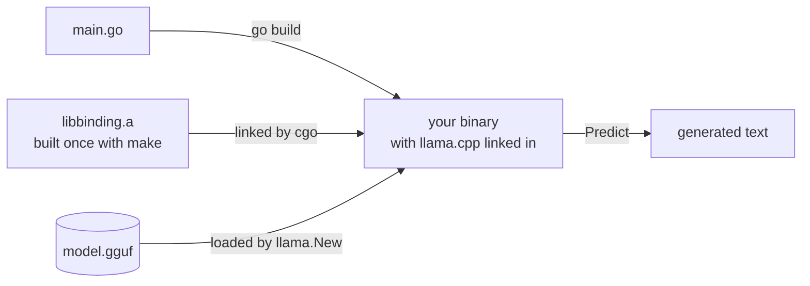
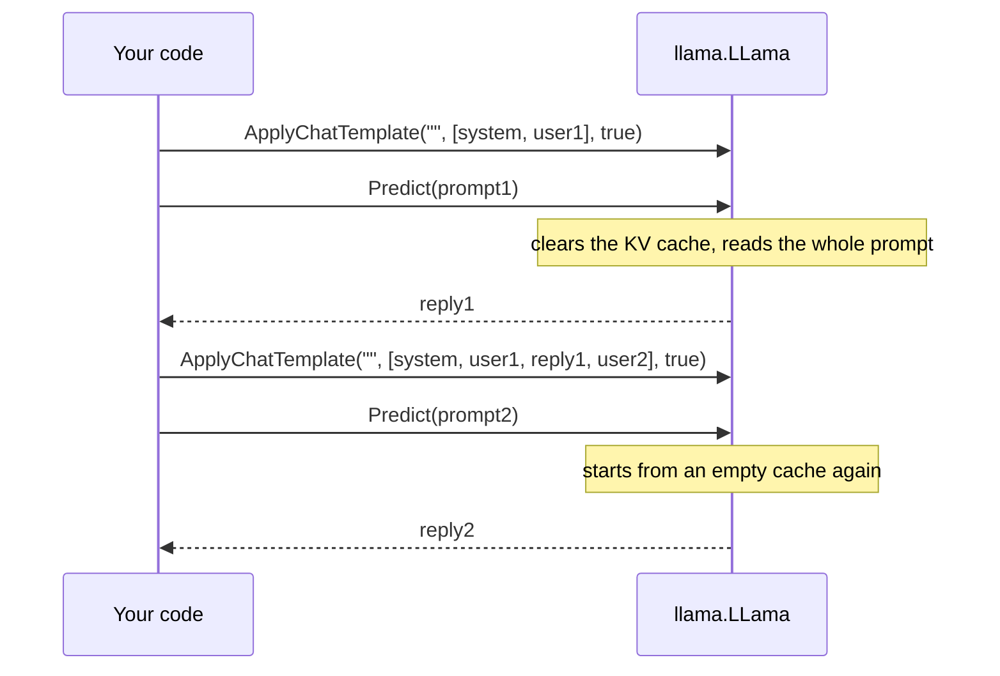

# Getting started: your first local LLM in Go

This guide takes you from a fresh machine to a Go program that answers questions with a language
model running on your own hardware. You will install a toolchain, build llama.cpp once, download a
model, write a 20-line program, and then turn it into a chat that streams its replies.

There is no server to start and no API key to manage. llama.cpp is compiled into your binary, and
it reads the model straight from a file on disk.



**Contents**

- [Words you will meet](#words-you-will-meet)
- [1. Install the toolchain](#1-install-the-toolchain)
- [2. Build the library](#2-build-the-library)
- [3. Choose a model](#3-choose-a-model)
- [4. Your first program](#4-your-first-program)
- [5. Make it a chat](#5-make-it-a-chat)
- [6. Stream the reply](#6-stream-the-reply)
- [7. Make it faster](#7-make-it-faster)
- [Docker](#docker)
- [Troubleshooting](#troubleshooting)
- [Next steps](#next-steps)

## Words you will meet

| Term | What it means here |
|---|---|
| GGUF file | The single file a model ships in: weights, tokenizer, chat template and metadata. llama.cpp loads only GGUF; the older GGML `.bin` files do not load. |
| Quantization | Storing weights in fewer bits so the model needs less memory. The level is part of the file name: `Q4_K_M` is a good default, `Q2_K` is smaller and less accurate, `Q8_0` is close to full quality. |
| Token | The unit a model reads and writes, usually a piece of a word. Limits such as `SetTokens(32)` count tokens, not characters. |
| Context | How many tokens of prompt plus reply the model can see at once. Set it with `SetContext(n)`; the default is 512. llama.cpp rounds it up to a multiple of 256, and 0 means the length the model was trained with. |
| Chat template | The exact text layout a chat model was trained on, such as `[INST] ... [/INST]`. `ApplyChatTemplate` writes it for you. |
| Sampling, temperature | How the next token is picked from the model's scores. A temperature of 0 or below always takes the likeliest token; higher values (the default is 0.8) add variety. |
| GPU layers | How many of the model's layers run on the GPU, set with `SetGPULayers(n)`. The default is 0: the weights stay in system memory and generation runs on the CPU until you ask, though a GPU build may still send large prompt batches to the GPU. |
| KV cache | The model's working memory of the tokens it has read so far. `Predict` clears it at the start of every call, so each call starts fresh. |

## 1. Install the toolchain

You need Go 1.26 or newer, a C++17 compiler, CMake 3.14 or newer, make and git. CI builds and tests
on Linux and macOS.

**Ubuntu or Debian**

```bash
sudo apt-get update
sudo apt-get install -y build-essential cmake git
```

`build-essential` brings GCC, make, and the OpenMP runtime (libgomp) that llama.cpp uses for its
CPU threads. Install Go from [go.dev/dl](https://go.dev/dl/): distribution packages often lag
behind 1.26.

**macOS**

```bash
xcode-select --install   # Apple's C and C++ compiler, make and git
brew install cmake go
```

The default macOS build includes Metal, so you can run layers on an Apple Silicon GPU without a
special build. [Step 7](#7-make-it-faster) shows how to ask for it.

**Windows** is not supported natively. The Ubuntu steps inside WSL2 will probably work, but CI
does not test them.

Check what you have:

```bash
go version      # go1.26 or newer
cmake --version # 3.14 or newer
```

## 2. Build the library

```bash
git clone --recurse-submodules https://github.com/AshkanYarmoradi/go-llama.cpp
cd go-llama.cpp
make libbinding.a
```

`make libbinding.a` does three things:

1. CMake configures the llama.cpp submodule, pinned to one upstream commit, into `build/` and
   compiles the libraries the binding links. llama.cpp's command-line tools are left out.
2. The C++ glue in `binding.cpp` is compiled into `binding.o`.
3. `ar` packs every object file into `libbinding.a` at the root of the checkout.

When you build a Go program that imports the package, cgo links `libbinding.a` statically from the
package directory. Your binary carries llama.cpp inside it and needs no llama.cpp library at run
time.

The first build compiles llama.cpp and takes several minutes. It runs one compile job per CPU;
`make JOBS=2 libbinding.a` uses fewer on a machine short of memory. After that, `go build` only
compiles your Go code.

Extra CMake options go in `CMAKE_ARGS`, either as an environment variable
(`CMAKE_ARGS="-DGGML_NATIVE=OFF" make libbinding.a`) or on the make command line
(`make CMAKE_ARGS="-DGGML_NATIVE=OFF" libbinding.a`). Either form combines with a `BUILD_TYPE`:
the backend it selects stays on. Rebuild the library from clean when something underneath it
changes:

- After `git pull`, run `git submodule update --init`, then `make clean && make libbinding.a`.
- Before you change `CMAKE_ARGS`, for example to add `-DGGML_NATIVE=OFF` or `-DGGML_METAL=OFF`,
  run `make clean`. The Makefile does not track those arguments, so `build/` keeps the ones it
  was configured with.

Switching `BUILD_TYPE` (the [GPU and BLAS builds](#gpu-and-blas-builds) in step 7) needs no
`make clean`: the Makefile records the `BUILD_TYPE` in `build/.build_type`, and when it changes,
deletes `build/` and rebuilds llama.cpp from scratch.

## 3. Choose a model

- Search [Hugging Face for GGUF models](https://huggingface.co/models?library=gguf). Pick an
  "Instruct" or "Chat" variant: base models continue your text rather than answer it.
- A model repository usually has one file per quantization. Start with `Q4_K_M`.
- Plan memory as the file size plus the KV cache, which grows with the context you ask for. A 7B
  model at `Q4_K_M` is a file of about 4 GB.

For a known-good first download, use the model CI tests against: CodeLlama-7B-Instruct at `Q2_K`,
about 2.8 GB.

```bash
curl -L -o model.gguf \
  https://huggingface.co/TheBloke/CodeLlama-7B-Instruct-GGUF/resolve/main/codellama-7b-instruct.Q2_K.gguf
```

It is a code-focused model at the smallest quantization, chosen to keep CI's download small. It is
fine for a first run; pick a newer instruct model at `Q4_K_M` when you build something real.

Try it with the interactive example that ships with the checkout:

```bash
LIBRARY_PATH=$PWD C_INCLUDE_PATH=$PWD go run ./examples -m model.gguf
```

Type a question, then press Enter on an empty line to send it. `-h` lists the other flags.

## 4. Your first program

Create a module next to the checkout, so the layout looks like this:

```text
src/
├── go-llama.cpp/   the checkout from step 2, with libbinding.a
└── hello/          your program, with model.gguf
```

```bash
cd ..   # out of the checkout
mkdir hello && cd hello
go mod init example.com/hello
mv ../go-llama.cpp/model.gguf .
```

Save this as `main.go`:

```go
package main

import (
	"fmt"
	"log"

	llama "github.com/AshkanYarmoradi/go-llama.cpp"
)

func main() {
	model, err := llama.New("model.gguf", llama.SetContext(2048))
	if err != nil {
		log.Fatal(err)
	}
	defer model.Free()

	answer, err := model.Predict("[INST] Answer to the following question:\nhow much is 2+2?\n[/INST]",
		llama.SetTokens(32))
	if err != nil {
		log.Fatal(err)
	}
	fmt.Println(answer)
}
```

Point Go at the checkout, then run it:

```bash
go mod edit -replace github.com/AshkanYarmoradi/go-llama.cpp=../go-llama.cpp
go mod tidy
LIBRARY_PATH=$PWD/../go-llama.cpp C_INCLUDE_PATH=$PWD/../go-llama.cpp go run .
```

llama.cpp prints its loading log to stderr, then the program prints an answer, which should
contain 4. CI asks CodeLlama this exact question on every pull request and checks for the 4.

Why the `replace`: a plain `go get` downloads the package without the llama.cpp submodule and
without the library you just built, so cgo would have nothing to link. The `replace` directive
makes Go compile against your checkout instead. `LIBRARY_PATH` and `C_INCLUDE_PATH` point the C
linker and compiler at the same checkout; this repository's CI builds the same way.

What each line does:

- `llama.New("model.gguf", llama.SetContext(2048))` loads the weights and creates a context with
  room for 2048 tokens of prompt and reply. Options passed to `New` are `ModelOption`s, fixed for
  the model's lifetime.
- `defer model.Free()` releases the model. It lives in C memory that Go's garbage collector cannot
  see, so without `Free` it stays until the process exits. A second `Free` does nothing.
- `model.Predict(prompt, llama.SetTokens(32))` tokenizes the prompt, runs it through the model and
  generates at most 32 new tokens (the default is 128). Options passed to `Predict` are
  `PredictOption`s and apply to that one call.
- The prompt uses CodeLlama's instruction format, `[INST] ... [/INST]`. Other models expect other
  formats; [step 5](#5-make-it-a-chat) stops you from writing them by hand.

If it fails, the error is one of two:

- `failed loading model "model.gguf"`: the path is wrong, the file is not GGUF, or the download
  was cut short. The llama.cpp log above the error says which.
- `inference failed`: this is `Predict`'s only error. In a first program the usual cause is a
  prompt longer than the context minus 4 tokens. The details are in the log on stderr.

The loading log is useful while you set things up and noisy afterwards. Installing a handler that
discards everything silences llama.cpp's part of it; the binding's own `loading model from` line
still goes to stderr:

```go
llama.SetLogHandler(func(llama.LogLevel, string) {}) // before llama.New
```

The [cookbook](cookbook.md#route-llamacpp-logs-into-slog) shows how to route the log into
`log/slog` instead.

## 5. Make it a chat

Chat models are trained on a specific prompt layout, with markers for where each turn starts and
ends. `ApplyChatTemplate` renders a conversation in the layout stored in the model file, so your
code does not depend on any one model's format.

`Predict` remembers nothing between calls: it clears the KV cache before it starts. A chat
therefore keeps the history in Go and renders all of it again for every turn.



Replace `main.go` with:

```go
package main

import (
	"bufio"
	"errors"
	"fmt"
	"log"
	"os"

	llama "github.com/AshkanYarmoradi/go-llama.cpp"
)

// fallback is used when the model file carries no chat template of its own.
// "llama2-sys" is the layout of CodeLlama-Instruct and Llama 2 Chat. Many newer
// models use "chatml"; llama.BuiltinChatTemplates() lists every name.
const fallback = "llama2-sys"

func render(model *llama.LLama, history []llama.ChatMessage) (string, error) {
	prompt, err := model.ApplyChatTemplate("", history, true) // "": the template in the GGUF file
	if errors.Is(err, llama.ErrNoChatTemplate) {
		prompt, err = model.ApplyChatTemplate(fallback, history, true)
	}
	return prompt, err
}

func main() {
	model, err := llama.New("model.gguf", llama.SetContext(4096))
	if err != nil {
		log.Fatal(err)
	}
	defer model.Free()

	history := []llama.ChatMessage{
		{Role: "system", Content: "You are a helpful assistant. Keep answers short."},
	}

	in := bufio.NewScanner(os.Stdin)
	fmt.Print("> ")
	for in.Scan() {
		history = append(history, llama.ChatMessage{Role: "user", Content: in.Text()})

		prompt, err := render(model, history)
		if err != nil {
			log.Fatal(err)
		}
		// Leave room for the reply: forget the oldest exchange while the
		// prompt takes more than half the context.
		limit := model.ContextParams().NCtx / 2
		for len(history) > 3 && len(model.Tokenize(prompt, model.GetVocabAddBOS(), true)) > limit {
			history = append(history[:1], history[3:]...) // keep the system message
			if prompt, err = render(model, history); err != nil {
				log.Fatal(err)
			}
		}

		reply, err := model.Predict(prompt, llama.SetTokens(256))
		if err != nil {
			log.Fatal(err)
		}
		fmt.Println(reply)

		history = append(history, llama.ChatMessage{Role: "assistant", Content: reply})
		fmt.Print("> ")
	}
}
```

How it works:

- `ApplyChatTemplate("", history, true)` uses the template stored in the GGUF file. `true` ends
  the prompt with the opening of the assistant's turn, which is what the model should continue.
- A model file without a template, or with one llama.cpp does not recognise, returns
  `ErrNoChatTemplate`. llama.cpp does not run a full Jinja engine; it recognises a fixed set of
  well-known templates. The fallback names one of them, so pick the one that matches your model.
- The reply stops where the model ends its turn, and the end-of-turn token's text is not part of
  it. Append it to the history as it is.
- The history grows with every turn. `Tokenize(prompt, model.GetVocabAddBOS(), true)` counts
  tokens exactly as `Predict` will: a BOS token only when the model asks for one, and
  special-token markup such as `<|im_start|>` read as single tokens. The loop drops the oldest
  user and assistant pair until the prompt fits in half the context.
- Reading the whole history again each turn costs prompt-processing time, though that runs much
  faster than generation. Keeping the cache between turns means driving the model yourself; the
  cookbook's [generation loop](cookbook.md#write-your-own-generation-loop) is the starting point.

## 6. Stream the reply

To print the reply as it is generated, pass a callback for that call. Replace the `Predict` call
and the `fmt.Println(reply)` after it with:

```go
reply, err := model.Predict(prompt,
	llama.SetTokens(256),
	llama.SetTokenCallback(func(piece string) bool {
		fmt.Print(piece) // a piece can end in the middle of a multi-byte character
		return true      // return false to stop generating
	}),
)
if err != nil {
	log.Fatal(err)
}
fmt.Println()
```

- The callback runs once per generated token, on the goroutine that called `Predict`. `Predict`
  still returns the whole reply when it finishes.
- A piece is raw bytes. An emoji or a CJK character can arrive split across two pieces. Printing
  them in order is fine; if you turn each piece into something on its own, such as a JSON event,
  buffer until `utf8.ValidString` reports true.
- The model is still busy with this `Predict` while the callback runs, and `Predict` carries on
  from its KV cache as it left it. Do not call `Free`, `Predict`, `Decode`, `Embeddings` or
  anything else that changes that cache from inside the callback. The binding releases its own
  lock before it calls you, so `model.SetTokenCallback` is safe there, and so is any method of a
  different model that no other goroutine is using.
- The option covers that one call only. A callback installed with `model.SetTokenCallback` is
  back in place when `Predict` returns.

## 7. Make it faster

Three settings decide most of the speed: where the layers run, how many CPU threads work on them,
and how big the model is.

```go
opts := []llama.ModelOption{llama.SetContext(4096)}
if llama.SupportsGPUOffload() {
	opts = append(opts, llama.SetGPULayers(99)) // 99 covers every layer of most models
}
model, err := llama.New("model.gguf", opts...)
if err != nil {
	log.Fatal(err)
}
defer model.Free()

n := runtime.NumCPU()
model.SetThreads(n, n) // generation, prompt processing; both default to 4
```

- **GPU.** `SupportsGPUOffload` reports whether the library can see a GPU to offload to: a GPU
  build, on a machine with that GPU and its driver. On Apple Silicon the default build has Metal,
  but layers still run on the CPU until you pass `SetGPULayers`. For NVIDIA, AMD or Vulkan,
  rebuild with a `BUILD_TYPE` and build your program with the matching tag, as in
  [GPU and BLAS builds](#gpu-and-blas-builds) below. The load log reports
  `offloaded N/M layers to GPU`.
- **Threads.** The context uses 4 threads unless you call `SetThreads`. `runtime.NumCPU` counts
  logical CPUs; on machines with hyper-threading, the number of physical cores is often faster.
  Measure both.
- **Size.** A smaller quantization, a smaller model or a smaller context each cut the work per
  token.

Measure instead of guessing. `Perf` reports llama.cpp's own counters:

```go
model.PerfReset()
if _, err := model.Predict(prompt, llama.SetTokens(128)); err != nil {
	log.Fatal(err)
}
p := model.Perf()
fmt.Printf("prompt: %.1f tokens/s, generation: %.1f tokens/s\n",
	float64(p.PromptTokens)/(p.PromptEvalMS/1000),
	float64(p.EvalTokens)/(p.EvalMS/1000))
```

The counters add up from load time until `PerfReset`, and the token counts never read below 1.

### GPU and BLAS builds

A GPU backend is chosen when you build the library, with `BUILD_TYPE`, and linked when you build
your program, with the Go build tag of the same name:

| Hardware | Build the library | Build your program | Needs |
|---|---|---|---|
| Apple Silicon | `make libbinding.a`; `BUILD_TYPE=metal` builds the same | no tag | Xcode command line tools |
| NVIDIA | `make BUILD_TYPE=cublas libbinding.a` | `-tags cublas` | CUDA toolkit under `/usr/local/cuda`, CMake 3.18+ |
| AMD | `make BUILD_TYPE=hipblas libbinding.a` | `-tags hipblas` | ROCm 6.1+ under `/opt/rocm`, CMake 3.21+ |
| NVIDIA, AMD or Intel through Vulkan | `make BUILD_TYPE=vulkan libbinding.a` | `-tags vulkan` | Vulkan headers and loader, `glslc` and SPIRV-Headers (Ubuntu: `libvulkan-dev glslc spirv-headers`), CMake 3.19+ |
| CPU with OpenBLAS | `make BUILD_TYPE=openblas libbinding.a` | `-tags openblas` | OpenBLAS development files and `pkg-config` |
| CPU with BLIS | `make BUILD_TYPE=blis libbinding.a` | `-tags blis` | BLIS development files and `pkg-config` |

For example, for an NVIDIA card, from the `hello` directory of [step 4](#4-your-first-program):

```bash
(cd ../go-llama.cpp && make BUILD_TYPE=cublas libbinding.a)
LIBRARY_PATH=$PWD/../go-llama.cpp C_INCLUDE_PATH=$PWD/../go-llama.cpp go run -tags cublas .
```

- The tag compiles a Go file, such as `llama_cublas.go`, that carries the backend's link flags. Do
  not pass those libraries in `CGO_LDFLAGS`; Go would put them in front of `libbinding.a`, where
  the linker can drop them. For a toolkit outside the default directory, add only its library
  path: `CGO_LDFLAGS="-L/opt/cuda/lib64"`.
- OpenBLAS and BLIS need `pkg-config`, which llama.cpp uses to find the BLAS headers, unless you
  name the header directory yourself with `CMAKE_ARGS="-DBLAS_INCLUDE_DIRS=<dir>"`.
- Any other `BUILD_TYPE` stops `make` with an error instead of quietly building for the CPU. That
  includes llama.cpp's own spellings, `cuda` and `hip`, and `clblas`, which went away with
  llama.cpp's CLBlast backend; use `vulkan` instead.
- On a machine without the GPU, such as a build server, a CUDA build needs the target
  architecture named, as in the [Docker](#docker) section below.

What CI proves: on macOS it runs the test suite on a Metal build, with every layer on the CPU. The
"GPU builds" workflow compiles and links the `cublas` and `vulkan` builds on every pull request,
in its `ubuntu-cuda-build` and `ubuntu-vulkan-build` jobs. Those runners have no GPU, so nothing
runs on a device. The `gpu`-labelled specs run in the "GPU tests" workflow, which needs a
self-hosted NVIDIA runner: started by hand, for a pull request labelled `gpu`, or for pushes to
`main` and tags once the repository variable `GPU_RUNNER` is `true`. CI does not build `hipblas`,
`openblas` or `blis` at all. [How it works](how-it-works.md#gpu-builds) covers the backends,
several GPUs and link errors.

## Docker

A multi-stage build compiles the library and your program in a Go image, then copies only the
binary into a slim runtime image. Put this `Dockerfile` in your module's root:

```dockerfile
FROM golang:1.26-trixie AS build
RUN apt-get update \
 && apt-get install -y --no-install-recommends cmake \
 && rm -rf /var/lib/apt/lists/*

# Build the library once. Pass --build-arg GO_LLAMA_REF=<release tag> to pin it.
ARG GO_LLAMA_REF=main
RUN git clone --recurse-submodules --branch "$GO_LLAMA_REF" \
      https://github.com/AshkanYarmoradi/go-llama.cpp /go-llama.cpp
# GGML_NATIVE=OFF: do not tune the library for the CPU of the build machine.
RUN cd /go-llama.cpp && CMAKE_ARGS="-DGGML_NATIVE=OFF" make libbinding.a

WORKDIR /app
COPY . .
RUN go mod edit -replace github.com/AshkanYarmoradi/go-llama.cpp=/go-llama.cpp \
 && LIBRARY_PATH=/go-llama.cpp C_INCLUDE_PATH=/go-llama.cpp go build -o /out/app .

FROM debian:trixie-slim
RUN apt-get update \
 && apt-get install -y --no-install-recommends libgomp1 \
 && rm -rf /var/lib/apt/lists/*
COPY --from=build /out/app /usr/local/bin/app
ENTRYPOINT ["/usr/local/bin/app"]
```

> **Not verified by CI.** No workflow builds this Dockerfile. It repeats the steps above, and
> it is the first thing to check if a container build fails.

- The library layers are cached, so rebuilding after a code change only reruns `go build`. The
  cached clone also ignores new commits until you change `GO_LLAMA_REF` or build with
  `--no-cache`.
- Without `GGML_NATIVE=OFF`, llama.cpp is tuned for the build machine's CPU, and the image can
  crash with an illegal instruction on an older one. On a Linux arm64 build machine the Makefile
  also compiles `binding.cpp` with `-mcpu=native`, which `GGML_NATIVE` does not change, so build
  there on a CPU no newer than the ones you deploy to.
- Even with `GGML_NATIVE=OFF`, an x86-64 build assumes SSE4.2, AVX, AVX2, FMA, F16C and BMI2:
  most Intel CPUs from Haswell on and AMD CPUs from Excavator on. For an older CPU, also turn off
  what it lacks, for example `-DGGML_AVX2=OFF -DGGML_FMA=OFF -DGGML_F16C=OFF -DGGML_BMI2=OFF` for
  one with AVX but not AVX2.
- The runtime image needs `libgomp1`, the OpenMP runtime the CPU backend uses.
- Mount the model when you run the container instead of copying gigabytes into the image, for
  example `docker run -v "$PWD/models:/models" ...`, and open it from `/models`.
- Add a `.dockerignore` containing `*.gguf`. `COPY . .` copies the whole module, so without it the
  model from step 4 goes into the build context and the build stage.

For NVIDIA GPUs, the same layout works with a CUDA base image:

- Build from `nvidia/cuda:12.6.2-devel-ubuntu24.04`, and install `build-essential`, CMake, git and
  Go 1.26 or newer in it.
- `docker build` cannot see a GPU, so name the GPU architectures to compile for:
  `CMAKE_ARGS="-DGGML_NATIVE=OFF -DCMAKE_CUDA_ARCHITECTURES=<arch>" make BUILD_TYPE=cublas libbinding.a`.
  `<arch>` is the GPU's compute capability without the dot, for example `86`. Write several as
  `'86;89'`, in single quotes, because the Makefile hands the arguments to a shell.
- Each CUDA compile job can take a few GB of memory. If the build is killed, lower the job count
  with `make JOBS=2 ...`.
- Build the program with `go build -tags cublas`.
- Run on `nvidia/cuda:12.6.2-runtime-ubuntu24.04` with `libgomp1` added, and start the container
  with `docker run --gpus all`.

CI's `ubuntu-cuda-build` job compiles and links a CUDA build inside that devel image on every pull
request, naming the architecture through `CMAKE_ARGS` the same way. Nothing in CI builds this
layout as a Docker image, uses the runtime image, or runs it on a GPU.

[How it works](how-it-works.md#gpu-builds) covers the GPU builds in detail.

## Troubleshooting

| Symptom | Likely cause | Fix |
|---|---|---|
| `cannot find -lbinding` | `libbinding.a` was not built, or the `replace` path does not lead to the checkout you built. | Run `make libbinding.a` in the checkout. `go list -m -f '{{.Dir}}' github.com/AshkanYarmoradi/go-llama.cpp` prints the directory Go uses. |
| `llama.cpp/` is empty, or CMake says the source directory does not contain `CMakeLists.txt` | The clone missed the submodule. | `git submodule update --init`, then `make libbinding.a`. |
| `requires go >= 1.26.0 (running go 1.2x; GOTOOLCHAIN=local)` | Your Go is older and automatic toolchain downloads are off (`GOTOOLCHAIN=local`). | Install Go 1.26 or newer, or allow `GOTOOLCHAIN=auto`. |
| `failed loading model "..."` | Wrong path; not a GGUF file; an old GGML `.bin` or a GGUF version 1 file; a truncated download; or an architecture newer than the pinned llama.cpp. | Read the llama.cpp log just above the error. Download the file again, or pick a newer conversion. |
| `inference failed` | The prompt is longer than the context minus 4 tokens, the abort callback fired, the context was too small to shift, a `WithGrammar` grammar did not parse, a decode failed, or llama.cpp raised an exception. | Read the log on stderr, or your `SetLogHandler`. Raise `SetContext` or shorten the prompt. If you set an abort callback, check `ctx.Err()`. |
| `Decode` returns -1 in your own loop | The batch holds more tokens than `ContextParams().NBatch`, a token id outside the vocabulary, or a sequence id the context does not hold. | Feed long prompts in several batches, or load with a larger `SetNBatch` and `SetContext`. Keep sequence ids below `ContextParams().NSeqMax`. |
| `Sampler.Sample` returns -1 | The sampler is empty (for example a grammar that did not parse), or a grammar stage placed after a truncation or picking stage refused the token. The reason is on stderr. | Put grammar stages first in the chain, and check `chain.Len()` after adding one. |
| The process exits with a `GGML_ASSERT` or `fatal error` message from llama.cpp while sampling | `Sampler.Sample` read an output that did not request logits, the chain has no stage that picks a token, or a misplaced grammar stage refused an end-of-generation token. | Pass `true` as the last argument of `Batch.Add` for the token you sample from. End the chain with `SamplerGreedy`, `SamplerDist` or `SamplerMirostatV2`, and put grammar stages first. |
| `undefined reference to GOMP_...` when linking | llama.cpp and your program were built by compilers with different OpenMP runtimes. | Build both with the same `CC` and `CXX`; on Linux that is usually GCC. |
| `libgomp.so.1: cannot open shared object file` at start-up | The OpenMP runtime is missing on the machine that runs the binary. | Install it, for example `apt-get install libgomp1`. |
| The reply is gibberish, repeats itself, or answers a different question | The prompt is not in the model's format, or the model is a base model. | Use `ApplyChatTemplate`, an instruct model, and a quantization of `Q4_K_M` or better. |
| Generation is slow | With 0 GPU layers, generation runs on the CPU with 4 threads. | `SetGPULayers` on a GPU build, `model.SetThreads(n, n)`, a smaller model or quantization. Check with `Perf`. |
| A new `CMAKE_ARGS` changed nothing | `build/` keeps the arguments it was configured with; only a `BUILD_TYPE` change triggers a rebuild. | `make clean`, then run `make` again with the new `CMAKE_ARGS`. |
| `Unknown BUILD_TYPE=...` or `BUILD_TYPE=clblas was removed` from `make` | The Makefile knows `cublas`, `hipblas`, `vulkan`, `metal`, `openblas` and `blis`, or no `BUILD_TYPE` for a CPU build. | Pick one of those; `vulkan` replaces `clblas`. Check for a `BUILD_TYPE` exported in your shell. |
| `Could NOT find PkgConfig` with `BUILD_TYPE=openblas` or `blis` | llama.cpp looks the BLAS headers up through `pkg-config`. | Install `pkg-config`, or pass `CMAKE_ARGS="-DBLAS_INCLUDE_DIRS=<dir>"`. |
| Linking fails after switching `BUILD_TYPE` | Usually the Go build lacks the tag that links the backend's libraries. | Build with the `-tags` that matches the `BUILD_TYPE`, such as `-tags cublas`. |
| `cannot find -lcublas` (or `-lhipblas`, `-lvulkan`) | The toolkit is not installed, or not in the directory the tag file names (`/usr/local/cuda`, `/opt/rocm`). | Install it, or add its library directory: `CGO_LDFLAGS="-L/path/to/lib"`. |
| Native Windows build fails | Windows is not supported. | Use WSL2 with the Ubuntu steps. |

## Next steps

- The [cookbook](cookbook.md) has recipes for streaming to HTTP clients, timeouts, JSON output,
  embeddings, your own generation loop and more. Each one says how much of it CI proves.
- [How it works](how-it-works.md) explains the three layers, the build and the GPU backends.
- [Running it in production](production.md) covers the failure model, memory, concurrency and
  operations.
- Coming from go-skynet? Read the [migration guide](migrating-from-go-skynet.md).
- The [API reference on pkg.go.dev](https://pkg.go.dev/github.com/AshkanYarmoradi/go-llama.cpp)
  has the package's examples, from [example_test.go](../example_test.go) and
  [example_loop_test.go](../example_loop_test.go). `go vet` compiles them, but nothing runs them
  against a model.
