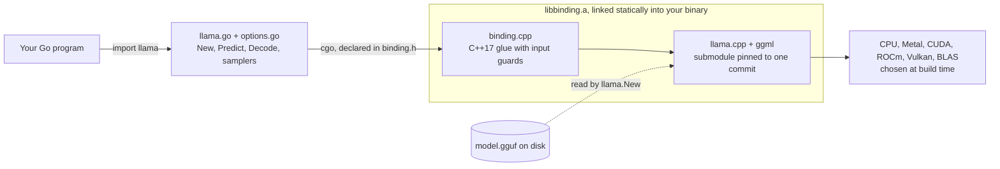
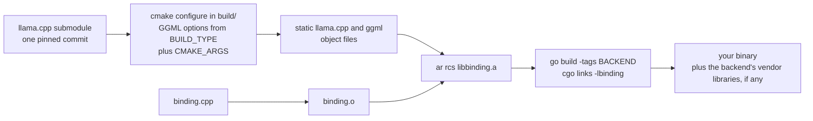
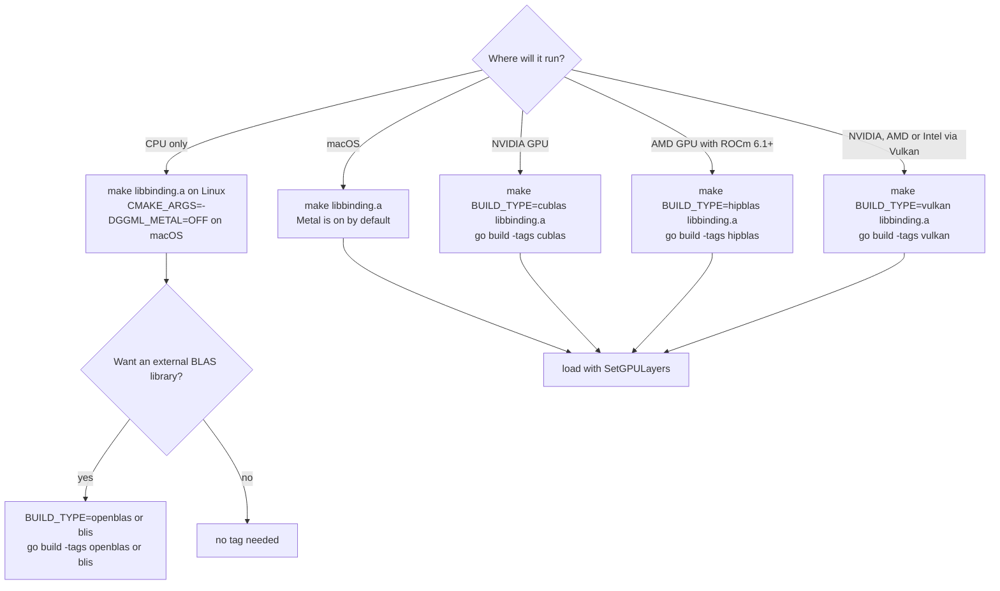
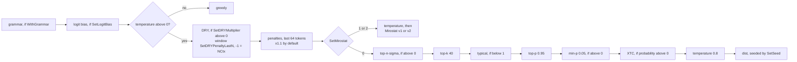
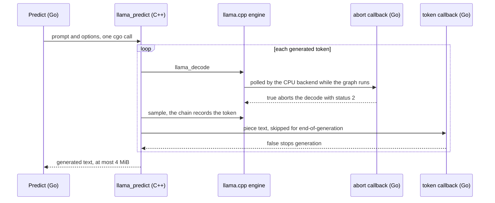
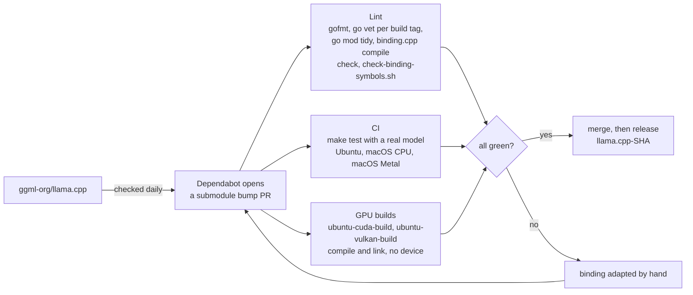

# How go-llama.cpp works

This page explains what happens between `llama.New` and the text coming back.
It is written for three kinds of reader: engineers weighing this binding against
a server or a runtime-loaded binding, anyone stuck on a build or link error, and
contributors. If you want a program running first, start with
[Getting started](getting-started.md).

- [The three layers](#the-three-layers)
- [One engine, linked in](#one-engine-linked-in)
- [The build pipeline](#the-build-pipeline)
- [GPU builds](#gpu-builds)
- [Inside Predict](#inside-predict)
- [Calling back into Go](#calling-back-into-go)
- [Memory and ownership](#memory-and-ownership)
- [Staying current with llama.cpp](#staying-current-with-llamacpp)
- [Testing](#testing)
- [Build troubleshooting](#build-troubleshooting)

## The three layers



| Layer | Files | Job |
|---|---|---|
| Go API | `llama.go`, `options.go` | What you import. Returns `error`, `[]int32` and typed enums rather than raw pointers; `Decode` and `Encode` keep llama.cpp's status codes. |
| C surface | `binding.h` | The `extern "C"` declarations. This is all cgo sees. |
| Glue | `binding.cpp` | C++17 that calls llama.cpp, hides its types behind `void*`, catches C++ exceptions, and checks inputs the engine would abort on. |
| Engine | `llama.cpp/` (git submodule) | llama.cpp and ggml at one pinned commit. |

cgo can call C but not C++. `binding.cpp` is the C++ side that turns
llama.cpp's API into plain C functions over opaque handles, and `binding.h`
declares those functions for cgo. [CONTRIBUTING.md](../CONTRIBUTING.md#the-layers)
describes how a change moves through the three files.

There are two ways into the engine, and they act on the same context:

- **`Predict`** runs a whole generation inside one cgo call: tokenize, decode,
  sample, stop. Go code runs again only inside your callbacks.
- **The low-level API** mirrors llama.cpp's own primitives: `NewBatch`,
  `Decode`, `Logits`, `NewSamplerChain`, the `Memory*` methods, and state and
  session files. Each method is a single cgo call, and your Go code runs the
  loop.

Because both share one context, they share one KV cache. `Predict` clears that
cache before it starts, so do not mix it with low-level sequences on the same
model. [Inside Predict](#inside-predict) has the details.

## One engine, linked in

These are the link directives at the top of `llama.go`:

```go
// #cgo LDFLAGS: -L${SRCDIR}/ -lbinding -lm -lstdc++
// #cgo linux LDFLAGS: -fopenmp
// #cgo darwin LDFLAGS: -framework Accelerate -framework Foundation -framework Metal -framework MetalKit
```

`libbinding.a` holds all of llama.cpp and ggml plus `binding.o`, and cgo links
it statically from the package directory. Linux adds the OpenMP runtime. macOS
adds the Accelerate, Foundation, Metal and MetalKit frameworks. A GPU or BLAS
build adds its vendor libraries through a build-tagged Go file (see
[GPU builds](#gpu-builds)). The binding never `dlopen`s llama.cpp.

What this gives you:

- **The engine is fixed at build time.** Each binding commit pairs with exactly
  one llama.cpp commit, the one its submodule points at. There is no separate
  engine library that could be swapped underneath the Go declarations, so the
  two cannot drift apart in production.
- **One binary to ship.** The engine is inside it. At run time it needs only
  the usual system runtimes (the C++ standard library, and OpenMP on Linux),
  plus, for GPU and BLAS builds, the vendor's shared libraries, as any program
  that uses them does.

What it costs:

- **A C++17 compiler, CMake and cgo.** Cross-compiling your program means
  cross-compiling llama.cpp too.
- **No `go get`-only install.** Go module downloads leave out git submodules,
  so `libbinding.a` has to be built from a checkout.
  [Getting started](getting-started.md) shows the `replace` directive that
  points your module at it.
- **Linux and macOS only.** The Makefile does not support Windows.
- **A new engine means a rebuild.** That is also what makes a rollback
  predictable: see [Upgrades and rollback](production.md#upgrades-and-rollback).

Runtime-loaded bindings, such as
[hybridgroup/yzma](https://github.com/hybridgroup/yzma), take the other side of
this trade. They load prebuilt llama.cpp shared libraries at run time, so they
need no C toolchain and can pick up a new engine without recompiling. In return
they have to keep their Go declarations compatible with whichever library is
installed on the machine.

## The build pipeline



`make libbinding.a` does five things:

1. Checks `BUILD_TYPE`. A value the Makefile does not know, llama.cpp's own
   `cuda` or `hip` included, stops `make` with an error instead of producing a
   CPU-only build, and so does the removed `clblas`. If `BUILD_TYPE` differs
   from the one recorded in `build/.build_type`, `build/` is deleted, so
   llama.cpp is rebuilt from scratch for the new backend.
2. Configures llama.cpp with CMake in `build/`: static libraries,
   position-independent code, OpenMP on, and only the libraries the binding
   links (llama.cpp's tests, examples, tools and `llama` app are not built).
   `CMAKE_ARGS` goes first, then `BUILD_TYPE`'s `GGML_*` options and the
   Makefile's fixed options; where they set the same variable, the later
   value wins.
3. Builds llama.cpp in parallel, then creates the sentinel file
   `build/build_complete`.
4. Compiles `binding.cpp` into `binding.o` against the same headers.
5. Copies the object files out of `build/` and packs them, together with
   `binding.o`, into a new `libbinding.a` that replaces the old one. CMake's
   compiler-identification objects and the Vulkan shader generator are left
   out, because they define `main()`.

`go build` then compiles `llama.go` with cgo and links `libbinding.a`:

```bash
LIBRARY_PATH=$PWD C_INCLUDE_PATH=$PWD go build ./...
```

The first build compiles llama.cpp from source, which is the slow part. Later
builds reuse `build/`. The build uses every CPU; set `JOBS=n` to use fewer,
for example for a CUDA build on a machine with little memory.

Two consequences are worth knowing:

- **CMake's link dependencies do not survive step 5.** An archive of object
  files does not record that the CUDA objects need `libcudart`. That is why each
  GPU and BLAS backend has a Go file, such as `llama_cublas.go`, that restates
  its libraries behind a build tag.
- **Only `BUILD_TYPE` is tracked.** The stamp in `build/.build_type` catches
  a change of backend, and nothing else does: a change to `CMAKE_ARGS`, a
  `git submodule update` of llama.cpp, or an edit to `binding.cpp` goes
  unnoticed. Run `make clean` first, or you link the previous build. (After
  an edit to `binding.cpp` alone, deleting `binding.o` is enough.)

Pass extra CMake options through the environment, the way CI does:

```bash
CMAKE_ARGS="-DGGML_METAL=OFF" make libbinding.a
```

`make CMAKE_ARGS=...` works too. The Makefile adds the GPU and BLAS options
with `override`, so a value given on the make command line adds to them
instead of replacing them. (`metal` relies on Metal being llama.cpp's default
on Apple, not on its option.)

## GPU builds

Pick a `BUILD_TYPE`, build `libbinding.a`, then build your program with the
matching Go tag:

```bash
make BUILD_TYPE=cublas libbinding.a
LIBRARY_PATH=$PWD C_INCLUDE_PATH=$PWD go build -tags cublas ./...
```

GPU offload is still opt-in per model. `SetGPULayers` defaults to 0, which
keeps every layer on the CPU:

```go
model, err := llama.New("model.gguf", llama.SetGPULayers(99))
if err != nil {
	log.Fatal(err)
}
defer model.Free()
```

A value larger than the model's layer count offloads every layer.



### Backends

| `BUILD_TYPE` | Backend | llama.cpp option | Go tag | Needs | CMake | In CI |
|---|---|---|---|---|---|---|
| (empty) | CPU on Linux; CPU and Metal on macOS | none | none | | 3.14+ | real-model tests |
| `metal` | Apple Metal | `GGML_METAL` | none | Xcode command line tools | 3.14+ | real-model tests, layers on the CPU |
| `cublas` | NVIDIA CUDA | `GGML_CUDA` | `cublas` | CUDA toolkit under `/usr/local/cuda` | 3.18+ | compile and link, every PR (`ubuntu-cuda-build`) |
| `hipblas` | AMD ROCm/HIP | `GGML_HIP` | `hipblas` | ROCm 6.1+ under `/opt/rocm` | 3.21+ | `go vet` only |
| `vulkan` | Vulkan (NVIDIA, AMD, Intel) | `GGML_VULKAN` | `vulkan` | Vulkan headers and loader, `glslc`, SPIR-V headers | 3.19+ | compile and link, every PR (`ubuntu-vulkan-build`) |
| `openblas` | CPU + OpenBLAS | `GGML_BLAS` | `openblas` | OpenBLAS, `pkg-config` | 3.14+ | `go vet` only |
| `blis` | CPU + BLIS | `GGML_BLAS` | `blis` | BLIS, `pkg-config` | 3.14+ | `go vet` only |
| `clblas` | removed | | | | | |

The CMake minimums come from llama.cpp's own build files. "Compile and link"
is the GPU builds workflow (`.github/workflows/build-gpu.yaml`), which runs on
every pull request and every push to `main` with two jobs:
`ubuntu-cuda-build`, inside NVIDIA's `nvidia/cuda` devel image, and
`ubuntu-vulkan-build`. Each builds `libbinding.a` on a hosted runner with no
GPU, checks that the backend's objects are in it and that nothing in it
defines `main()`, links the test binary and the example with the build tag,
and checks that both binaries depend on the vendor libraries (`libcudart`,
`libcublas` and `libcuda`, or `libvulkan`). Nothing runs on a device. "`go vet`
only" means Lint type-checks the build tag's Go file, which it does for every
tag; nothing is compiled or linked.

The specs labelled `gpu` run in a separate GPU tests workflow
(`.github/workflows/test-gpu.yaml`) on a self-hosted runner with an NVIDIA GPU.
It is opt-in: it runs when started by hand, on a pull request that carries the
`gpu` label, and on pushes to `main` and tags only when the repository
variable `GPU_RUNNER` is `true`. It passes only if CUDA found a device and the
spec's layers were offloaded to it.

Notes per backend:

- **CUDA.** The tag file links the CUDA runtime, cuBLAS (with cuBLASLt) and
  the driver API (`libcuda`) from `/usr/local/cuda`, with `lib64/stubs` on
  the search path so the link also succeeds on a build machine with no
  driver. By default llama.cpp compiles for the GPUs it finds on the build
  machine. On one without a GPU (a CI runner, a `docker build`), name the
  target architecture: `CMAKE_ARGS="-DCMAKE_CUDA_ARCHITECTURES=89"
  make BUILD_TYPE=cublas libbinding.a` (89 is the RTX 40 series; use your
  card's compute capability). For a toolkit installed elsewhere, add its
  library directory with `CGO_LDFLAGS="-L/path/to/cuda/lib64"`: unlike a `-l`,
  a `-L` works from anywhere on the link line. At run time the CUDA runtime and
  cuBLAS shared libraries must be on the loader path, and the NVIDIA driver
  supplies `libcuda.so.1`.
- **ROCm.** `GPU_TARGETS` defaults to a list of common cards; set it to yours
  for a faster build, for example
  `make BUILD_TYPE=hipblas GPU_TARGETS=gfx1100 libbinding.a` for the
  Radeon RX 7900 series. llama.cpp refuses ROCm older than 6.1. For ROCm
  outside `/opt/rocm`, pass `ROCM_HOME=/path/to/rocm` to `make`, and add its
  `-L` path through `CGO_LDFLAGS` as for CUDA.
- **Vulkan.** The one vendor-neutral GPU backend. On Debian and Ubuntu:
  `sudo apt-get install libvulkan-dev glslc spirv-headers`.
- **Metal.** llama.cpp turns Metal on by default on Apple platforms and embeds
  its shader library in the binary, so nothing needs copying next to your
  program. `BUILD_TYPE=metal` builds the same thing and is kept for clarity.
  For a CPU-only macOS build, pass `CMAKE_ARGS="-DGGML_METAL=OFF"`.
- **OpenBLAS and BLIS.** CPU builds that hand large matrix multiplications to
  an external BLAS library. Besides the library they need `pkg-config`, which
  llama.cpp uses to find the BLAS headers, unless `CMAKE_ARGS` sets
  `-DBLAS_INCLUDE_DIRS=<dir>`. For OpenBLAS on Debian and Ubuntu:
  `sudo apt-get install libopenblas-dev pkg-config`. For BLIS, install its
  development package and `pkg-config`.
- **CLBlast.** llama.cpp removed its CLBlast backend, so `BUILD_TYPE=clblas`
  stops with an error that says so. Use `vulkan` for GPUs without CUDA or ROCm.

### Several GPUs

With more than one GPU, llama.cpp spreads the offloaded layers across all of
them, in proportion to each device's free memory. `SetTensorSplit` sets the
proportions instead, one number per device, separated by commas:

```go
model, err := llama.New("model.gguf",
	llama.SetGPULayers(99),
	llama.SetTensorSplit("3,1"), // three quarters on device 0, a quarter on device 1
)
if err != nil {
	log.Fatal(err)
}
defer model.Free()
```

Each `New` parses the string into its own zeroed list of `MaxDevices()`
proportions, so nothing carries over from an earlier load. A device past the
end of the list gets none. Entries past `MaxDevices()` are dropped with
a warning on stderr. If any entry is not a number, the whole split is ignored,
with a message on stderr, and llama.cpp falls back to its free-memory split.

`SetMainGPU` picks a device only in llama.cpp's single-GPU split mode, which
the binding does not select, so it does not change placement. To keep a
process on one GPU, hide the others with the vendor's device mask, such as
`CUDA_VISIBLE_DEVICES=1`.

### Why build tags and not `CGO_LDFLAGS`

Older instructions passed the GPU libraries in `CGO_LDFLAGS`. That breaks on
common Linux toolchains. `go build` puts `CGO_LDFLAGS` from the environment
*before* the package's own `#cgo LDFLAGS`, so `-lcublas` lands in front of
`-lbinding`. A linker that runs with `--as-needed`, as Ubuntu's GCC does by
default, drops a shared library that nothing has asked for yet. The
`cuDeviceGet` and `cublas*` references inside `libbinding.a` then come out
undefined. Flags in a tagged Go file such as `llama_cublas.go` are emitted
after `-lbinding`, so the order is right.

### Why the old option names failed quietly

llama.cpp renamed its backend options from `LLAMA_*` to `GGML_*`. The old
`LLAMA_CUBLAS` is now a fatal CMake error. `LLAMA_HIPBLAS`, `LLAMA_BLAS` and
`LLAMA_CLBLAST` are not recognised at all: CMake prints an "unused variable"
warning, and the build carries on CPU-only. If you pass your own `CMAKE_ARGS`,
use the `GGML_*` names from `llama.cpp/ggml/CMakeLists.txt`.

### Checking that the GPU is used

`SupportsGPUOffload` reports whether the engine found a GPU it can offload to.
It needs no model. It returns false on a CPU-only `libbinding.a`, and also on a
GPU build that finds no device or driver at run time:

```go
if !llama.SupportsGPUOffload() {
	log.Println("no GPU to offload to: CPU-only build, or no device or driver")
}
```

When a model loads, llama.cpp logs how many layers went to the device. Route
the log through [`SetLogHandler`](production.md#observability) to see these
lines, or read them on stderr:

```text
ggml_cuda_init: found 1 CUDA devices (Total VRAM: ...)
load_tensors: offloaded 33/33 layers to GPU
```

`offloaded 0/33` means the backend is there but `SetGPULayers` was left at 0.
`ggml_cuda_init: failed to initialize CUDA` means the build is fine but found
no device or driver: check the driver, or `--gpus` for a container. No
`ggml_cuda_init` line at all means the binary was linked against a CPU-only
`libbinding.a`: rebuild it with `BUILD_TYPE=cublas`.

## Inside Predict

`Predict` is a convenience: one call, one prompt in, one string out. Knowing
what it does explains most of its behaviour.

1. **Options.** Your `PredictOption`s are applied on top of `DefaultOptions`.
   A `SetTokenCallback` option is registered for this call only; afterwards
   any callback you set with `(*LLama).SetTokenCallback` is back in place. A
   `SetThreads` option sets both of the context's thread counts for this call
   and restores them afterwards.
2. **Clear the KV cache.** Every sequence in the context is dropped. Each call
   starts from an empty cache, so `Predict` cannot resume a conversation or
   continue state you loaded. Send the whole conversation again, rendered with
   `ApplyChatTemplate`.
3. **Tokenize.** The prompt is tokenized with the model's BOS token if its
   vocabulary asks for one, and with special-token markup such as `</s>`
   parsed into single tokens. An empty prompt becomes a lone BOS. A prompt
   longer than `ContextParams().NCtxSeq - 4` tokens fails. (`NCtxSeq` is the
   context one sequence can use, which is all of `NCtx` unless the model was
   loaded with `SetNSeqMax`.)
4. **Build the sampler chain** from the options, in the order shown below,
   with the grammar first. A `WithGrammar` grammar that does not parse fails
   the call, rather than letting it generate unconstrained text.
5. **Read the prompt.** The prompt is decoded in chunks no larger than
   `SetBatch` and never larger than the context's `ContextParams().NBatch`.
6. **Generate.** Each step samples a token (the chain records it exactly
   once), stops on an end-of-generation token without emitting its text, and
   otherwise passes the token's text to the token callback. A callback that
   returns `false` stops generation. The text is then appended to the result,
   and the result is checked against the stop words.
7. **Shift when the context is full.** The first `SetNKeep` tokens (default 64,
   never more than the prompt) stay. Half of the tokens after them are dropped
   and the rest slide down. If even that cannot make room, the call fails.
8. **Stop** at the first of: an end-of-generation token, a stop word, a
   callback returning `false`, or the `SetTokens` budget (default 128).
9. **Return.** The text is copied into a Go buffer sized at 8 bytes per token
   of the `SetTokens` budget, plus the prompt's length, plus 1 KiB, and never
   more than 4 MiB. Longer output is cut off, possibly mid-character. Go then
   trims a leading space, the prompt text if the output starts with it, a
   leading newline, and a trailing stop word.

Every failure comes back as the same `inference failed` error. The reason is
logged: the binding's own messages, such as `prompt is too long`, go to stderr,
and the engine's go through [`SetLogHandler`](production.md#observability) when
one is installed. A C++ exception inside the call also becomes this error
instead of ending the process.

The token callback sees each piece before the stop-word check, so a streaming
client receives the stop word's text even though the returned string has it
trimmed. Filter it on the streaming side if that matters.

### The sampler chain



The numbers are the `DefaultOptions` values. A few things follow from the
order:

- **The grammar comes first**, so every later stage, and the final pick, only
  sees tokens the grammar allows.
- **`SetTemperature(0)` (or below) means greedy**: the most likely token after
  the grammar and the logit bias. DRY, the penalties and the truncation stages
  are skipped.
- **DRY is off by default** (`SetDRYMultiplier` is 0) and runs only at a
  temperature above 0. Its look-back window, `SetDRYPenaltyLastN`, defaults
  to -1, which means the context size, `ContextParams().NCtx`. A larger window
  is cut to the context size, and 0 turns DRY off. No sequence breakers are
  set, so a newline or punctuation does not end a repeat.
- **The penalty stage is on by default**, because the default `SetPenalty` is
  1.1. It is left out only when the repeat penalty is 1.0 and the frequency
  and presence penalties are 0. `SetRepeat` sets its window.
- **The seed defaults to -1**, which picks a new random seed on every call.
  Pass `SetSeed(n)` to make sampling repeatable on the same build and
  hardware.

If you need a different order, or stages `Predict` does not offer, build your
own chain with `NewSamplerChain` and run the loop yourself. The
[cookbook](cookbook.md) shows how. Put grammar stages first there too. A
grammar stage placed after top-k or after the stage that picks can be handed a
token it does not allow: `Sample` then returns -1 and restarts the grammar, or
ends the process if that token is an end-of-generation token
([tier 3](production.md#tier-3-process-aborts)).

## Calling back into Go

C cannot hold a Go function value, so the binding uses cgo's `//export`. Three
exported Go functions are the entry points: one for token callbacks, one for
abort callbacks and one for log records. Token and abort callbacks are stored in
package-level maps keyed by the address of the model's C handle, so each model
has its own. The log handler is a single process-wide value.



| Callback | Set with | Runs | Rules |
|---|---|---|---|
| Token | `(*LLama).SetTokenCallback`, or the `SetTokenCallback` option for one call | Synchronously, on the goroutine that called `Predict`, once per token | It may call `SetTokenCallback`, and methods on other models. It must not `Free` its own model or start another `Predict` or `Decode` on it: that model is mid-generation. |
| Abort | `(*LLama).SetAbortCallback` | From inside a decode, on an engine thread, many times per decode | Must be cheap and safe for concurrent use: an atomic flag or `ctx.Err()`. |
| Log | `SetLogHandler` (process-wide) | On any engine thread, possibly several at once, including during `New` | Must be safe for concurrent use and must not call into this package. |

In each case the Go side looks the function up under a lock and releases the
lock before calling it. A callback therefore never blocks other models'
callbacks, and a token callback can call back into the package, for
`SetTokenCallback` or another model, without deadlocking.

Some consequences:

- **A token callback sits on the generation path.** The next token is not
  sampled until it returns. Hand the text to a buffered channel or a
  `strings.Builder` and return.
- **The abort callback is polled by llama.cpp's CPU backend**, between graph
  operations. Work running on a GPU is not interrupted mid-graph. With full
  offload, the dependable stop point is the token callback, between tokens.
  [Timeouts](production.md#timeouts-and-back-pressure) combines the two.
- **`Free` unregisters both per-model callbacks.** The allocator can hand the
  freed handle's address to a later model, and a leftover entry would fire
  for it.

## Memory and ownership

Go's garbage collector does not see C memory, and nothing in this package uses
a finalizer. Whatever you create, you free.

| Object | Created by | Released by | Rules |
|---|---|---|---|
| `*LLama` | `New`, `NewFromSplits` | `Free` | Owns the weights, one context with its KV cache, applied LoRA adapters and its callbacks. A second `Free` is a no-op. Any other method after `Free` is invalid. |
| `*Batch` | `NewBatch` | `Batch.Free` | Free it exactly once. `Reset` empties it for reuse without reallocating. |
| Sampler chain | `NewSamplerChain`, `Clone` | the chain's `Free` | Frees every stage in it. |
| Sampler stage | `SamplerTopK` and the other constructors | its own `Free`, until you `Add` it | After `Add` the chain owns it: never free it separately. |
| Borrowed stage | `chain.At(i)` | nobody | A view into the chain. Never free it. |
| Removed stage | `chain.Remove(i)` | you | Ownership comes back to you. |

Lifetimes that depend on the model:

- **Grammar, lazy-grammar and infill stages keep a pointer to the model's
  vocabulary.** Free them, or the chain holding them, before you free the model.
- **A chain attached with `SetSequenceSampler` is used by the context.** Detach
  it with `SetSequenceSampler(seq, nil)`, or free the model, before you free
  the chain.

Data crossing the boundary:

- **Everything you get back is a Go copy.** `Logits`, `TokenEmbedding`,
  `Tokenize`, `TokenToPiece`, `StateData`, the metadata maps, `Version` and the
  rest copy out of C memory into fresh Go values. They stay valid after `Free`.
- **Everything you pass in is used only during the call.** Slices such as
  `Batch.Add`'s sequence ids, `SetStateData`'s bytes or `SamplerLogitBias`'s
  biases are read or copied by the engine before the call returns. C never
  keeps a Go pointer.
- **Buffers grow instead of truncating.** Functions that fill a buffer report
  the size they need and the Go side retries, so long chat templates, pieces
  and metadata values come back whole. `Predict`'s 4 MiB cap is the main
  exception; `ModelInfo.Description` (255 bytes) and `SystemInfo` (4 KiB) are
  also capped. [CONTRIBUTING.md](../CONTRIBUTING.md#buffer-conventions)
  describes the two contracts.

## Staying current with llama.cpp



Dependabot checks llama.cpp for new commits every day
([`.github/dependabot.yml`](../.github/dependabot.yml)) and opens a pull request
that moves the submodule. The bump merges only after the same gates as any
other change. Releases are cut by hand and tagged `llama.cpp-<sha>`, after the
engine commit they carry, usually one per merged bump; a release that changes
only the binding gets a suffix, such as `-dep`. "Checked daily" is the
accurate phrase: a bump that breaks something waits until the binding is
adapted.

Several checks catch a breaking engine change early:

| Check | Catches | Runs in |
|---|---|---|
| `binding.cpp` compile check against the new headers | renamed or re-typed functions | Lint, in seconds |
| `scripts/check-binding-symbols.sh` | a `binding.h` declaration with no definition, which would only fail at link time | Lint |
| `static_assert`s on the enums mirrored into Go (`grep static_assert binding.cpp`) | renumbered enums, which would otherwise be silent wrong answers | every compile |
| The Ginkgo suite against CodeLlama-7B-Instruct Q2_K | behaviour changes, including new engine aborts, which show up as `SIGABRT` | CI, Ubuntu and macOS |

When a bump goes red, [CONTRIBUTING.md](../CONTRIBUTING.md#when-llamacpp-breaks-the-build)
is the runbook. Open Dependabot pull requests show the gate at work: a red one
is a bump the binding has not been adapted to yet.

To see which engine a checkout uses:

```bash
git submodule status llama.cpp
```

At run time, `llama.Version()` returns llama.cpp's version string from its
build files, which is coarser than a commit. Record the release tag or the
submodule commit of what you deploy.

How other Go options follow upstream, as of 2026-10-07:

| Project | How it follows llama.cpp |
|---|---|
| This binding | Dependabot checks daily; a bump merges once Lint, the real-model CI and the GPU builds pass. |
| [tcpipuk/llama-go](https://github.com/tcpipuk/llama-go) | Bumped by hand, roughly monthly. The last bump was on 2026-08-28. |
| [hybridgroup/yzma](https://github.com/hybridgroup/yzma) | Loads prebuilt llama.cpp releases at run time, so a newer engine needs no new yzma release, within the versions it supports. |
| [go-skynet/go-llama.cpp](https://github.com/go-skynet/go-llama.cpp) | Pinned to a September 2023 llama.cpp. No commits since March 2024. |

## Testing

The specs are [Ginkgo](https://onsi.github.io/ginkgo/) tests in
`llama_test.go`. Most need a real model and skip without one.

`make test` is what CI runs. It downloads CodeLlama-7B-Instruct Q2_K (close to
3 GB), builds `libbinding.a`, and runs every spec not labelled `gpu`,
giving a failing spec up to five attempts. With a `BUILD_TYPE` it also passes
the matching build tag, so `make BUILD_TYPE=cublas test` compiles
`llama_cublas.go`; `GPU_TESTS=true` runs only the `gpu` specs instead. Every
pull request and every push to `main` runs it in the CI workflow on:

- Ubuntu, CPU (`ubuntu-latest`);
- macOS, CPU only, with `-DGGML_METAL=OFF` (`macOS-latest`);
- macOS, Metal, with the specs loading 0 GPU layers (`macOS-metal-latest`);

each with Go 1.26.x and the latest stable Go. The GPU builds workflow
compiles and links the CUDA and Vulkan builds (`ubuntu-cuda-build` and
`ubuntu-vulkan-build`; see [Backends](#backends)), and the opt-in GPU tests
workflow runs the `gpu` specs on a self-hosted NVIDIA runner. Lint runs
`gofmt`, `go vet` once per build tag (which also compiles the examples), the
`go mod tidy` check, the `binding.cpp` compile check and
`check-binding-symbols.sh`, and it warns when the
[engine coverage](engine-coverage.md) page is out of date.

To run the suite against a model you already have:

```bash
export TEST_MODEL=/path/to/model.gguf
LIBRARY_PATH=$PWD C_INCLUDE_PATH=$PWD go test -timeout 1h ./... -ginkgo.label-filter='!gpu'
```

Add `-tags cublas` (or your backend's tag) for a GPU or BLAS build. See
[CONTRIBUTING.md](../CONTRIBUTING.md#testing) for why the timeout is needed.

A few specs check CodeLlama-specific answers, such as "2+2" coming back with a
4, so another model can fail those while being fine. Specs that need several
sequences load their model with `SetNSeqMax(2)`. The regression specs for the
binding's own defect fixes are in the "Binding defect fixes (regression)"
context.

## Build troubleshooting

| Symptom | Cause | Fix |
|---|---|---|
| CMake: the source directory `llama.cpp` does not appear to contain `CMakeLists.txt` | the submodule was never checked out | `git submodule update --init --recursive` |
| `Unknown BUILD_TYPE=...` | a value the Makefile does not know, such as llama.cpp's own `cuda` or `hip` | use `cublas`, `hipblas`, `vulkan`, `metal`, `openblas` or `blis`, or leave it empty for a CPU build |
| `BUILD_TYPE=clblas was removed` | llama.cpp no longer has a CLBlast backend | `BUILD_TYPE=vulkan`, or `cublas` or `hipblas` |
| CMake: `Could NOT find PkgConfig` with `openblas` or `blis` | `pkg-config` is not installed | install it, or pass `-DBLAS_INCLUDE_DIRS=<dir>` in `CMAKE_ARGS` |
| CMake: `BLAS not found` | the OpenBLAS or BLIS library is not installed | install it (`libopenblas-dev` on Debian and Ubuntu) |
| `cannot find -lbinding` | `libbinding.a` was not built, or the build ran elsewhere | `make libbinding.a` in the checkout your `replace` directive points at |
| `cannot find -lcublas` (or `-lcudart`, `-lhipblas`, ...) | the toolkit is not under `/usr/local/cuda` or `/opt/rocm` | add its library directory with `CGO_LDFLAGS="-L/path/to/lib"` |
| `undefined reference to cuDeviceGet` or `cublas...` | a CUDA `libbinding.a` linked without the tag | build with `-tags cublas`; do not pass the libraries in `CGO_LDFLAGS` |
| `undefined reference to GOMP_...` or `omp_...` | the linker cannot find the OpenMP runtime llama.cpp was compiled against | install GCC's OpenMP runtime (part of `build-essential` on Ubuntu), and use the same compiler for `make` and `go build` |
| `LLAMA_CUBLAS is deprecated, use GGML_CUDA instead` | an old option name in `CMAKE_ARGS` or an old Makefile | use `BUILD_TYPE=cublas` from a current checkout, and `GGML_*` names in `CMAKE_ARGS` |
| CMake: "Manually-specified variables were not used" | an option llama.cpp does not know, usually an old `LLAMA_*` name | rename it; the option did nothing |
| A GPU build runs on the CPU | `SetGPULayers` left at 0, or the `libbinding.a` you linked was built without the GPU `BUILD_TYPE` (the Go tag alone adds only link flags) | pass `SetGPULayers`; rebuild with `make BUILD_TYPE=...`, then read the load log as in [Checking that the GPU is used](#checking-that-the-gpu-is-used) |
| A CUDA build fails, or targets the wrong card, on a build machine without a GPU | llama.cpp compiles for the GPUs it finds on the build machine | `CMAKE_ARGS="-DCMAKE_CUDA_ARCHITECTURES=89"`, using your card's compute capability |
| `error while loading shared libraries: libcudart.so...` | the CUDA runtime is not on the loader path | install the runtime, or add its directory to the loader configuration |
| `CMake 3.18 or higher is required` (or 3.19, 3.21) | the backend needs a newer CMake | see the CMake column in [Backends](#backends) |

A test or program that dies with `SIGABRT` and `signal arrived during cgo
execution` hit an engine abort, not a build problem. The engine's
`file:line: message` is printed just above the Go traceback.
[Running it in production](production.md#failure-model) lists the inputs that
cause one and the guards to write.
