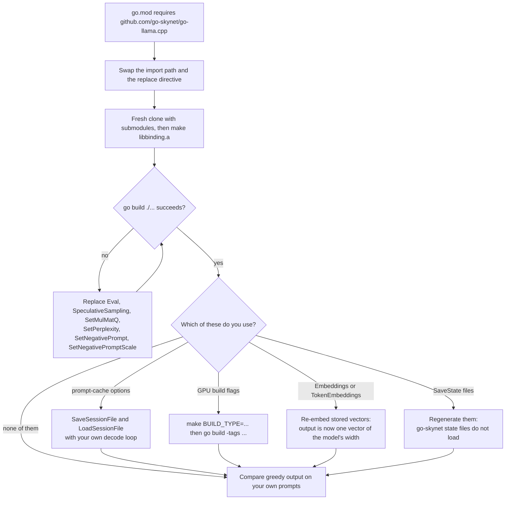
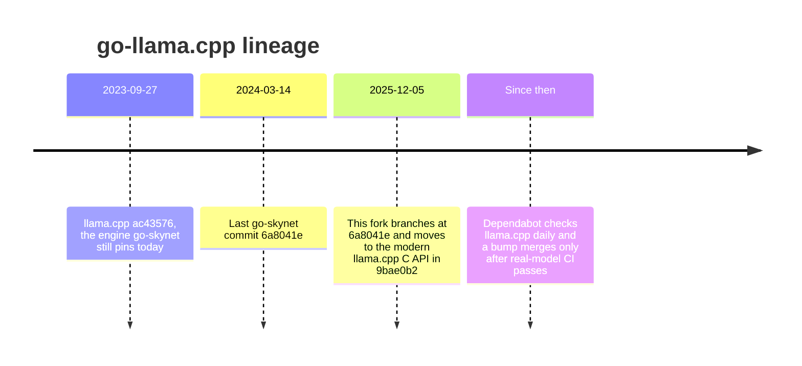

# Migrating from go-skynet/go-llama.cpp

This repository started from the last commit of
[go-skynet/go-llama.cpp](https://github.com/go-skynet/go-llama.cpp) and kept
its API. The package is still called `llama`, and `New` and `Predict` have the
same signatures. Most programs move over by changing one import path and
rebuilding.

This page covers everything else: the six names that were removed, the
behaviour that changed without a compile error, and how to check that your
program still does what you expect.

## TL;DR

1. Change the import path and your `replace` directive ([Step 1](#step-1-switch-the-module)).
2. Build `libbinding.a` from a fresh clone. You need Go 1.26+, a C++17
   compiler and CMake ([Step 2](#step-2-rebuild-the-engine)).
3. If `go build` fails, replace the six removed names
   ([Step 3](#step-3-fix-what-no-longer-compiles)).
4. Read the changes the compiler cannot catch
   ([Step 4](#step-4-check-what-changed-without-a-compile-error)). The ones
   most programs notice: RoPE settings now come from the model, `Predict` adds
   a min-p stage by default, and the prompt-cache options do nothing.
5. Compare greedy output on your own prompts ([Step 5](#step-5-verify-the-migration)).

```diff
 import (
-	llama "github.com/go-skynet/go-llama.cpp"
+	llama "github.com/AshkanYarmoradi/go-llama.cpp"
 )
```

```diff
-replace github.com/go-skynet/go-llama.cpp => ./go-llama
+replace github.com/AshkanYarmoradi/go-llama.cpp => ./go-llama
```



## Is this you?

You are in the right place if your `go.mod` requires
`github.com/go-skynet/go-llama.cpp`, usually with a `replace` directive pointing
at a local clone, or if you vendor go-skynet's repository as a git submodule.

go-skynet has had no commits since March 2024, and its engine is still the
llama.cpp of September 2023. The repository is not archived, but it predates
llama.cpp's sampler-chain API and most model architectures and quantization
types released since. This fork branched at exactly go-skynet's last commit,
`6a8041e`. One commit, `9bae0b2`, moved it to the modern llama.cpp C API and
made every removal listed below. Since then the API has grown. The only
signature change was to `SamplerPenalties`, which go-skynet never had.



## What did not change

- **The package and the two calls you use most.** The package name is `llama`,
  options are still functional options, and
  `New(model string, opts ...ModelOption) (*LLama, error)` and
  `Predict(text string, opts ...PredictOption) (string, error)` are unchanged.
  This fragment compiles against both projects:

  ```go
  model, err := llama.New("model.gguf", llama.SetContext(2048), llama.SetGPULayers(0))
  if err != nil {
  	log.Fatal(err)
  }
  defer model.Free()

  out, err := model.Predict("[INST] How much is 2+2? [/INST]", llama.SetTokens(32), llama.SetThreads(8))
  if err != nil {
  	log.Fatal(err)
  }
  fmt.Println(out)
  ```

- **Almost every exported name.** Every exported type (`LLama`, `ModelOptions`,
  `PredictOptions`, `ModelOption`, `PredictOption`) is still there, and so are
  all but six of go-skynet's exported functions and methods.
- **All 12 option variables**, misspelling included: `DefaultModelOptions`,
  `DefaultOptions`, `EnabelLowVRAM`, `EnableNUMA`, `EnableEmbeddings`,
  `EnableF16Memory`, `EnableF16KV`, `Debug`, `EnablePromptCacheAll`,
  `EnablePromptCacheRO`, `EnableMLock` and `IgnoreEOS`. Several of them no
  longer do anything; see [Step 4](#options-that-are-accepted-but-do-nothing).
- **Most defaults.** `SetTokens` 128, top-k 40, top-p 0.95, temperature 0.8,
  repeat penalty 1.1 over the last 64 tokens, seed -1 (random), context 512,
  batch 512, mmap on, and 0 GPU layers. The defaults that did change are listed
  in [Step 4](#step-4-check-what-changed-without-a-compile-error).
- **The build entry points.** `git clone --recurse-submodules`,
  `make libbinding.a`, `make test` and `make clean`, plus a `replace`
  directive in your own module.
- **The test model.** CI runs against the same CodeLlama-7B-Instruct Q2_K file
  go-skynet's suite used. go-skynet's suite had 5 specs; this fork runs a full
  Ginkgo suite on Linux and macOS for every pull request.

## Step 1: Switch the module

Rewrite the import path in your Go files first. `perl -pi` behaves the same on
Linux and macOS:

```bash
grep -rl --include='*.go' --exclude-dir=vendor --exclude-dir=go-llama \
  'github.com/go-skynet/go-llama.cpp' . |
  xargs perl -pi -e 's#github\.com/go-skynet/go-llama\.cpp#github.com/AshkanYarmoradi/go-llama.cpp#g'
```

Replace `go-llama` with the directory of any go-skynet checkout inside your
module. Its own example and tests import the old path too, and if they are
rewritten, moving that checkout to the fork fails with `Your local changes ...
would be overwritten`. `git -C go-llama checkout -- .` undoes the rewrite.

Then update `go.mod` for whichever setup you have.

### Your module requires go-skynet through a `replace`

```bash
# Clone and build the fork next to your module.
git clone --recurse-submodules https://github.com/AshkanYarmoradi/go-llama.cpp ../go-llama.cpp
make -C ../go-llama.cpp libbinding.a

# Swap the requirement and the replace directive, then let Go tidy up.
go mod edit \
  -dropreplace=github.com/go-skynet/go-llama.cpp \
  -droprequire=github.com/go-skynet/go-llama.cpp \
  -replace=github.com/AshkanYarmoradi/go-llama.cpp=../go-llama.cpp
go mod tidy
go build ./...
```

`go mod tidy` writes the requirement as
`v0.0.0-00010101000000-000000000000`, the placeholder Go uses for a module
replaced by a directory. It also raises your module's `go` line to `1.26.0`,
because the fork requires it. If your build sets `LIBRARY_PATH` and
`C_INCLUDE_PATH`, point them at the new checkout.

### You vendor go-skynet as a git submodule

Point the submodule at the fork, move it to `main` (go-skynet used `master`),
and rebuild from clean:

```bash
git submodule set-url -- go-llama https://github.com/AshkanYarmoradi/go-llama.cpp
git -C go-llama fetch origin
git -C go-llama checkout origin/main
git -C go-llama submodule sync --recursive
git -C go-llama submodule update --init --recursive
make -C go-llama clean libbinding.a

go mod edit \
  -dropreplace=github.com/go-skynet/go-llama.cpp \
  -droprequire=github.com/go-skynet/go-llama.cpp \
  -replace=github.com/AshkanYarmoradi/go-llama.cpp=./go-llama
go mod tidy
git add .gitmodules go-llama go.mod go.sum
```

### Pinning a version

There are no semver tags yet, so a `require` line always shows a
pseudo-version. Releases are tagged `llama.cpp-<sha>`, usually one per merged
engine bump. To pin,
check out a commit or one of those tags in your clone, run
`git submodule update --init` inside it, and rebuild with
`make clean libbinding.a`.

## Step 2: Rebuild the engine

The engine is about three years newer, and the build changed with it:

| | go-skynet | This fork |
|---|---|---|
| Go | 1.21 | 1.26 or newer |
| C++ standard | C++11 | C++17 |
| Build | CMake, then individual object files copied from `build/` into `llama.cpp/` and archived | `make libbinding.a` runs one CMake build into `./build` and archives it |
| Extra link flags | Accelerate on macOS | Metal, MetalKit, Foundation and Accelerate on macOS; `-fopenmp` on Linux (libgomp ships with GCC) |
| Patches | `patches/1902-cuda.patch` | none |

Build from a fresh clone, or run `make clean` first. The first build compiles
all of llama.cpp and takes a while; later builds reuse it.

### Models

Neither project reads the old GGML `.bin` format. Both read GGUF, with one
difference: this engine rejects GGUF version 1 files, and `New` returns
`failed loading model "<path>"` while llama.cpp logs
`GGUFv1 is no longer supported`. Re-convert those with
`llama.cpp/convert_hf_to_gguf.py`. Older GGUF files that do load may log
`missing pre-tokenizer type` followed by a quality warning; re-converting from
the original weights fixes that too.

### GPU builds

go-skynet's GPU recipes passed linker flags by hand. Here the flags live in
build-tag files, so you pick a `BUILD_TYPE` for `make` and the matching tag
for `go build`:

| You used | Now |
|---|---|
| `BUILD_TYPE=cublas` with `CGO_LDFLAGS="-lcublas -lcudart ..."` | `make BUILD_TYPE=cublas libbinding.a`, then `go build -tags cublas` (CUDA under `/usr/local/cuda`) |
| `BUILD_TYPE=hipblas` with ROCm compilers and `CGO_LDFLAGS` | `make BUILD_TYPE=hipblas libbinding.a`, then `go build -tags hipblas` (ROCm 6.1+ under `/opt/rocm`) |
| `BUILD_TYPE=openblas` or `blis` with `CGO_LDFLAGS` | `make BUILD_TYPE=openblas libbinding.a`, then `go build -tags openblas` (`blis` works the same way). Both also need `pkg-config`, which llama.cpp uses to find the BLAS headers, unless `CMAKE_ARGS` sets `-DBLAS_INCLUDE_DIRS` |
| `BUILD_TYPE=clblas` (OpenCL through CLBlast) | Removed upstream, and `make` stops with an error. Use `BUILD_TYPE=vulkan` and `-tags vulkan`, which needs the Vulkan headers and loader, `glslc` and the SPIR-V headers |
| `BUILD_TYPE=metal`, the Metal frameworks in `CGO_LDFLAGS`, and copying `ggml-metal.metal` | Metal is part of the default Apple build. `BUILD_TYPE=metal` still works, and there are no flags to pass and no `.metal` file to copy |

Switching `BUILD_TYPE` rebuilds llama.cpp from scratch on its own. Run
`make clean` after you change `CMAKE_ARGS`. A `CMAKE_ARGS` given on the make
command line adds to the build type's options instead of replacing them, and
a `BUILD_TYPE` the Makefile does not know, such as `cuda`, stops with an error
instead of quietly building for the CPU. Offloading is still opt-in per
model with `SetGPULayers(n)`, which defaults to 0, and the new
`llama.SupportsGPUOffload()` reports whether llama.cpp found a GPU it can
offload to: false on a CPU-only build, and on a GPU build with no device or
driver. [how-it-works.md](how-it-works.md) has the details of each backend.

## Step 3: Fix what no longer compiles

Six exported names were removed. The links go to their go-skynet source.

| Removed | Use instead |
|---|---|
| [`(*LLama).Eval(text string, opts ...PredictOption) error`](https://github.com/go-skynet/go-llama.cpp/blob/6a8041ef6b46d4712afc3ae791d1c2d73da0ad1c/llama.go#L179) | `Tokenize`, then `NewBatch` and `Batch.Add`, then `Decode`. See the snippet below. |
| [`(*LLama).SpeculativeSampling(ll *LLama, text string, opts ...PredictOption) (string, error)`](https://github.com/go-skynet/go-llama.cpp/blob/6a8041ef6b46d4712afc3ae791d1c2d73da0ad1c/llama.go#L219) | No built-in replacement. You can build it from a second `*LLama` as the draft model, using `Decode`, `Logits` and `MemorySeqRemove` to roll back rejected tokens. This fork does not test that pattern. `SetNDraft` still compiles and does nothing. |
| [`SetMulMatQ(b bool) ModelOption`](https://github.com/go-skynet/go-llama.cpp/blob/6a8041ef6b46d4712afc3ae791d1c2d73da0ad1c/options.go#L100) | Delete the call. llama.cpp chooses its matrix-multiplication kernels itself. |
| [`SetPerplexity(b bool) ModelOption`](https://github.com/go-skynet/go-llama.cpp/blob/6a8041ef6b46d4712afc3ae791d1c2d73da0ad1c/options.go#L204) | Request logits per token instead: `batch.Add(tok, pos, seqIDs, true)`, then `model.Logits(i)`. `Example_perplexity` in [example_test.go](../example_test.go) computes perplexity this way. |
| [`SetNegativePrompt(np string) PredictOption`](https://github.com/go-skynet/go-llama.cpp/blob/6a8041ef6b46d4712afc3ae791d1c2d73da0ad1c/options.go#L216) and [`SetNegativePromptScale(nps float32) PredictOption`](https://github.com/go-skynet/go-llama.cpp/blob/6a8041ef6b46d4712afc3ae791d1c2d73da0ad1c/options.go#L210) | No replacement. llama.cpp removed classifier-free guidance from its sampling API. |

If you build option structs by hand, four fields went with them:
`ModelOptions.MulMatQ`, `ModelOptions.Perplexity`,
`PredictOptions.NegativePrompt` and `PredictOptions.NegativePromptScale`.

### Replacing `Eval`

go-skynet's `Eval` tokenized the text with BOS, ran it through the model from
position 0, and returned. This does the same and leaves the next-token logits
ready for `model.Logits(-1)` or a sampler chain:

```go
// decode feeds tokens into sequence 0 starting at position pos, in chunks of
// at most the context's NBatch tokens (the most one Decode accepts), and
// requests logits for the last one.
func decode(model *llama.LLama, tokens []int32, pos int) error {
	if len(tokens) == 0 {
		return errors.New("no tokens to decode")
	}
	n := model.ContextParams().NBatch
	batch := llama.NewBatch(n, 1)
	defer batch.Free()
	for start := 0; start < len(tokens); start += n {
		batch.Reset()
		for i := start; i < min(start+n, len(tokens)); i++ {
			if err := batch.Add(tokens[i], int32(pos+i), []int32{0}, i == len(tokens)-1); err != nil {
				return err
			}
		}
		if rc := model.Decode(batch); rc != 0 {
			return fmt.Errorf("decode returned status %d", rc)
		}
	}
	return nil
}

// eval is the closest match to go-skynet's model.Eval(text).
func eval(model *llama.LLama, text string) error {
	model.MemoryClear(true) // Eval always started at position 0
	return decode(model, model.Tokenize(text, true, false), 0)
}
```

Only the last token asks for logits. Sampling from a position that did not ask
for them stops the process inside llama.cpp, so keep the `true` on whichever
token you read.

### If you adopted the fork early

`llama.SamplerPenalties(...)` became the method `model.SamplerPenalties(...)`
when llama.cpp started requiring the vocabulary size for that stage. go-skynet
never had it. [CHANGELOG.md](../CHANGELOG.md) lists the notable API changes
since the fork.

## Step 4: Check what changed without a compile error

These compile unchanged but behave differently. Each table says what go-skynet
did, what happens now, and what to do about it.

### Defaults

| Default | go-skynet | Now |
|---|---|---|
| `DefaultModelOptions.FreqRopeBase` / `FreqRopeScale` | 10000 / 1.0 | 0 / 0, meaning "use the model's trained values" |
| `DefaultOptions.MinP` | (no such field) | 0.05, so `Predict` adds a min-p stage |
| `DefaultOptions.Threads` | 4 | 0, meaning "keep the context's setting", which is 4 unless you change it |

### Loading a model

| You use | go-skynet | Now | What to do |
|---|---|---|---|
| No RoPE options | Every model ran at RoPE base 10000 and scale 1.0. Passing 0 also gave 10000 and 1.0. | The model's own trained values. `WithRopeFreqBase`/`WithRopeFreqScale` with a non-zero value still override. | Usually nothing: models trained with other values now run as trained, so their output changes. To get go-skynet's RoPE values back, pass `WithRopeFreqBase(10000)` and `WithRopeFreqScale(1)`. |
| `EnableF16Memory`, or not | The KV cache was 32-bit unless you passed it. | The KV cache is always 16-bit, llama.cpp's default. The option does nothing. | Expect the cache to take half the memory. Remove the option. |
| `EnableMLock` | mmap plus mlock. | Selects llama.cpp's mlock load mode, which reads the model into RAM instead of mapping it. | If you relied on mmap with mlock, measure load time and memory. |
| `SetLoraAdapter`, `SetLoraBase` | An adapter in the old GGML LoRA format, applied with the optional base model. A failure made `New` fail. | The adapter must be GGUF and is applied at scale 1.0. `SetLoraBase` does nothing. A failure only prints a warning on stderr, and `New` succeeds. | Convert adapters with `llama.cpp/convert_lora_to_gguf.py`. Prefer `model.ApplyLoRA(path, scale)`, which returns an error. |
| `SetModelSeed`, `EnabelLowVRAM` | Passed to llama.cpp. | No effect. | Seed each call with `SetSeed`. Control VRAM with `SetGPULayers`. |
| `SetContext(n)` | Used as given. | Rounded up to a multiple of 256. `SetContext(0)` means the model's training context. | Read `model.ContextParams().NCtx` for the real size. |
| `New` errors | `failed loading model` | `failed loading model "<path>"`. `New` also accepts the first shard of a `-00001-of-0000N.gguf` set. | Update any string matching. The reason for a failure is in the llama.cpp log. |

To see the RoPE values your model was trained with:

```go
arch, _ := model.ModelMetadataValue("general.architecture")
if base, ok := model.ModelMetadataValue(arch + ".rope.freq_base"); ok {
	fmt.Println("trained RoPE base:", base) // go-skynet always ran at 10000
}
```

### Generating with `Predict`

| You use | go-skynet | Now | What to do |
|---|---|---|---|
| Prompt tokenization | BOS was added only for SentencePiece vocabularies. Special-token text in the prompt, such as `</s>` or `<\|im_start\|>`, was split into ordinary text tokens. | BOS follows the model's own add-BOS flag, and special-token markup is parsed into single control tokens, as chat templates expect. | Hand-built chat prompts now tokenize the way the model was trained. If you put untrusted text into a prompt, strip special-token strings from it first. |
| Default sampling | Repeat penalty, top-k, tail-free, typical, top-p, temperature. | The same stages minus tail-free, plus min-p 0.05. | `SetMinP(0)` removes the min-p stage. |
| `SetTemperature(0)` | Greedy, after the logit bias and the repeat penalty (1.1 by default). | Greedy after the grammar and the logit bias only. The repeat, frequency and presence penalties are skipped. | If greedy replies now loop, keep a temperature above 0 and pass `SetTopK(1)`. The penalty stage runs before top-k, so the pick is greedy but penalized, close to go-skynet's. |
| `SetTailFreeSamplingZ` | Ran tail-free sampling. | No effect: llama.cpp removed it. | Use `SetMinP` or `SetTopNSigma` instead. |
| `SetPenalizeNL`, or not | By default the newline token was exempt from the repeat penalty. | Newlines are penalized like any other token, and the option does nothing. | If replies lose their line breaks, lower `SetPenalty`. |
| Repeat-penalty window (`SetRepeat`, default 64) | The last 64 tokens of prompt and reply together, so words from the prompt were penalized from the first generated token. | Only the tokens `Predict` has generated, for the repeat, frequency and presence penalties alike. The prompt is not counted. | Replies may reuse the prompt's wording more. To count the prompt, run your own loop and `Accept` the prompt tokens into a chain holding `model.SamplerPenalties` before sampling. |
| `SetLogitBias("token+value")` | One token. A malformed value could abort the process. | The same format, still one token. A malformed value is reported on stderr and ignored. | For several tokens, use `model.SamplerLogitBias` in your own chain. |
| `WithGrammar` | Constrained the choice. A grammar that failed to parse made `Predict` return an error. | Constrains the choice: the grammar stage runs first, and each token is accepted once. A grammar that fails to parse still makes `Predict` return an error, the generic `inference failed`. | Nothing. The parser prints why it rejected a grammar to stderr, bypassing any `SetLogHandler`. |
| End of generation | Stopped on the EOS token only. | Stops on any end-of-generation token (`IsEOG`), such as `<\|eot_id\|>` or `<\|im_end\|>`. Its text is not part of the result or the token callback, as before. | Stop words you added only to catch end-of-turn markers can go. |
| `SetStopWords` | Matched within a couple of characters of the end, then trimmed with `strings.TrimRight`, which treats the stop word as a set of characters. | Matches when the output ends with the stop word, and removes exactly that suffix. | Nothing. Replies no longer lose legitimate trailing characters. |
| The result buffer | The prompt and the reply were copied into a buffer of `SetTokens` bytes, which most calls overran. | The buffer allows 8 bytes per token plus the prompt plus 1 KiB, up to 4 MiB. Anything longer is cut off silently. | Stream long generations with `SetTokenCallback`. |
| `SetThreads(n)` per call | Used for that call. | Used for that call, then the context's setting comes back. | Nothing. To set it once, call `model.SetThreads(n, nBatch)` after `New`. |
| `SetTokenCallback(fn)` per call | Afterwards, deleted any callback set with `model.SetTokenCallback`. | Afterwards, restores it. | Nothing. |
| `Debug` | Echoed every token to stdout and printed timings. | Only prints llama.cpp's performance summary, through the log. | Use a token callback to echo tokens. |

### Embeddings

| You use | go-skynet | Now | What to do |
|---|---|---|---|
| `Embeddings(text)` | The last token's embedding, in a slice of `SetTokens` floats (128 by default). Real models have far more dimensions than that, so the copy overran the slice. | One vector of the model's output embedding width, `n_embd_out`, which is `n_embd` (`GetModelInfo().EmbeddingSize`) for nearly every model. When the context pools (`ContextParams().Pooling` is not `PoolingNone`, as for most embedding models) it is the pooled sequence embedding; a generative model does not pool and returns the last token's. A reranker returns its scores. Text longer than the context's `NBatch` returns an error. | Drop any `SetTokens` sizing; the options are ignored. Re-embed stored vectors instead of mixing old and new ones in one index. |
| `TokenEmbeddings(tokens)` | Turned the ids back into text and re-tokenized it, adding BOS for SentencePiece models. | Embeds exactly the ids you pass, with the same output as `Embeddings`. An id outside the vocabulary returns an error. | If you relied on the added BOS, prepend `model.GetSpecialTokens().BOS` yourself. |
| Enabling embeddings | `EnableEmbeddings` at load. | `EnableEmbeddings` at load, or `model.SetEmbeddings(true)` later. | Nothing. |

### Saved state and prompt caching

| You use | go-skynet | Now | What to do |
|---|---|---|---|
| `SetPathPromptCache`, `EnablePromptCacheAll`, `EnablePromptCacheRO` | `Predict` loaded a session file, skipped the matching prompt prefix, and saved it again. | No effect. `Predict` starts every call from an empty cache. | Save and restore the cache yourself with `SaveSessionFile` and `LoadSessionFile` (below). Delete old session files: this engine cannot read them. |
| `SaveState` / `LoadState` | Handed llama.cpp the wrong pointer, so the files were not usable. | Real llama.cpp state. `SaveState` reports write errors, and `LoadState` restores into a fresh context. | Regenerate any state files. For in-memory snapshots, use `StateData` and `SetStateData`. |
| `Free` | Calling it twice freed the model twice. | Calling it again does nothing, and it also unregisters the model's token and abort callbacks. | Nothing. |

`Predict` no longer has a prompt cache built in. The replacement decodes a long
shared prefix once, saves it, and later restores it and decodes only the new
text. It reuses `decode` from [Replacing `Eval`](#replacing-eval):

```go
// savePrefix decodes a shared prompt prefix once and writes the cache and its
// tokens to path.
func savePrefix(model *llama.LLama, prefix, path string) error {
	tokens := model.Tokenize(prefix, true, true) // parse special tokens, as Predict does
	model.MemoryClear(true)
	if err := decode(model, tokens, 0); err != nil {
		return err
	}
	return model.SaveSessionFile(path, tokens)
}

// resume restores the prefix, in this process or another, and decodes only
// the new text after it. Load the same model with the same options first.
func resume(model *llama.LLama, path, text string) error {
	cached, err := model.LoadSessionFile(path)
	if err != nil {
		return err
	}
	return decode(model, model.Tokenize(text, false, true), len(cached))
}
```

After `resume`, sample the reply with a sampler chain. Don't call `Predict` in
between: it clears the cache. The [cookbook](cookbook.md) has the full
generation loop.

### Options that are accepted but do nothing

These still compile so that old code builds, but they have no effect. Options
with no effect are marked `Deprecated` in the API docs, so `staticcheck`
(check SA1019) and gopls point them out.

| Option | Where it applies | Use instead |
|---|---|---|
| `IgnoreEOS` | `Predict` | Nothing in `Predict`. In your own loop, keep going past `IsEOG`. It did nothing in go-skynet either. |
| `EnableF16KV` | `Predict` | Nothing: the KV cache is already 16-bit. |
| `SetPathPromptCache`, `EnablePromptCacheAll`, `EnablePromptCacheRO` | `Predict` | `SaveSessionFile` / `LoadSessionFile` |
| `SetMlock`, `SetMemoryMap` | `Predict` | `EnableMLock`, `SetMMap` when loading |
| `SetRopeFreqBase`, `SetRopeFreqScale` | `Predict` | `WithRopeFreqBase`, `WithRopeFreqScale` when loading |
| `SetPredictionMainGPU`, `SetPredictionTensorSplit` | `Predict` | `SetTensorSplit` when loading. The load-time `SetMainGPU` does not change placement either, because the binding uses llama.cpp's layer split, where `main_gpu` is not read. |
| `SetNDraft` | `Predict` | Nothing; speculative decoding is up to you ([Step 3](#step-3-fix-what-no-longer-compiles)). |
| `SetTailFreeSamplingZ` | `Predict` | `SetMinP` or `SetTopNSigma` |
| `SetPenalizeNL` | `Predict` | Nothing |
| `SetModelSeed` | `New` | `SetSeed` on each call |
| `EnableF16Memory` | `New` | Nothing: the KV cache is already 16-bit. |
| `EnabelLowVRAM` | `New` | `SetGPULayers` |
| `SetLoraBase` | `New` | Nothing; use `ApplyLoRA` for adapters. |

To find them without staticcheck (adjust the `llama.` prefix if you import the
package under another name):

```bash
grep -rnw --include='*.go' -E 'llama\.(IgnoreEOS|EnableF16KV|SetPathPromptCache|EnablePromptCacheAll|EnablePromptCacheRO|SetMlock|SetMemoryMap|SetRopeFreqBase|SetRopeFreqScale|SetPredictionMainGPU|SetPredictionTensorSplit|SetNDraft|SetTailFreeSamplingZ|SetPenalizeNL|SetModelSeed|EnableF16Memory|EnabelLowVRAM|SetLoraBase)' .
```

## Step 5: Verify the migration

1. **Build and vet.** `go build ./... && go vet ./...`. Then run staticcheck
   to find the options that no longer do anything:

   ```bash
   go run honnef.co/go/tools/cmd/staticcheck@latest -checks SA1019 ./...
   ```

2. **Read the engine's log once.** Route it to stderr with a filter, then load
   your model. Check the `freq_base` line against what you expect, the
   `offloaded N/M layers to GPU` line on a GPU build, and any warnings, such
   as an old GGUF file's missing pre-tokenizer:

   ```go
   llama.SetLogHandler(func(level llama.LogLevel, text string) {
   	if level == llama.LogLevelWarn || level == llama.LogLevelError ||
   		strings.Contains(text, "offloaded") || strings.Contains(text, "freq_base") {
   		fmt.Fprint(os.Stderr, text)
   	}
   })
   ```

3. **Compare outputs with sampling taken out.** `SetTemperature(0)` makes both
   versions pick the most likely token. go-skynet still applied its repeat
   penalty before that pick and this fork does not, so also pass
   `SetPenalty(1)` to both. Differences then come from the engine rather than
   the sampler. Expect different text anyway: the engine is newer, RoPE values
   now come from the model, and the prompt may tokenize differently
   ([Step 4](#generating-with-predict)). Judge whether the answers are right,
   not whether they match.

   ```go
   out, err := model.Predict(prompt, llama.SetTemperature(0), llama.SetPenalty(1), llama.SetTokens(64))
   if err != nil {
   	log.Fatal(err)
   }
   fmt.Println(out)
   ```

4. **Compare speed** with the same thread count in both versions. `Perf`
   reports the counters llama.cpp keeps:

   ```go
   p := model.Perf()
   if p.PromptEvalMS > 0 && p.EvalMS > 0 {
   	fmt.Printf("prompt %.1f tok/s, generation %.1f tok/s\n",
   		float64(p.PromptTokens)/p.PromptEvalMS*1000,
   		float64(p.EvalTokens)/p.EvalMS*1000)
   }
   ```

## Bugs you inherited that are gone

go-skynet had memory-safety bugs that could corrupt a Go program without any
error. If you saw rare crashes or garbled output, these may explain it. None
of them exist here:

- `Predict` copied the prompt and the reply together into a buffer of
  `SetTokens` bytes with `strcpy`, and trimmed the prompt off afterwards. With
  the default of 128, most calls wrote past the Go slice.
- `Embeddings` and `TokenEmbeddings` wrote a full embedding into a slice of
  `SetTokens` floats.
- `TokenizeString` wrote every token into a slice of `SetTokens` ints, so
  long inputs overran it. It is bounds-safe now, and `Tokenize` is the simpler
  call.
- Each `Predict` and `TokenizeString` call leaked C allocations.
- A malformed `SetMainGPU`, `SetTensorSplit` or `SetLogitBias` value could
  throw a C++ exception through cgo, which ends the process. Those values are
  now reported on stderr and ignored (for `SetTensorSplit`, the whole split),
  and other C++ exceptions inside `Predict` come back as an error.
- `SaveState` and `LoadState` passed the wrong pointer type to llama.cpp, so
  they read and wrote the wrong memory.

## What is still the same, limitations included

Some behaviour carried over unchanged. None of it is a migration regression,
but it is worth knowing:

- **Not `go get`-only.** You still clone with submodules, run
  `make libbinding.a`, and add a `replace` directive.
- **`Predict` starts from an empty cache** on every call, as it did in
  go-skynet without a prompt cache. For multi-turn chat, send the whole
  conversation each time (`ApplyChatTemplate` renders it), or drive the cache
  yourself with `Decode`.
- **`Predict` errors are generic.** It returns `inference failed`; the reason
  goes to stderr or to your `SetLogHandler`.
- **`IgnoreEOS` and the per-call RoPE, GPU, mmap and mlock options** did not
  change generation in go-skynet either. Those settings are fixed when the
  model loads.
- **GPU offload is opt-in.** `SetGPULayers` defaults to 0.
- **One goroutine at a time.** A `*LLama` is not safe for concurrent use. Keep
  token callbacks short and don't call `Free` or `Predict` on the model from
  inside one. `SetTokenCallback` and calls on other models are safe there:
  the binding releases its lock before it runs the callback.
- **`Free` is still required.** Nothing is reclaimed by the garbage collector.

[production.md](production.md) covers the failure model and the remaining
known limitations.

## What you gain

Most of these have a recipe in the [cookbook](cookbook.md). GPU builds are
covered in [how-it-works.md](how-it-works.md#gpu-builds).

- **Chat prompts from the model itself.** `ApplyChatTemplate` renders a
  conversation with the template stored in the GGUF file.
- **Cancellation.** `SetAbortCallback` stops a decode that is already running,
  for example when a `context.Context` expires.
- **Your own generation loop.** `Tokenize`, `NewBatch`, `Decode`,
  `NewSamplerChain`, `IsEOG` and `TokenToPiece` give you every step that
  `Predict` hides.
- **Current sampling.** Min-p, XTC, DRY and top-n-sigma are available as
  `Predict` options. They apply only above temperature 0, and min-p, XTC and
  top-n-sigma are skipped when `SetMirostat` selects Mirostat 1 or 2.
  Composable stages include `SamplerLogitBias` to ban or boost tokens, and
  `SamplerGrammar` and `SamplerGrammarLazy` for GBNF; put grammar stages first
  in a chain.
- **KV-cache control.** `MemorySeqRemove`, `MemorySeqAdd` and `MemoryCanShift`
  let you shift a long conversation instead of starting over.
- **Save and resume across processes.** `SaveSessionFile` and
  `LoadSessionFile`, in-memory `StateData` and `SetStateData`, and
  per-sequence `SequenceStateData`.
- **Several sequences per context**, once you raise the `SetNSeqMax` load
  option (up to `MaxParallelSequences()` and the batch size).
- **Logs in your own logger.** `SetLogHandler` routes llama.cpp's output
  wherever you want it.
- **Adapters at run time.** `ApplyLoRA` stacks LoRA adapters with a scale,
  `ClearLoRA` removes them, and `SetControlVector` steers the model.
- **Model introspection.** `GetModelInfo`, `Architecture`, `ModelMetadata`,
  `GetSpecialTokens`, `ContextParams` and `Perf`.
- **Model files from Go.** `Quantize`, `NewFromSplits` for sharded models, and
  `SaveModel`.
- **GPU backends on a current engine.** CUDA, ROCm and Vulkan (which replaces
  go-skynet's OpenCL) through `BUILD_TYPE` and a build tag, with no
  hand-written linker flags. Metal is the default on Apple, and OpenBLAS or
  BLIS serve the CPU.
- **An engine that keeps up.** Dependabot checks llama.cpp daily. A bump merges
  only after CI has run a real 7B model on Linux and macOS.

## Getting help

- Something still broken after following this page? Open a
  [migration issue](https://github.com/AshkanYarmoradi/go-llama.cpp/issues/new?template=migration.yml).
  It asks for your old commit, the call involved, and what you expected.
- [CHANGELOG.md](../CHANGELOG.md) lists API changes made since the fork.
- [getting-started.md](getting-started.md) walks through a first build and
  covers common build errors.

Thanks to the go-skynet authors, whose design this fork still follows.
