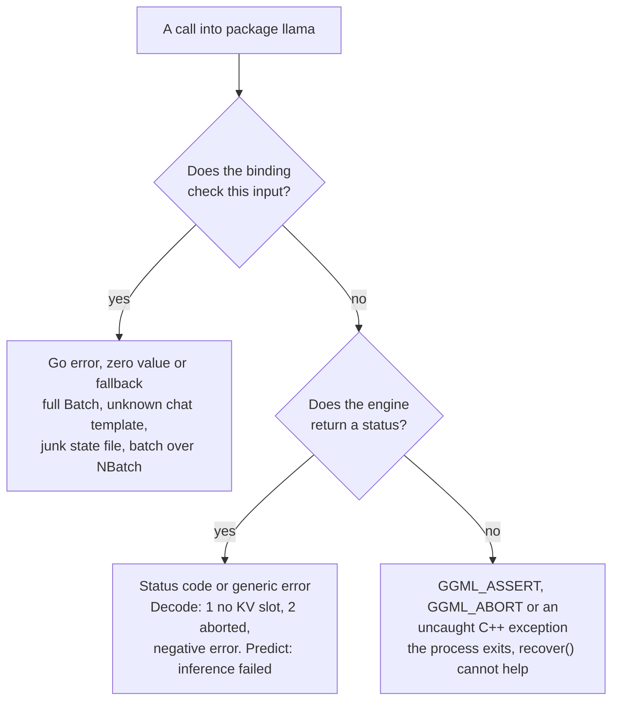

# Running go-llama.cpp in production

This page is for engineers deciding whether to put the binding inside a
service, and for those who already have. It covers what is tested, how calls
fail, how to share a model between goroutines, how to cancel work, what to log,
and how to upgrade and roll back. The README's "Things to know" and "Tested on"
sections are summaries of this page.

How the pieces fit together is in [How it works](how-it-works.md). Recipes for
everyday tasks are in the [cookbook](cookbook.md).

- [Support matrix](#support-matrix)
- [Failure model](#failure-model)
- [Guards the binding already has](#guards-the-binding-already-has)
- [Concurrency](#concurrency)
- [Resources and lifetime](#resources-and-lifetime)
- [Thread tuning](#thread-tuning)
- [Timeouts and back-pressure](#timeouts-and-back-pressure)
- [Observability](#observability)
- [Upgrades and rollback](#upgrades-and-rollback)
- [Known limitations](#known-limitations)
- [Security](#security)

## Support matrix

Last reviewed 2026-10-07.

| Platform | Backend | What CI does |
|---|---|---|
| Linux x86-64 | CPU | Runs the real-model specs |
| macOS, Apple Silicon | CPU | Runs the real-model specs |
| macOS, Apple Silicon | Metal | Runs the real-model specs with 0 GPU layers, so layer offload is not exercised (large prompt batches still run on Metal) |
| Linux x86-64 | CUDA | The `ubuntu-cuda-build` job builds `libbinding.a` in the `nvidia/cuda` image and links binaries against it, on a runner with no GPU. The `gpu` specs run only in the opt-in GPU tests workflow, on a self-hosted NVIDIA runner. |
| Linux x86-64 | Vulkan | The `ubuntu-vulkan-build` job builds `libbinding.a` and links binaries against it, on a runner with no GPU |
| Linux | ROCm, OpenBLAS, BLIS | Not built. Lint type-checks their build tags with `go vet`. |
| Linux arm64, Intel Macs | any | Not tested |
| Windows | any | Not supported by the Makefile |

Every pull request and every push to `main` runs the real-model jobs of the
CI workflow, on Go 1.26.x and on the latest stable Go, and the two jobs of the
GPU builds workflow. The real-model jobs load one model,
CodeLlama-7B-Instruct at Q2_K. Other architectures go through the same engine
code, but this repository does not test them, so smoke-test your own model
before you ship (see [Upgrades and rollback](#upgrades-and-rollback)). The GPU
tests workflow runs when started by hand, on a pull request labelled `gpu`, and
on pushes to `main` and tags only when the repository variable `GPU_RUNNER` is
`true`.
[Backends](how-it-works.md#backends) says what each check proves.

## Failure model



Failures fall into three tiers. The first two are ordinary Go error handling.
The third ends the process, and the only defence is not to make the call.

### Tier 1: Go errors, zero values and fallbacks

| Call | Bad input | What you get |
|---|---|---|
| `New`, `NewFromSplits` | missing or unreadable file, empty shard list | error and a nil model |
| `New` | `SetNSeqMax` above `MaxParallelSequences()`, or above the batch size (the smaller of `SetNBatch` and `SetContext`, which is the training context for `SetContext(0)`) | error and a nil model |
| `New` | non-numeric `SetMainGPU` | the value is ignored, with a message on stderr |
| `New` | a `SetTensorSplit` entry that is not a number | the whole split is ignored, with a message on stderr, and llama.cpp's default split is used |
| `New` | more `SetTensorSplit` entries than `MaxDevices()` | the extra entries are ignored, with a message on stderr |
| `Predict` | malformed `SetLogitBias` string | the bias is ignored and generation continues |
| `Predict` | a `WithGrammar` grammar that does not parse | `inference failed` |
| `Batch.Add` | batch full, too many sequence ids | error |
| `Decode` | more tokens than `ContextParams().NBatch` | -1 |
| `Encode` | more tokens than `ContextParams().NUbatch` | -1 |
| `Embeddings`, `TokenEmbeddings` | embeddings not enabled, input longer than `NBatch`, a token id outside the vocabulary | error |
| `ApplyChatTemplate` | a template llama.cpp cannot place | `ErrNoChatTemplate` |
| `SetStateData`, `SetSequenceStateData` | empty data | error |
| `LoadSessionFile`, `LoadSequenceFile` | missing or malformed file | error |
| `SaveModel`, `SaveState` | unwritable path | error |
| `TokenToPiece` | token id outside the vocabulary | `""` |
| `Detokenize` | any token id outside the vocabulary | `""` for the whole call |
| `TokenText`, `TokenScore`, `TokenAttr`, `IsEOG`, `IsControlToken` | token id outside the vocabulary | zero value |
| `TokenToPiece`, `TokenText`, `TokenScore`, `TokenAttr`, `IsControlToken` | any token of a model without a vocabulary (`VocabNone`, such as an audio codec) | zero value |
| `ParseLoadMode` | unknown name | `LoadModeAuto` |
| `MemorySeqDiv` | divisor of 1 or less | no-op |
| `MemorySeq*` | a sequence id outside `[0, NSeqMax)` | no-op; `MemorySeqRemove` returns `false`, `MemorySeqPosMin` and `MemorySeqPosMax` return -1. A negative id in `MemorySeqRemove` means every sequence. |
| `SequenceStateSize*`, `SequenceStateData*`, `SaveSequenceFile` | a sequence id outside `[0, NSeqMax)` other than -1 (every sequence) | size 0; an error, and no file written |
| `SetSequenceStateData*`, `LoadSequenceFile` | a sequence id outside `[0, NSeqMax)` other than -1 | error |
| `SetSequenceStateDataWith` with `SeqStateOnDevice` | anything but the exact bytes of the latest on-device capture of that sequence, in the same `LLama`, with the same flags | error |
| `Sampler{}` (zero value) | `Len`, `Name`, `Seed`, `Free`, `Accept`, `Reset`, `Clone`, `Sample` | empty results (`Seed` reports `DefaultSeed`, `Clone` nil, `Sample` -1), no-ops |
| `Sampler.Accept` | a negative id; with a grammar stage in the chain, a token the grammar does not allow next (including an id outside the vocabulary, or an end-of-generation token before the grammar is complete) | ignored: no stage records the token. A grammar refusal is reported on stderr; a negative id is dropped silently. |
| `Sampler.Sample` | a grammar stage placed after a truncation or picking stage is handed a token it does not allow | -1, with the reason on stderr; the chain's grammar stages restart from the beginning of their grammar. An end-of-generation pick still aborts ([tier 3](#tier-3-process-aborts)). |
| `SamplerDRY` | a window larger than the context, or a stage the engine cannot allocate | the window is cut to `ContextParams().NCtx`; a failed allocation returns an empty stage that `Add` ignores |
| `Add`, `Remove`, `At`, `Len`, `Perf` | called on a single stage instead of a chain | no-ops |
| `SamplerGrammar`, `SamplerGrammarLazy` | a grammar that does not parse | an empty stage that `Add` ignores: check `chain.Len()` |
| `Free` | second call, or a nil `*LLama` | no-op |

The specs in `llama_test.go` pin most of these, in the contexts named
"Malformed input does not crash the process", "Defensive guards (regression)",
"Binding defect fixes (regression)", "Low-level batching", "Chat templates",
"State and session persistence" and "Sampler chain safety".

### Tier 2: status codes and the generic Predict error

`Decode` returns llama.cpp's status:

| Status | Meaning | What to do |
|---|---|---|
| 0 | success | |
| 1 | no free KV slot for this batch; nothing was decoded | free space with `MemorySeqRemove` and `MemorySeqAdd`, or send a smaller batch |
| 2 | aborted by your abort callback | usually a deadline: check your context |
| -1 | invalid batch: more tokens than `NBatch`, a token id outside the vocabulary, a sequence id the context does not have | fix the batch; the log says which |
| below -1 | the backend failed, for example to allocate memory | log it and treat the model as suspect |

After status 2 or a status below -1, the micro-batches that finished stay in
the KV cache and the failed one is removed. `MemorySeqPosMax(seq)` tells you
where to resume.

`Predict` returns the same error, `inference failed`, for every failure: a
prompt longer than `ContextParams().NCtxSeq - 4` tokens, a decode error, an
abort, a context too small to shift, a grammar that does not parse, or a C++
exception. The details are logged: the binding's own messages go to stderr,
and the engine's go through [`SetLogHandler`](#observability). To give callers
a useful answer, check what you can before the call (prompt length) and after
it (`ctx.Err()`), as [Timeouts](#timeouts-and-back-pressure) shows.

### Tier 3: process aborts

Some inputs reach a `GGML_ASSERT` or `GGML_ABORT` inside llama.cpp, or a C++
exception that nothing catches before it crosses into cgo. Either one ends the
whole process with `SIGABRT`. A nil pointer, such as most `*LLama` methods
after `Free`, ends it with `SIGSEGV`; a dangling one, such as a `*Batch` used
after its `Free`, can corrupt memory first. `recover()` cannot catch any of
these, and neither can anything else in Go.
[CONTRIBUTING.md](../CONTRIBUTING.md#engine-aborts-cannot-be-caught) explains
why.

| Trigger | Guard |
|---|---|
| `Sampler.Sample` on an output that did not request logits | Add the token you will sample from with `logits` set to true. With index -1, that is the batch's last token. |
| `Sample` on a chain with no stage that picks a token | End every chain with `SamplerDist`, `SamplerGreedy` or `SamplerMirostatV2` |
| `Sample` on a chain whose grammar stage comes after a truncation or picking stage, when the token picked is an end-of-generation token the grammar does not allow yet | Put grammar stages first in the chain, so the pick only ever sees tokens the grammar allows |
| `SamplerGrammarLazy` with a trigger pattern that is not a valid regular expression (llama.cpp compiles it with `std::regex`, which throws through cgo) | Use fixed, tested trigger patterns; never pass user input as a pattern |
| `Tokenize`, `TokenizeString`, `Predict` or `Embeddings` on a model without a vocabulary (`VocabType() == VocabNone`) | Check `VocabType()` before any text call |
| A `*LLama` method after `Free` (other than a second `Free`), a `*Batch` after its `Free`, or a stage freed after a chain took it | Follow the [ownership rules](how-it-works.md#memory-and-ownership) |
| A GGUF file that crashes llama.cpp's parser | Load only models you trust (see [Security](#security)) |

Token ids from outside are not on this list. `TokenToPiece` and `Detokenize`
return `""` for an id outside the vocabulary, `Decode` returns -1, the
embedding calls return an error, and `Sampler.Accept` refuses one that a
grammar stage would reject (see
[tier 1](#tier-1-go-errors-zero-values-and-fallbacks)). Also, `Sample` already
records the token it returns in every stage, so do not `Accept` it again. That
is not fatal, but it records the token a second time, which skews the penalty
history and moves a grammar stage on twice, unless the grammar refuses it.

One check covers the input that most often comes from outside:

```go
// promptFits reports whether Predict can read the whole prompt.
func promptFits(model *llama.LLama, prompt string) bool {
	tokens := model.Tokenize(prompt, model.GetVocabAddBOS(), true)
	return len(tokens) <= model.ContextParams().NCtxSeq-4
}
```

`promptFits` tokenizes the way `Predict` does: with a BOS token when the
vocabulary asks for one, and with special-token markup parsed.

If an abort does happen, the test log or crash output ends with `SIGABRT` and
`signal arrived during cgo execution`. The engine's `file:line: message` is
printed just above the Go traceback. If your service passes untrusted input to
the low-level API and you cannot validate all of it, run inference in a worker
process that a supervisor restarts. Then an abort costs one worker, not the
service.

## Guards the binding already has

- **Exceptions stop at the C boundary.** The calls the binding knows can throw
  are wrapped in `try`/`catch`: option parsing, state, session and sequence
  files, model saving, `Predict`, `Decode`, `Encode`, the embedding calls,
  `Sampler.Accept`, `Sampler.Sample` and `SamplerDRY`. The failure becomes an
  error or a documented fallback.
- **Values the engine aborts on are checked first.** That covers enum names,
  load-mode names, sequence ids, token ids passed to `TokenToPiece`,
  `Detokenize` and the vocabulary accessors, models without a vocabulary (in
  the per-token accessors only), tokens a grammar stage would refuse in
  `Sampler.Accept`, `MemorySeqDiv`'s divisor, chain-only operations on a
  single stage, batch capacity, batches larger than one decode or encoder pass
  accepts, and a `SetNSeqMax` larger than the batch size. (The engine rejects
  one above `MaxParallelSequences()` itself, so `New` returns an error in both
  cases.)
- **Mirrored enums are checked at compile time.** Each enum copied into Go has
  a `static_assert` against `llama.h`. If upstream renumbers one, the build
  fails instead of returning wrong answers.
- **Buffers grow instead of truncating.** Text and token outputs retry at the
  size the engine reports. `Predict`'s 4 MiB cap is the main limit;
  `ModelInfo.Description` (255 bytes) and `SystemInfo` (4 KiB) are also
  capped.
- **Every engine bump passes the same gates.** Lint compile-checks
  `binding.cpp` against the new headers and runs
  `scripts/check-binding-symbols.sh`, and CI runs the real-model suite.

## Concurrency

**A `*LLama` serves one caller at a time.** It owns one context, which has one
KV cache and one output buffer. Serialize every call that touches it:
`Predict`, `Embeddings`, `Decode`, `Encode`, `Logits`, `Sample(model, ...)`,
the `Memory*` and state methods, `SetThreads`, `SetEmbeddings` and `Perf`.
`*Batch` and `*Sampler` values are not safe for concurrent use either.

There are three ways to serve several requests.

**One model behind a lock.** The simplest option. Requests queue, and memory
use is that of one model.

**A pool of models.** Each worker gets its own `*LLama`, so requests run in
parallel. Every `New` loads the model again and creates its own context, KV
cache and copy of any GPU layers. How much memory the instances share depends
on the platform and backend, so measure two before sizing a pool. A buffered
channel of models makes a pool that also gives you back-pressure: a request
waits for an idle model, or gives up when its context ends. The cookbook's
[`Pool`](cookbook.md#share-a-model-across-goroutines) works this way. To also
check the prompt length and stop between tokens, have it call `generate` from
[Timeouts and back-pressure](#timeouts-and-back-pressure) on the model it
lends out, in place of `Predict`. A pool of size 1 is a lock that also respects
deadlines.

**One context, many sequences.** The `SetNSeqMax(n)` model option lets one
context hold `n` sequences, so a single goroutine can put tokens from several
conversations into one `Decode`. This is how servers such as `llama-server`
batch requests. You write the scheduling loop with the low-level API. Calls
are still serialized, and `Predict` cannot be used for this, because it clears
the whole cache. Each sequence gets `ContextParams().NCtxSeq` tokens of the
cache, and valid sequence ids are `[0, NSeqMax)`. `New` fails if `n` exceeds
`MaxParallelSequences()` or the batch size, the smaller of `SetNBatch` and
`SetContext`.

### Process-wide state

Separate models can run on separate goroutines, but a few things are shared by
the whole process:

- **The log handler.** `SetLogHandler` replaces llama.cpp's global logger, for
  every model. The handler can be called from several engine threads at once.
- **`EnableNUMA`.** NUMA setup applies to the whole process.
- **`DefaultOptions` and `DefaultModelOptions`.** These are exported variables
  that every `New` and `Predict` reads. Treat them as read-only and pass
  options instead.
- **`BackendFree`.** Call it at most once, at shutdown, after every model has
  been freed. Nothing in the package works afterwards.

## Resources and lifetime

A `*LLama` holds the weights, one context and its callbacks. Its memory is
roughly:

- **the weights**: `GetModelInfo().ModelSize` bytes, split between RAM and
  VRAM by `SetGPULayers`;
- **the KV cache**, which grows with the context size;
- **compute buffers** for the batch size.

`SetContext` is rounded up to a multiple of 256, and `SetContext(0)` means the
model's full training context, which can be far larger than you need. Read the
size you actually got from `ContextParams().NCtx`, and measure the process
under load rather than estimating.

Release it with `Free`. Nothing frees it for you: there is no finalizer, and
the memory stays until the process exits. A second `Free` is a no-op, but no
other method may be called after it. `Free` also drops the model's token and
abort callbacks. [Memory and ownership](how-it-works.md#memory-and-ownership)
lists the rules for batches and samplers.

Loading options that matter in production:

- **Memory mapping is the default.** The weights are mapped from the file, so
  never write to a model file while a process has it loaded. Replace it with a
  rename instead.
- **`EnableMLock`** reads the weights into memory instead of mapping them, and
  asks the operating system to keep them in RAM rather than swapping them out.
  It can need a higher locked-memory limit (`ulimit -l`, or the `IPC_LOCK`
  capability in a container). If locking fails, llama.cpp logs a warning that
  names `RLIMIT_MEMLOCK`.
- **`SetGPULayers`** defaults to 0, which keeps every layer on the CPU.
- **A GPU build uses the GPU even at 0 layers.** llama.cpp sends large prompt
  batches to the device. For a CPU-only process, build without a GPU backend
  (`CMAKE_ARGS=-DGGML_METAL=OFF` on macOS).

Per-call allocations are released: `Predict`, `TokenizeString` and the
embedding calls free their C memory on every call.

## Thread tuning

The context starts with llama.cpp's default of 4 threads for generation and 4
for prompt processing. There are two knobs:

```go
// For every later call on this model: generation threads, then
// prompt-processing threads.
model.SetThreads(8, 8)

// For one call only, both counts. The context's setting comes back afterwards.
out, err := model.Predict(prompt, llama.SetThreads(4))
```

`DefaultOptions.Threads` is 0, which means "keep the context's setting".

Some starting points, to be confirmed by measurement:

- **Count physical cores, not logical CPUs.** `runtime.NumCPU()` includes SMT
  siblings and, on hybrid chips, efficiency cores.
- **These threads are invisible to Go's scheduler.** They are native threads
  that `GOMAXPROCS` does not limit. In a container with a CPU quota, size the
  threads to the quota.
- **Add the pool up.** Four models with eight threads each want 32 cores. More
  threads than cores usually slows everything down.
- **With every layer on a GPU, CPU threads matter much less.**

Measure tokens per second with `Perf` (see [Observability](#observability))
and keep the fastest setting.

## Timeouts and back-pressure

There are two ways to stop a generation, and a deadline needs both:

- **The token callback** runs between tokens. Returning `false` ends
  generation, and `Predict` returns the text so far with no error.
- **The abort callback** is polled by llama.cpp's CPU backend while a decode is
  running. Returning `true` stops that decode, and `Predict` returns
  `inference failed`. It is what interrupts a long prompt on the CPU. GPU work
  is not interrupted mid-graph.

```go
// generate runs one Predict call that stops soon after ctx is done.
func generate(ctx context.Context, model *llama.LLama, prompt string) (string, error) {
	if !promptFits(model, prompt) {
		return "", errors.New("prompt is longer than the context")
	}

	model.SetAbortCallback(func() bool { return ctx.Err() != nil })
	defer model.SetAbortCallback(nil)

	out, err := model.Predict(prompt,
		llama.SetTokens(256),
		llama.SetTokenCallback(func(string) bool { return ctx.Err() == nil }),
	)
	if ctx.Err() != nil {
		return "", ctx.Err()
	}
	return out, err
}
```

Checking `ctx.Err()` after the call turns both kinds of stop into the
context's own error, so callers can tell a timeout from a failure. The callbacks
only read `ctx.Err()`, which is safe from any thread.

Limits worth setting on every request:

- **Always pass `SetTokens`.** `SetTokens(0)` means no token limit.
- **Check the prompt length first.** `promptFits` turns an over-long prompt
  into a client error instead of `inference failed`.
- **Bound the queue.** The pool's `select` on `ctx.Done()` means time spent
  waiting for a model counts against the request's deadline.
- **Stream long output.** `Predict`'s return value is capped at 4 MiB. The
  token callback sees every piece.

## Observability

Route llama.cpp's log into your logger once, at startup. The handler is called
from engine threads, possibly concurrently, so it must be safe for that. Use
the buffering handler from the
[cookbook](cookbook.md#route-llamacpp-logs-into-slog); it keeps continuation
records (`LogLevelCont`) at their line's level.

The binding's own diagnostics, such as `prompt is too long`, are printed to
stderr, not through this handler, so keep capturing stderr as well.

Log the build and the hardware when the process starts, and the context once
the model has loaded:

```go
slog.Info("llama.cpp",
	"version", llama.Version(),
	"gpu_offload", llama.SupportsGPUOffload(),
	"system", llama.SystemInfo(),
)

p := model.ContextParams()
slog.Info("model loaded", "n_ctx", p.NCtx, "n_batch", p.NBatch, "n_seq_max", p.NSeqMax)
```

`Version()` is llama.cpp's version number, not a commit, so also record the
binding release you built from. `SupportsGPUOffload` is false on a CPU-only
build and also on a GPU build that found no device. The engine's own load log
says how many devices it found, for example
`ggml_cuda_init: found 2 CUDA devices`. On a GPU build, look for its
`load_tensors: offloaded N/M layers to GPU` line: an `N` of 0 means the
model's layers are on the CPU.

`Perf` gives per-context counters. Reset them before a request and read them
after, inside the same lock:

```go
model.PerfReset()
out, err := model.Predict(prompt, llama.SetTokens(128))
if err == nil {
	p := model.Perf()
	if p.EvalMS > 0 {
		slog.Info("generated",
			"tokens_per_second", float64(p.EvalTokens)/(p.EvalMS/1000),
			"prompt_ms", p.PromptEvalMS,
			"bytes", len(out),
		)
	}
}
```

`PromptTokens` and `EvalTokens` never read below 1, even when nothing ran, so
check the millisecond fields before dividing.

Signals worth alerting on:

- a rising rate of `inference failed`;
- `Decode` statuses other than 0, by value;
- an offload line with `N` of 0 on a GPU host;
- process restarts with `SIGABRT`, which mean an input reached
  [tier 3](#tier-3-process-aborts).

## Upgrades and rollback

The engine is compiled into your binary, so an upgrade is a rebuild and a
rollback is the previous build.

**How releases work.** Releases are cut by hand and tagged `llama.cpp-<sha>`,
after the engine commit they carry, usually one per merged llama.cpp bump. A
release that changes only the binding gets a suffix, such as `-dep`, so read
the release notes rather than the tag to tell the two apart. There are no
semver tags yet, so Go records a pseudo-version. `CHANGELOG.md` lists the
changes to the Go API and to behaviour; plain engine bumps are not listed one
by one.

**Pin a release.** Keep the binding as a submodule (or vendored checkout) of
your repository, check out a release tag, record it, and point your module at
it:

```bash
git submodule add https://github.com/AshkanYarmoradi/go-llama.cpp third_party/go-llama.cpp
cd third_party/go-llama.cpp
git checkout llama.cpp-<sha>              # a tag from the Releases page
git submodule update --init --recursive   # the matching llama.cpp
make clean libbinding.a
cd ../..
git add third_party/go-llama.cpp          # record the pinned release
go mod edit -replace github.com/AshkanYarmoradi/go-llama.cpp=./third_party/go-llama.cpp
go mod tidy
```

Without the `git add`, your repository still records the commit that
`git submodule add` checked out, not the release. Fresh clones of your
repository need `git clone --recursive` (or
`git submodule update --init --recursive`) to fetch both the binding and its
llama.cpp.

**Upgrade checklist.**

1. Read [CHANGELOG.md](../CHANGELOG.md) between your tag and the new one.
2. Check out the new tag, run `git submodule update --init --recursive`, then
   `make clean libbinding.a` with the same `BUILD_TYPE` as before. Skipping
   `make clean` links the old engine. `git add` the submodule path in your
   repository to record the new tag.
3. Smoke-test with **your** model. CI covers only CodeLlama-7B-Instruct Q2_K.
   Check properties rather than exact strings: the answer contains what it
   should, it stops, the output parses if you constrain it. A new engine can
   change sampled text.
4. Compare `Perf` numbers and memory use with the previous build on the same
   hardware.
5. Watch the load-time log for new warnings.

**Roll back.** Keep the previous binary or image and redeploy it. To rebuild
an older version, check out the previous tag, update the submodule, and run
`make clean libbinding.a` again. No state outside your binary depends on the
engine version, except files you saved with `SaveSessionFile`, `SaveState` or
`SaveSequenceFile`. Do not expect those to load across engine versions.

## Known limitations

These are current behaviour, not bugs waiting on a fix. Design around them.

- **`Predict` starts from an empty KV cache on every call.** It cannot resume a
  conversation or continue state you loaded. Re-send the conversation rendered
  with `ApplyChatTemplate`, or write your own loop with `Decode` and the
  session-file APIs.
- **`Predict` has one error message.** Every failure is `inference failed`.
  The reason is on stderr or in the log handler. Check prompt length and your
  context's deadline yourself.
- **`Sampler.Sample` still has fatal cases.** It aborts the process on an
  output without logits, on a chain with no stage that picks a token, and on
  an end-of-generation pick that a grammar stage placed later in the chain
  does not allow. Put grammar stages first. See
  [tier 3](#tier-3-process-aborts).
- **Embeddings are decoded in one batch.** `Embeddings` and `TokenEmbeddings`
  accept at most `ContextParams().NBatch` tokens and return an error for
  longer input. Load the model with a larger `SetNBatch` (a generative model
  also caps it at the context size), or split the text yourself.
- **An unparsable grammar is not an error in your own chain.**
  `SamplerGrammar` and `SamplerGrammarLazy` return an empty stage that `Add`
  ignores, so check `chain.Len()` after adding it. The parser prints the
  reason on stderr, and llama.cpp logs `failed to parse grammar`. (`Predict`
  with such a grammar in `WithGrammar` fails with `inference failed`.)
- **GPU offload is off by default.** `SetGPULayers` defaults to 0.
- **The context size is rounded up to a multiple of 256**, and 0 means the
  model's training context.
- **`Predict` output is capped at 4 MiB** and may end mid-character at the cap.
  Stream with the token callback for more.
- **Streaming shows stop words.** The token callback receives the stop word's
  text before `Predict` trims it from the returned string.
- **`Predict` trims the prompt from the start of the output.** A reply that
  begins with the exact prompt text loses that prefix.
- **The abort callback does not interrupt GPU work mid-graph.** Combine it with
  the token callback, as in [Timeouts](#timeouts-and-back-pressure).
- **One sequence per context by default.** Contexts hold one sequence unless
  you raise `SetNSeqMax`.
- **Linux and macOS only.**

### Behaviour that changed

If you are upgrading from an older commit, these changed. Each has its entry
in [CHANGELOG.md](../CHANGELOG.md).

| Area | Before | Now |
|---|---|---|
| `Embeddings`, `TokenEmbeddings` | `SetTokens` floats (128 by default) holding the first token's vector, written past the end of the slice for most models | one vector of the model's output embedding width (`n_embd_out`, which is `n_embd` for nearly every model): the pooled embedding when the context pools, or the last token's for a model that does not pool. A reranker returns its scores. `TokenEmbeddings` embeds the ids you pass. |
| `TokenEmbedding`, `SequenceEmbedding` | always read `n_embd` floats: past the end of the engine's row for a reranker or a model with a narrower output, and a truncated row for a wider one | read the row's real width |
| `SetEmbeddings` | did not change what `Embeddings` accepts | it does |
| RoPE defaults | `New` forced base 10000 and scale 1.0 on every model | the model's own values, unless you pass `WithRopeFreqBase` or `WithRopeFreqScale` |
| `WithGrammar` | grammar applied after the token was picked; could abort; an unparsable grammar was skipped | grammar first, so output is constrained; an unparsable grammar fails the call |
| Sampler history | each token recorded twice in the penalty history: frequency counts doubled, and the `SetRepeat` window covered half as many tokens | recorded once |
| DRY window | the default -1 reached llama.cpp, which treats a negative window as 0, so DRY never ran unless `SetDRYPenaltyLastN` or `SamplerDRY` got a positive window; a huge window could exhaust memory | -1 means `ContextParams().NCtx`, a larger window is cut to it, and 0 disables DRY |
| `Sampler.Accept`, `Sampler.Sample` | a token a grammar stage refused, an id outside the vocabulary given to a grammar stage, or `Sample` on an empty `Sampler`, ended the process | `Accept` ignores the token, `Sample` returns -1 ([tier 3](#tier-3-process-aborts) lists what still aborts) |
| `TokenToPiece`, `Detokenize` | an id outside the vocabulary ended the process | `""` |
| `SetTensorSplit` | parsed into a static buffer shared by every `New` and never cleared, so a shorter split inherited an earlier one's trailing values | each `New` parses into its own zeroed buffer |
| `Predict` output | could end with the end-of-generation token's text, such as `</s>` | it does not |
| `SetStopWords` | trimmed with `strings.TrimRight`, as a character set | trimmed as a suffix |
| `SetThreads` (predict option) | ignored | applies to that call |
| `SetTokenCallback` (predict option) | removed a callback set with the method | restores it |
| Token callbacks | ran under the registry lock, so `SetTokenCallback` inside one deadlocked | run without it |
| Long inputs | `Predict` with `SetBatch` above `NBatch`, `Decode` above `NBatch`, or `Encode` above `NUbatch`, aborted | prompts are chunked; `Decode` and `Encode` return -1 |
| `LoadState` | read only as many bytes as the current context's state, so restoring into a fresh context failed | reads the whole file |
| Sequences per context | always 1, so `Decode` rejected any sequence id above 0 | `SetNSeqMax(n)` at load |
| `Memory*` sequence ids | a negative id other than -1, or an id past llama.cpp's limit of 256 sequences, ended the process | an id outside `[0, NSeqMax)` is a sequence that is not there; `MemorySeqRemove` takes any negative id to mean every sequence |
| Sequence state reads (`SequenceStateSize*`, `SequenceStateData*`, `SaveSequenceFile`) | an id from `NSeqMax` to 255 was described as an empty sequence, and `SaveSequenceFile` wrote a file for it | an id outside `[0, NSeqMax)`, other than -1, is not there: size 0, an error, no file |
| `SetSequenceStateDataWith` with `SeqStateOnDevice` | bytes that did not match the context's on-device snapshot could end the process, or restore into the wrong cells | only the latest on-device capture of that sequence, with the same flags, restores; anything else is an error |
| `SetSequenceSampler(seq, nil)` | returned false and left the chain attached | detaches it |
| `Free` | a second call freed the model twice | no-op |
| `TokenizeString` | could write past its buffer | bounds-safe |
| Leaks | `Predict`, `TokenizeString` and the embedding calls leaked C strings on every call | freed |

Options that have no effect are now marked `Deprecated: has no effect.` in
GoDoc, so `staticcheck` flags them in your code. The
[migration guide](migrating-from-go-skynet.md#options-that-are-accepted-but-do-nothing)
lists them with what to use instead.

## Security

- **A GGUF file is input to a large C++ parser.** llama.cpp parses it, not
  this binding. Treat models from untrusted sources as untrusted input: pin
  the files you load and verify their checksums.
- **Model output is not a security boundary.** Prompt injection and harmful
  completions are properties of the model.
- **Report binding bugs privately**, as [SECURITY.md](../SECURITY.md) explains.
  Report engine bugs to [ggml-org/llama.cpp](https://github.com/ggml-org/llama.cpp/security).
